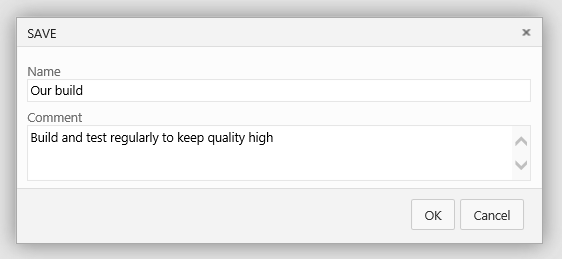

<properties
	pageTitle="Build your Eclipse projects"
  description="Build your Eclipse projects"
  services="visual-studio-online"
  documentationCenter = ""
  authors="terryaustin"
  manager="terryaustin"
  editor="terryaustin" /> 

# Build your Eclipse projects

Build your Java projects in the cloud with Ant, Gradle, or Maven and Visual Studio Online.

## Set up your build

1. If you haven't already:

 - [Connect Eclipse to your Visual Studio Online account](../setup/connect-to-visual-studio-online.md).
 - [Upload the code](../code/share-your-code-in-git-eclipse.md) that you're going to build.
2. From the team explorer in Eclipse, open the builds page.

3. Create a build definition.

4. Choose Start with an empty build definition.

5. If your project builds with Maven, add the Maven build step. Otherwise add the build step your team uses.

6. Provide the path to your Maven POM file.

7. Select the continuous integration (CI) trigger and specify the code you want to build.

8. Save the definition.

9. Queue your new definition to make sure it works.

You've created your first Eclipse build in the cloud! Since this is a CI build, a build is started every time you push a commit to one of the branches specified on the Triggers tab.

## Try this next

- [Create a backlog](../work/create-your-backlog-vs.md) to plan, organize, and track your work.
- [Add users and their licenses](../setup/assign-licenses-to-users-vs.md) to your Visual Studio Online account.

## Q &amp; A

#### Q: Can I set up gated builds?

[Improve code quality with branch policies](https://msdn.microsoft.com/Library/vs/alm/Code/git/branch-policies) with an option to require that code builds before it can be merged to a branch.
