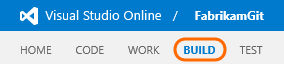
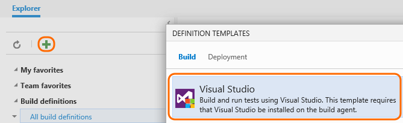
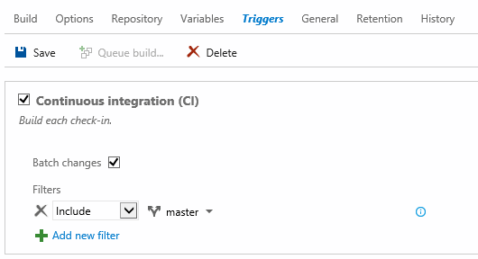
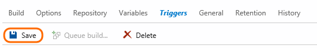
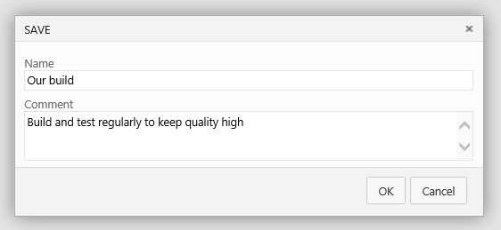
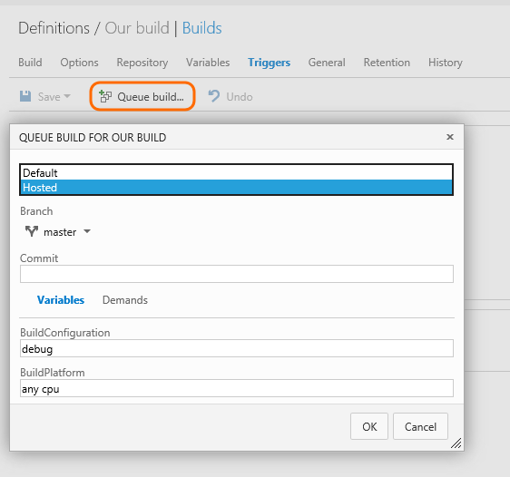
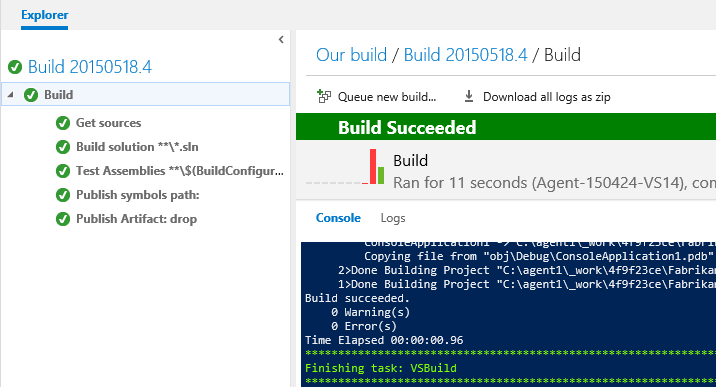

<properties
	pageTitle="Build your Visual Studio projects"
  description="Build your Visual Studio projects"
  services="visual-studio-online"
  documentationCenter = ""
  authors="terryaustin"
  manager="terryaustin"
  editor="terryaustin" /> 

# Build your Visual Studio projects

## Define the build process

Build your code automatically every time you check it in to catch problems early.

1. If you haven't already, upload your code to [TFVC](../../code/share-your-code-in-tfvc-vs.md) or [GIT](../../code/share-your-code-in-git-vs.md).
2. Create the build definition.

3. Select the continuous integration (CI) trigger and specify the code you want to build

4. Save the definition.

5. Queue your new definition to make sure it works.

You've created your first Visual Studio build in the cloud! Since this is a CI build, a build is started every time you push a commit to one of the branches specified on the Triggers tab.

## Try this next

- [Create a backlog](../../work/create-your-backlog-vs.md) to plan, organize, and track your work.
- [Add users and their licenses](../../setup/assign-licenses-to-users-vs.md) to your Visual Studio Online account.

## Q &amp; A

#### Q: Can I set up gated builds?

[Improve code quality with branch policies](https://msdn.microsoft.com/Library/vs/alm/Code/git/branch-policies) with an option to require that code builds before it can be merged to a branch.

#### Q: Where can I learn about more options to define my builds?

[Build your Visual Studio solution](https://msdn.microsoft.com/en-us/Library/vs/alm/Build/vs/define-build)
