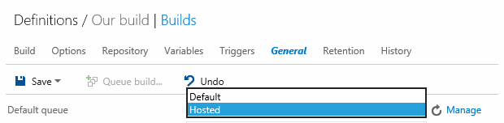

<properties
	pageTitle="Hosted pool"
  description="Hosted pool"
  services="visual-studio-online"
  documentationCenter = ""
  authors="terryaustin"
  manager="terryaustin"
  editor="terryaustin" /> 

# Hosted pool

When you build your app, you need an agent pool. It's much easier to use the hosted pool, but some restrictions apply.

## When can I use a hosted pool?

These questions are here to help you figure out if any of the restrictions apply to you.

#### Q: Are you running a [XAML build](https://msdn.microsoft.com/en-us/library/ms181709%28v=vs.120%29.aspx)?

A: No. Then you can use the hosted pool. Otherwise, you might be able to use the [hosted build controller](../hosted-build-controller-vs.md).

#### Q: Does your build depend on software other than [this software](../hosted-agent-pool.md#software) that is installed on hosted build resources?

A: No. Then you can use the hosted pool.

#### Q: Do you need to run more than one build at a time in your account?

A: No. Then you can use the hosted pool.

#### Q: Does your build process take less than an hour to run?

A: Yes. Then you can use the hosted pool.

#### Q: Does your build process use less than 10GB of total storage on a build server?

A: Yes. Then you can use the hosted pool.

#### Q: Do any of the processes for your build need administrator privileges?

A: No. Then you can use the hosted pool.

#### Q: Do you need to log on to the build server?

A: No. Then you can use the hosted pool.

#### Q: Do you need to run your build service in interactive mode (not as a service)?

A: No. Then you can use the hosted pool.

If you are not sure about the answers to these questions, you can just try the hosted pool and see if it works. Any issues will be reported in the build log.

## Software on the hosted build server

The hosted build server is deployed with the following software:

- Windows Server 2012 R2, 64-bit environment, with Windows PowerShell
- Team Foundation Build (Team Foundation Server 2013)
- Visual Studio 2015 RTM
- Visual Studio 2013 Update 4
- Visual Studio SDK 2013 RTM
- Visual Studio 2012 Ultimate Update 4
- Visual Studio SDK 2012 RTM
- Visual Studio 2010 SP1
- The .NET Framework

 - .NET 4.6
 - .NET 4.5.2
 - .NET 4.5.1
 - .NET 4.5
 - .NET 3.5 SP1
- Microsoft Azure

 - SDK 2.7
 - SDK 2.6
 - SDK 2.5
 - SDK 2.4
 - SDK 2.3
 - SDK 2.2
 - SDK 2.1
 - SDK 2.0
 - SDK 1.8
 - SDK 1.7
- Other components

 - Apache ANT 1.9.4
 - Apache Maven 3.2.2
 - CMake
 - Git for Windows 1.9.5
 - Java Standard Edition Development Kit 1.8
 - Microsoft Office Developer Tools for Visual Studio 2013 Update 1
 - Node.js 0.10.32
 - Node.js Tools 1.0 Alpha for Visual Studio 2013
 - Python Tools for Visual Studio 2012 and Visual Studio 2013
 - SharePoint 2010 and SharePoint 2013
 - SQL Server Data Tools for Visual Studio 2010, Visual Studio 2012, and Visual Studio 2013
 - TFS Build Extensions
 - TypeScript 1.4
 - WIX Toolset 3.7
 - Web Deploy 3.0
 - Windows Phone SDK 8.0

## Use an on-premises build agent

If you can't use the hosted pool, here's information on using an on-premises build agent instead:

- [Deploy an agent to build Windows and Azure apps](https://msdn.microsoft.com/Library/vs/alm/Build/agents/windows)
- [Xplat build agents](https://msdn.microsoft.com/en-us/Library/vs/alm/Build/agents/xplat)
