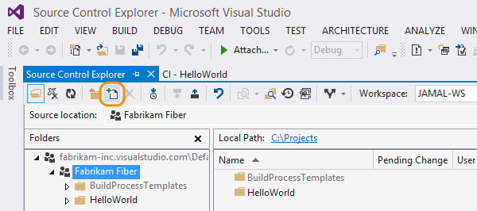
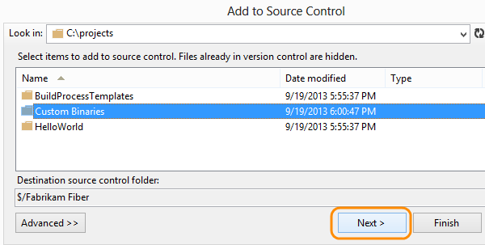
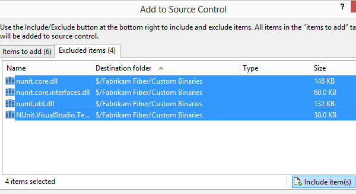
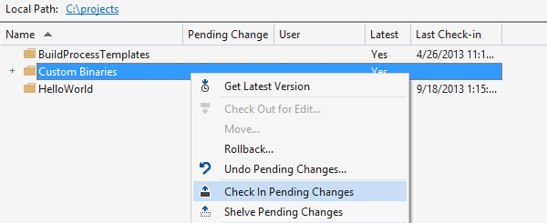
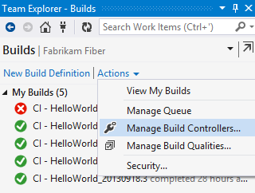
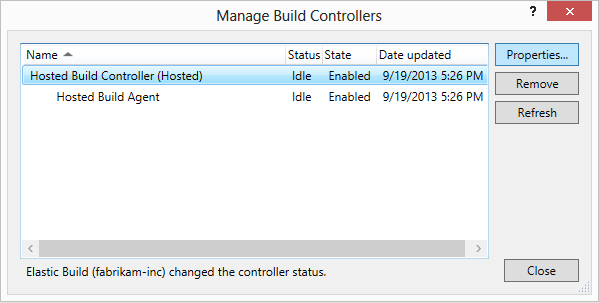
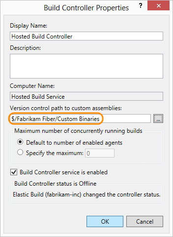

# Hosted build controller for XAML builds

To run a [xaml build](https://msdn.microsoft.com/en-us/library/ms181709%28v=vs.120%29.aspx), you need a build controller. It's much easier to use the hosted build controller, but some restrictions apply.

## When can I use a hosted build controller?

These questions are here to help you figure out if any of the restrictions apply to you.

#### Q: Are you running a [XAML build](https://msdn.microsoft.com/en-us/library/ms181709%28v=vs.120%29.aspx)?

A: Yes. Then you can use the hosted build controller. Otherwise, you might be able to use the [hosted pool](https://www.visualstudio.com/get-started/build/hosted-agent-pool).

#### Q: Does your build depend on software other than [this software](https://www.visualstudio.com/get-started/build/hosted-build-controller-vs#software) that is installed on the build controller?

A: No. Then you can use the hosted build controller. (But if you do need other software, you can install it on on-premises build agents and control them using an on-premises build controller. Learn more on MSDN: [Build controller](https://msdn.microsoft.com/library/ee330987.aspx), [Build agent](https://msdn.microsoft.com/library/bb399135.aspx).)

#### Q: Do you need to run more than one build at a time in your account?

A: No. Then you can use the hosted build controller.

#### Q: Does your build process take less than an hour to run?

A: Yes. Then you can use the hosted build controller.

#### Q: Does your build process use less than 10GB of total storage on a build server?

A: Yes. Then you can use the hosted build controller.

#### Q: Do any of the processes for your build need administrator privileges?

A: No. Then you can use the hosted build controller.

#### Q: Do you need to log on to the build server?

A: No. Then you can use the hosted build controller.

#### Q: Do you need to run your build service in [interactive mode](https://msdn.microsoft.com/library/ms181712.aspx#interactive)?

A: No. Then you can use the hosted build controller.

If you are not sure about the answers to these questions, you can just try the hosted build controller and see if it works. Any issues will be reported in the build log.

If you can't use the hosted build controller, here's information on using an [on-premises build controller](https://msdn.microsoft.com/library/ee330987) instead.

## Are there any extra steps required to use the hosted build controller?

Some situations need further configuration steps. See if any of these apply to you.

Q:Does your build process depend on custom activities or tasks?

A:Yes. Follow the steps [here](https://www.visualstudio.com/get-started/build/hosted-build-controller-vs#supplemental_binaries) and then you can use the hosted build controller.

Q:Do you want to run unit tests using third-party unit test frameworks?

A:Yes. Follow the steps [here](https://www.visualstudio.com/get-started/build/hosted-build-controller-vs#supplemental_binaries) and then you can use the hosted build controller.

## Add assemblies for custom activities and other unit test frameworks

If your build process depends on custom code, such as custom workflow activities, custom MSBuild tasks, or [other unit test frameworks](https://www.visualstudio.com/get-started/create-and-run-unit-tests-vs#frameworks) then read on.

### Check in the assemblies and tasks

1. Add the folder to version control that contains the assemblies and tasks.

2. Select the items to add.

3. Check to see if any of the binaries have been excluded. Go to the excluded items tab to include them all.

4. Now check the items in.

### Tell the hosted build controller where to find the code

1. From the Builds page (Keyboard: Ctrl + 0, B), go to the list of build controllers.

2. Edit the properties for the hosted build controller.

3. Set the path to the location of the custom binaries.

The hosted build controller is now enabled to run your custom build processes or run tests from other unit test frameworks.

## Software on the hosted build server

The hosted build server is deployed with the following software:

- Windows Server 2012 R2, 64-bit environment, with Windows PowerShell
- Team Foundation Build (Team Foundation Server 2013)
- Visual Studio 2015 RTM
- Visual Studio 2013 Update 4
- Visual Studio SDK 2013 RTM
- Visual Studio 2012 Ultimate Update 4
- Visual Studio SDK 2012 RTM
- Visual Studio 2010 SP1
- The .NET Framework

 - .NET 4.6
 - .NET 4.5.2
 - .NET 4.5.1
 - .NET 4.5
 - .NET 3.5 SP1
- Microsoft Azure

 - SDK 2.7
 - SDK 2.6
 - SDK 2.5
 - SDK 2.4
 - SDK 2.3
 - SDK 2.2
 - SDK 2.1
 - SDK 2.0
 - SDK 1.8
 - SDK 1.7
- Other components

 - Apache ANT 1.9.4
 - Apache Maven 3.2.2
 - CMake
 - Git for Windows 1.9.5
 - Java Standard Edition Development Kit 1.8
 - Microsoft Office Developer Tools for Visual Studio 2013 Update 1
 - Node.js 0.10.32
 - Node.js Tools 1.0 Alpha for Visual Studio 2013
 - Python Tools for Visual Studio 2012 and Visual Studio 2013
 - SharePoint 2010 and SharePoint 2013
 - SQL Server Data Tools for Visual Studio 2010, Visual Studio 2012, and Visual Studio 2013
 - TFS Build Extensions
 - TypeScript 1.4
 - WIX Toolset 3.7
 - Web Deploy 3.0
 - Windows Phone SDK 8.0

For more details, see [this](http://go.microsoft.com/fwlink/?LinkId=286671) list.

#### Q:How can I learn more about using custom build process activities?

A: Learn more [here](https://msdn.microsoft.com/library/dd647551.aspx).
