# Create and run unit tests with Visual Studio

Create unit tests and run them frequently to make sure your code is working properly.

## Create a unit test

1. Create a unit test project.

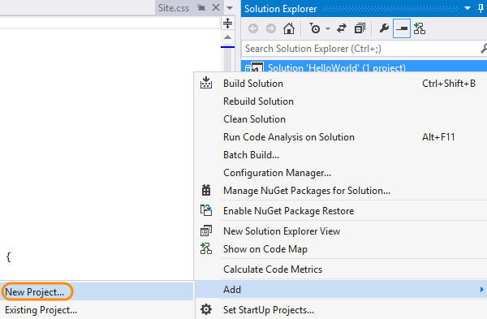
2. Name your project.

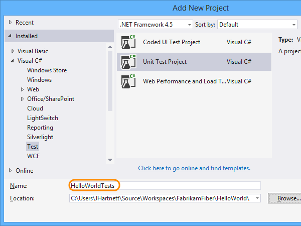

The project is now added to your solution.

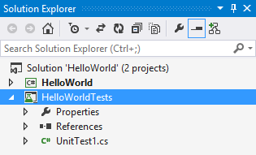
3. In the unit test project, add a reference to the project you want to test.

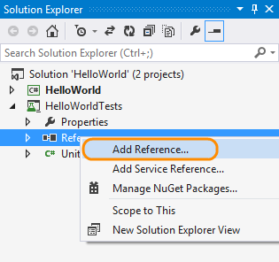
4. Select the project that contains the code you'll test.

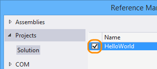
5. Code your unit test.

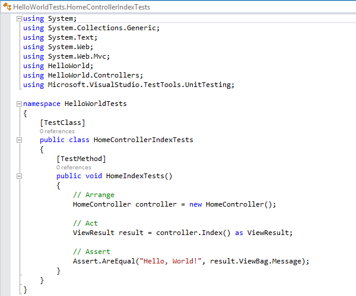

## Run unit tests

1. Open Test Explorer.

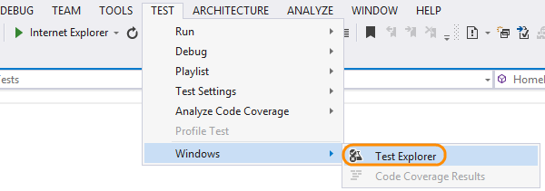
2. Run unit tests.

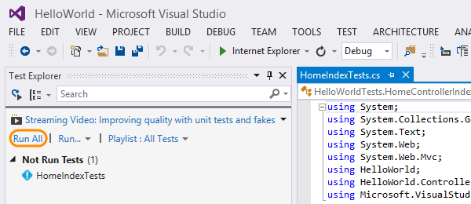

You can see the unit tests that passed or failed in Test Explorer.

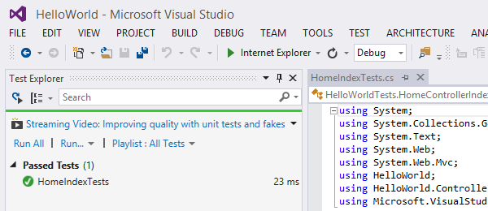

## Try this next

- [Debug your app](https://www.visualstudio.com/get-started/code/debug-your-app-vs)

## Q &amp; A

#### Q:    Can I run unit tests in Visual Studio if I use a different unit test framework?

A:  Yes, use the plug-in for that framework so that Visual Studio's test runner 
can work with that framework. Here are the 
[unit testing framework plug-ins for Visual Studio](http://go.microsoft.com/fwlink/?LinkID=246630) 
that are available right now.

1. Use Visual Studio's extension manager to download your plug-in.

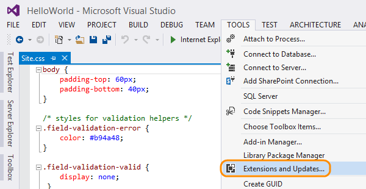
2. Download your plug-in from the Visual Studio Gallery under Tools/Testing, 
or search for it if you know the name.

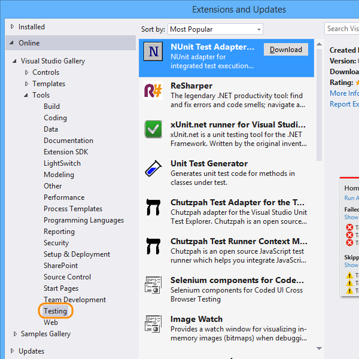
3. Create a class library project.

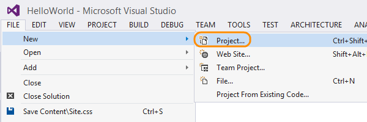

Add the project to your solution.

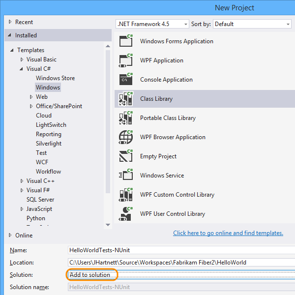
4. In the class library project, run NuGet to install the plug-in.

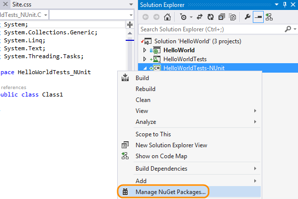

[NuGet](http://nuget.codeplex.com/documentation) is an extension of Visual Studio 
that you can use to add and update libraries and tools for your projects.
5. Install your plug-in. If you know the name, you can search for it online.

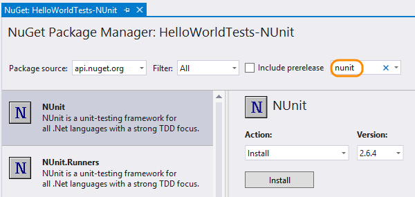

The framework is referenced in your project.

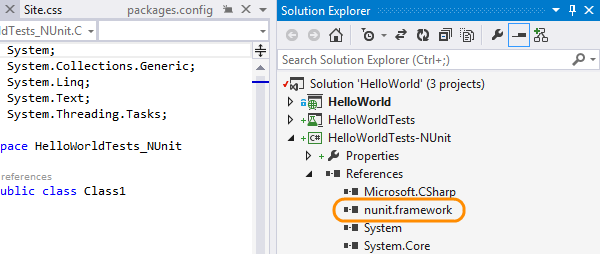
6. In the class library project, add a reference to the project you want to test.

7. Select the project that contains the code you'll test.

8. Code your unit test.

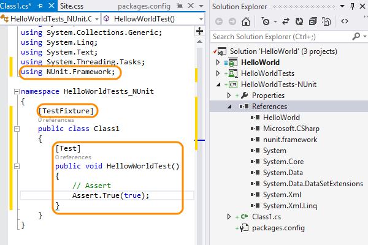
