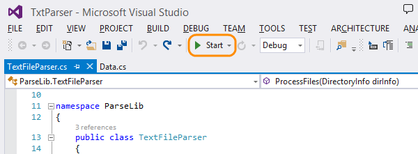
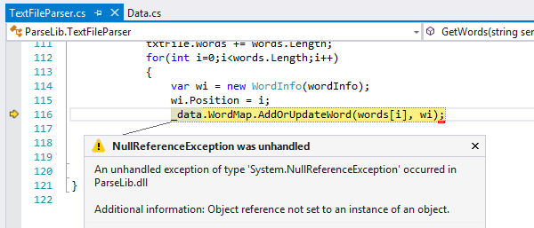
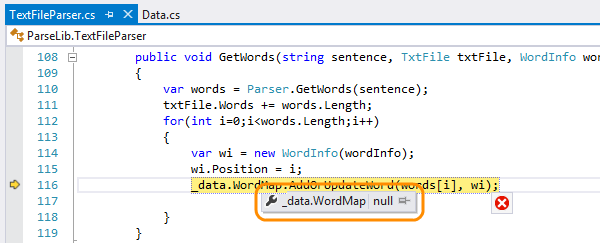
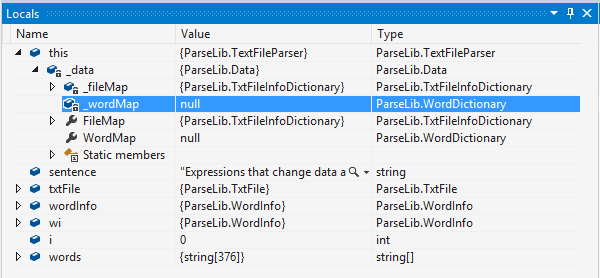
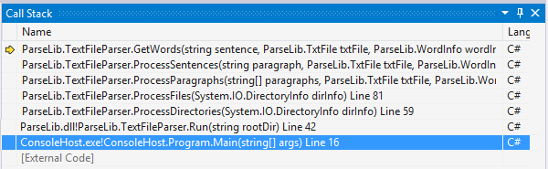
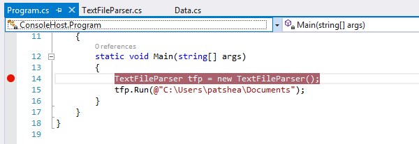
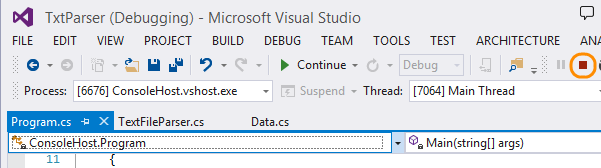
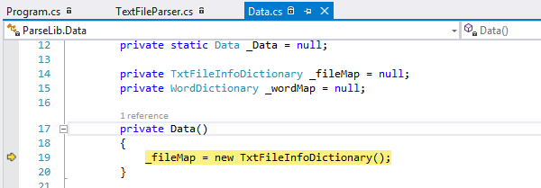
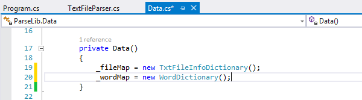

<properties
	pageTitle="Debug your app with Visual Studio"
  description="Debug your app with Visual Studio"
  services="visual-studio-online"
  documentationCenter = ""
  authors="terryaustin"
  manager="terryaustin"
  editor="terryaustin" /> 

# Debug your app with Visual Studio

When you have to find and fix problems in your app, 
use the integrated Visual Studio debugger.

1. Open your app project in Visual Studio.

2. Run your app in debug mode to find exceptions, problems during execution, 
or data values. Press F5 or choose Start.

3. When the debugger catches an exception, it suspends running your app.

4. Close the exception dialog box, so you can start finding the uninitialized 
object. Even at an exception, the debugger lets you examine your app's state.

5. Move your mouse over variables to view their values in a data tip.

6. In the Locals window, you can get more information more about the problem.

In this case, the problem might be that this property 
references a private field. Usually, the next step is to go 
through your code to find where things went wrong.

7. In the Call Stack window, you can see the path that your app took 
to reach the point where the exception happened.

Use what you know about the code to choose where to set a breakpoint.

8. Open the file where you want to start debugging. Select 
the line where you want to put the breakpoint. Press F9 or double-click in the 
left-hand gutter next to the line.

In the gutter, the breakpoint appears as a red circle. The breakpoint 
stops your app's execution, so that you can start stepping through code.

9. Because the debugger caught an exception, you'll have to stop your
debugging session, then restart your session. Press Shift + F5, 
or on the toolbar, choose Stop Debugging.

10. Restart your debugging session. Use the stepping commands 
to move through your code, looking for the method that most
likely created the uninitialized object. 
[What are the stepping commands?](debug-your-app-vs.md#step_commands)

11. When you find the place where you can fix the issue, 
stop debugging, and change or add code.

12. Restart your debugging session, and run through the app 
again to confirm your fix.

## Try this next

- [Share your code in TFVC using Visual Studio](share-your-code-in-tfvc-vs.md) or
[share your VS code in Git using Visual Studio](share-your-code-in-git-vs.md), 
depending on how you set up your team project.

## Q &amp; A

#### Q:    What are the stepping commands?

A:  You can move through the app using one of these commands:

**Step Over (F10)**: Stepping over a function always runs
the next line of code, and then suspends execution. It doesn't
matter if that line calls a method in your code.

**Step Into (F11)**: When you step into a line of code, 
the debugger performs one of these actions:

- If the statement calls a function in your code, 
the debugger moves to the first line of the called 
function, and then suspends execution.

- If the next statement doesn't call a function in your code,
like a system or framework function, the debugger runs the statement, 
moves to the next statement, and then suspends execution.

**Continue (F5)**: Resume running your app and continue 
until execution reaches a breakpoint, an exception happens, 
or the application exits.

**Run to cursor (Ctrl + F10)**: Acts like a temporary breakpoint. 
Select a line in the code, open the shortcut menu, and choose Run to Cursor.

The debugger continues running your app until the line that contains 
your cursor is about to run, or until it reaches a breakpoint between 
the line where execution resumed and the cursor.

#### Q:    Can I get more control over when my breakpoints fire?

A:  Yes, you can disable breakpoints temporarily, and you can set 
conditions that determine when a breakpoint fires. 
[Learn more here](https://msdn.microsoft.com/library/5557y8b4%28v=vs.120%29.aspx).

#### Q:    Can I debug an app that's not on my Visual Studio computer?

A:  Yes, but only if the app is running on a device that's connected over a network, 
or that's connected directly to your Visual Studio computer. You'll have to do 
[some configuration](https://msdn.microsoft.com/library/y7f5zaaa%28v=vs.120%29.aspx) 
to debug this way.

#### Q:    Can I change my code without stopping the debug session?

A:  Sometimes, but
[the rules on when you can do this are complicated](https://msdn.microsoft.com/library/bcew296c%28v=vs.120%29.aspx). 
The best way is to just try it. You'll get an error if the language or context 
doesn't support editing. If that happens, you can just remove your changes.

