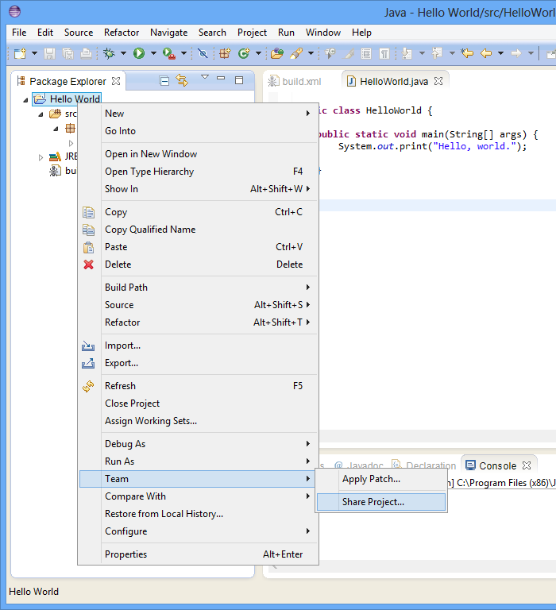
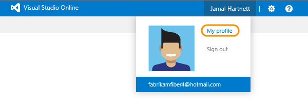
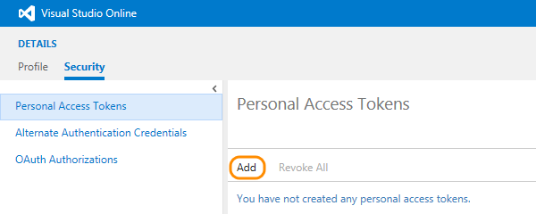

<properties
	pageTitle="Share your code in Git using Eclipse"
  description="Share your code in Git using Eclipse"
  services="visual-studio-online"
  documentationCenter = ""
  authors="terryaustin"
  manager="terryaustin"
  editor="terryaustin" /> 


# Share your code in Git using Eclipse


Share your code with your team with Visual Studio Online and Eclipse.


Before you start:


1. If you don't have a Visual Studio Online account, [create it first](../setup/sign-up-for-visual-studio-online.md).

2. If you have not yet connected to a team project in your Visual Studio Online account, [do that now](../setup/connect-to-visual-studio-online.md).


If your team project uses Git in your Visual Studio Online account, read on. However, if your team project uses TFVC in your Visual Studio Online account,then read [Share your code in TFVC using Eclipse](share-your-code-in-tfvc-eclipse.md)


## Share using Git


### Clone the repository


1. Show the Git views.


Select the repositories and staging views.


If you don't have the Git views, you can get them by [downloading EGit](http://www.eclipse.org/egit/).

2. Use the Git repositories view to clone the Git repository for your team project.


3. Specify the URL for your project repository. The URL will look like `http://{your_account}.visualstudio.com/DefaultCollection/_git/{your_team_project}`


 - [Find out your repo URL](share-your-code-in-git-eclipse.md#gitrepourl).

 - Create a [personal access token](share-your-code-in-git-eclipse.md#pat) for authentication. 
Enter your usual username and use the token as the password.


4. Specify where you'll keep the cloned repository on your machine. It's okay if your Git repository is empty.


The repository for your team project shows up in the Git repositories view.


### Push your code to the remote repository


1. In Package Explorer, right-click the project and choose Team, Share Project.




2. Make sure you share it to Git.


Map the remote repository to your working directory.


3. Add your files to the Git index to stage your changes.


4. Enter a commit message and push the source to the remote repository.


Use your [personal access token](share-your-code-in-git-eclipse.md#pat) for authentication.


Your code is in your team project's Git repository, so now your teammates can contribute.


### Try this next


- [Build your Eclipse projects](../build/build-your-app-eclipse.md)


## Q&amp;A


#### Q: Where can I find the URL for my Git repository?


A: You'll find it in the code hub in your team project.


1. Sign in to your Visual Studio Online account and browse to your team project or type the team project URL directly in your browser.


- The URL will look like `https://{your_account}.visualstudio.com/DefaultCollection/{your_team_project}`

- If you are not sure about your team project URL, [Sign in to your Visual Studio](http://go.microsoft.com/fwlink/?LinkID=309329) and select your account.


1. Open the code hub from your you team project's home page.


2. Select the the repository and click on the **clone** action to get the URL.


#### Q: Why should I use personal access tokens?


A: Personal access tokens are a more convenient and secure replacement 
for alternate authentication credentials.


#### Q: Why can't connect to my Git repo?


A: To use Git with your Visual Studio Online account, create a personal access token 
so that you can sign in from Eclipse.


1. Sign in to your Visual Studio Online account (`http://[youraccount].visualstudio.com`).

2. Go to your team project's home page and open your profile.




3. Create a new personal access token for this account.




4. Enter the details for this token.


5. Select the [scopes](https://www.visualstudio.com/integrate/get-started/auth/oauth#scopes) that this token authorizes.


6. After you finish creating the token, make sure to copy the token. You'll use this token as your password for your Git tools or application.


**Note: Remember that these tokens are your identity. 
When used, the token is acting as you. 
Keep your tokens secret and treat them like your password.
To help keep your token more secure, consider using the 
[Windows Credential Store for Git](http://gitcredentialstore.codeplex.com)
so that you don't have to enter your credentials every time you push.**


For example, if you use the Git command prompt to run a Git command, you'll be prompted for a username and password.


```

git clone https://[account].visualstudio.com/DefaultCollection/_git/[team project]

```


Enter a username that does not contain an @ character (for example, Jamal, not fabrikamfiber4@hotmail.com). 
Use the token that you created as your password.


```

Username for 'https://fabrikam-inc.visualstudio.com': Jamal
Password for 'https://fabrikam-inc.visualstudio.com': [COPY THE TOKEN HERE]

```

7. When you don't need your token anymore, just revoke the token to remove its access from this account.


#### Q: Can I still use alternate authentication credentials?


A:  Yes.


1. Sign in to your Visual Studio Online account (`http://[youraccount].visualstudio.com`).

2. Go to your team project's home page and open your profile.


3. Enable alternate authentication credentials for this account. Then provide a secondary username and password.


#### Q: What if the Git views don't show up.


A: You can [download EGit](http://www.eclipse.org/egit/) to use Git with Eclipse.


#### Q: Can I use my GitHub repository instead of Visual Studio?


A:  Yes, provide the name of your GitHub repository in Step 3 under "Clone the repository" above instead of the name of your VSO repository.

