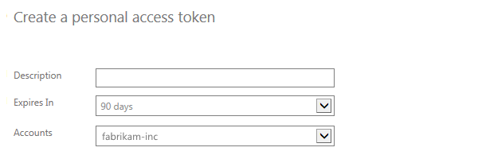
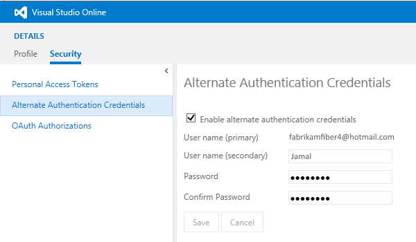

<properties
	pageTitle="Share your code in Git using Xcode"
  description="Share your code in Git using Xcode"
  services="visual-studio-online"
  documentationCenter = ""
  authors="terryaustin"
  manager="terryaustin"
  editor="terryaustin" /> 

# Share your code in Git using Xcode


Share your Xcode projects in Visual Studio Online using a Git repository. 
If you want to share your Xcode projects using TFVC instead, 
then read [Share your code in TFVC using Xcode](share-your-code-in-tfvc-xcode.md).


## Clone the repository

1. If your team doesn't already have a team project that uses a Git repository for version control, create one.
2. Go to your repositories root and clone your team project repository.


```
cd ~/repositories 
 git clone https://[account].visualstudio.com/DefaultCollection/_git/[team project]
```
3. You'll be prompted for credentials.


To authenticate access to your Visual Studio Online account, 
 create a [personal access token](share-your-code-in-git-xcode.md#pat). Then, enter a username that 
 does not contain an @ character (for example, Jamal, not fabrikamfiber4@hotmail.com).
 Use the token that you created as your password.


Now you have a local clone of the Git repository in your team project. 
You can add your code to the local repository, 
and push your commits to share them in Visual Studio Online.


## Add your code to the repository

1. Move your code into the local Git repository.


2. In Xcode, commit your changes locally.


3. Push your changes to your team project's repository.


## Q&amp;A

#### Q: Where can I find the URL for my Git repository?


A: You'll find it in the code hub in your team project.


1. Sign in to your Visual Studio Online account and browse to your team project or type the team project URL directly in your browser.

- The URL will look like `https://{your_account}.visualstudio.com/DefaultCollection/{your_team_project}`
- If you are not sure about your team project URL, [Sign in to your Visual Studio](http://go.microsoft.com/fwlink/?LinkID=309329) and select your account.

1. Open the code hub from your you team project's home page.


2. Select the the repository and click on the **clone** action to get the URL.


#### Q: Can I add my local Git repository to the team project?


A: Yes, as long as your team project is set up to use Git for version control (instead of TFVC), you can add as many repositories as you need.


1. Go to the repository you want to add and define the remote origin.


```
cd ~/repos/[repository] 
  git remote add origin http://[account].visualstudio.com/DefaultCollection/_git/[repository]
```
2. Push your repository to your team project.


```
git push -u origin --all
```

#### Q: Can I use my GitHub repository instead of Visual Studio?


A:  Yes.  Provide the name of your GitHub repository in Step 2 under "Clone the repository" above instead of the name of your VSO repository.


#### Q: Should I use Git or TFVC for my team project?


A: That depends on a [number of factors](https://msdn.microsoft.com/en-us/Library/vs/alm/Code/overview#tfvc_or_git_summary),
like the size of your codebase and the size and distribution of your team.


#### Q: If my team project uses Team Foundation Version control, can I still share my Xcode projects in Visual Studio Online?


A: Yes, use the Git-tf command line tool to push your changes from the local Git repotory to TFVC.  See [Share your code in TFVC using Xcode](share-your-code-in-tfvc-xcode.md)


#### Q: Why should I use personal access tokens?


A: Personal access tokens are a more convenient and secure replacement for alternate authentication credentials.


#### Q: Why can't I connect to Xcode?


A: You can't sign in to Xcode with an account that contains an @ character, so you'll have to create and use a personal access token. 
You can use any username, for example, Jamal, rather than fabrikamfiber4@hotmail.com.


1. Sign in to your Visual Studio Online account (`http://[youraccount].visualstudio.com`).
2. Go to your team project's home page and open your profile.


3. Create a new personal access token for this account.


4. Enter the details for this token.



5. Select the [scopes](https://www.visualstudio.com/integrate/get-started/auth/oauth#scopes) that this token authorizes.


6. After you finish creating the token, make sure to copy the token. You'll use this token as your password for your Git tools or application.


**Note: Remember that these tokens are your identity. 
When used, the token is acting as you. 
Keep your tokens secret and treat them like your password.
To help keep your token more secure, consider using the 
[Windows Credential Store for Git](http://gitcredentialstore.codeplex.com)
so that you don't have to enter your credentials every time you push.**


For example, if you use the Git command prompt to run a Git command, you'll be prompted for a username and password.


```
git clone https://[account].visualstudio.com/DefaultCollection/_git/[team project]
```


Enter a username that does not contain an @ character (for example, Jamal, not fabrikamfiber4@hotmail.com). 
Use the token that you created as your password.


```
Username for 'https://fabrikam-inc.visualstudio.com': Jamal
Password for 'https://fabrikam-inc.visualstudio.com': [COPY THE TOKEN HERE]
```
7. When you don't need your token anymore, just revoke the token to remove its access from this account.

#### Q: Can I still use alternate authentication credentials?


A:  Yes, use the secondary username from your account's alternate credentials, for example, Jamal, not fabrikamfiber4@hotmail.com.


1. Sign in to your Visual Studio Online account (`http://[youraccount].visualstudio.com`).
2. Go to your team project's home page and open your profile.


3. Enable alternate authentication credentials for this account. Then provide a secondary username and password.



