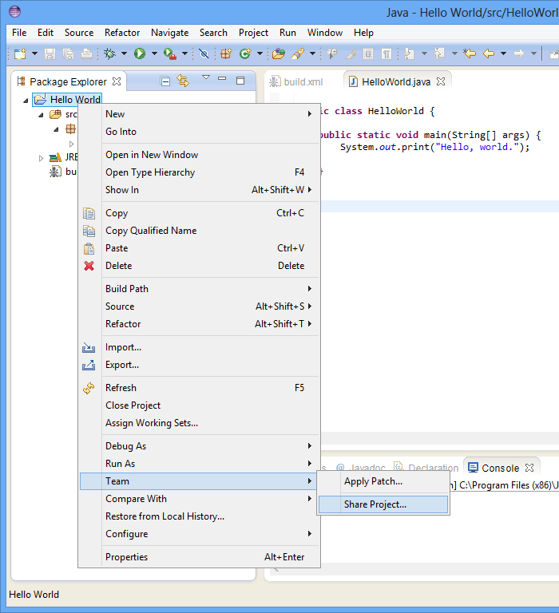
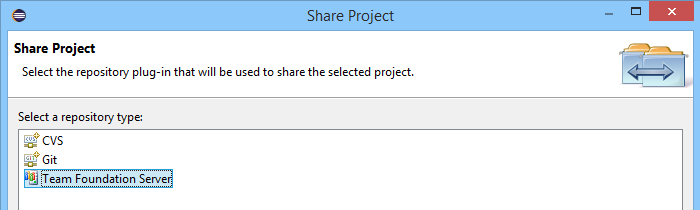
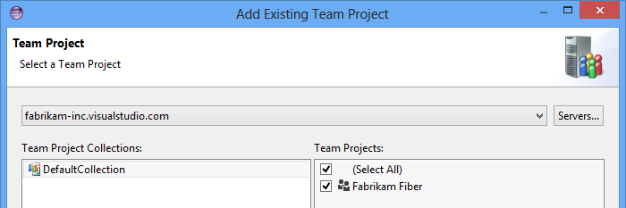
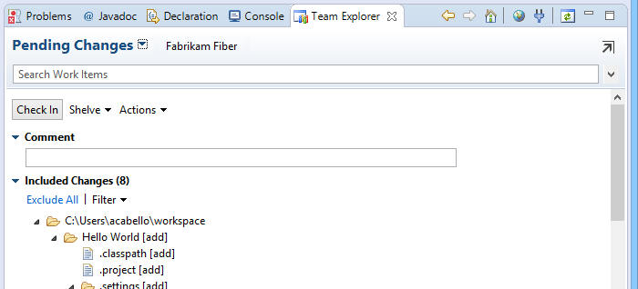

<properties
	pageTitle="Share your code in TFVC using Eclipse"
  description="Share your code in TFVC using Eclipse"
  services="visual-studio-online"
  documentationCenter = ""
  authors="terryaustin"
  manager="terryaustin"
  editor="terryaustin" /> 

# Share your code in TFVC using Eclipse

Share your code with your team with Visual Studio Online and Eclipse.

Before you start:

1. If you don't have a Visual Studio Online account, [create it first](../../setup/sign-up-for-visual-studio-online.md).
2. If you have not yet connected to a team project in your Visual Studio Online account, [do that now](../../setup/connect-to-visual-studio-online.md).

If your team project uses TFVC in your Visual Studio Online account, read on. However, if your team project uses Git in your Visual Studio Online account,then read [Share your code in Git using Eclipse](../share-your-code-in-git-eclipse.md)

## Share using TFVC

1. If you haven't yet, [Connect to Visual Studio Online using Eclipse](../../setup/connect-to-visual-studio-online.md#TEEConnect).
2. In Package Explorer, right-click the project and choose Team, Share Project.

3. Make sure you share it to Team Foundation Server.

4. Select the server and team project.

5. Check in the files.

Your code is in TFVC, so now your teammates can contribute.

## Try this next

- [Build your Eclipse projects](../../build/build-your-app-eclipse.md)

## Q&amp;A
