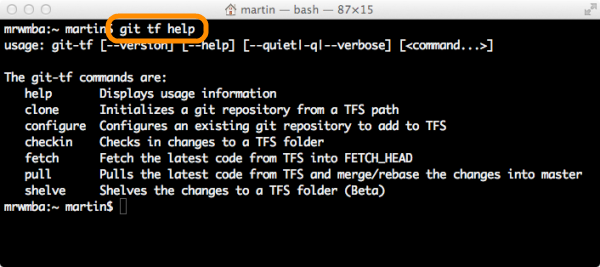
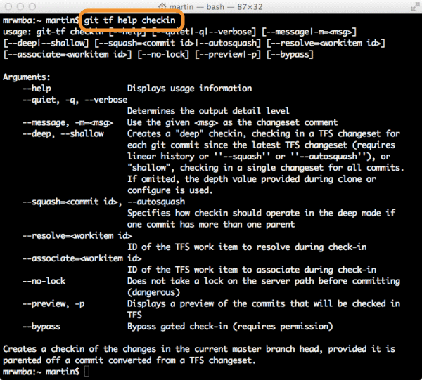

<properties
	pageTitle="Share your code in TFVC using Xcode"
  description="Share your code in TFVC using Xcode"
  services="visual-studio-online"
  documentationCenter = ""
  authors="terryaustin"
  manager="terryaustin"
  editor="terryaustin" /> 

# Share your code in TFVC using Xcode


Share your Xcode projects in Visual Studio Online using a TFVC repository by using the Git-tf command line tool to push your changes from the local Git repotory to TFVC.


##### Download and configure Git-tf

1. Download and extract [Git-tf](http://go.microsoft.com/fwlink/p/?LinkId=261658).
2. Add Git-tf and the Java runtime to your path.


```
export JAVA_HOME=/Library/Java/Home 
 export PATH=$PATH:$JAVA_HOME/bin:/git_tf
```
3. Go to the root of your local repository.


```
pushd /ws/FabrikamFiber
```
4. To share your Git repository in Visual Studio Online, configure the connection and check in your code. You'll be prompted for credentials.


```
git tf configure https://fabrikamfiber.visualstudio.com $/FabrikamFiber 
 git tf checkin
```


Or, if your team's code is already in Visual Studio Online, you can clone a local repository using Git-tf.


```
git tf clone https://fabrikamfiber.visualstudio.com $/FabrikamFiber
```
5. If you don't want to be prompted for credentials every time you run Git-tf, you can store your credentials in your Git configuration.


```
git config git-tf.server.username fabrikamfiber4@hotmail.com 
 git config git-tf.server.password mypassword
```

##### Share your code

1. After you commit changes to your local Git repository, and you're ready to share them in Visual Studio Online, check them in.


```
git commit -a 
 git tf checkin
```


If you've committed multiple changes locally, you'll still get just one changeset in Visual Studio Online.
2. Resolve a bug or close a task when you check in by providing the work item ID with the resolve flag.


```
git tf checkin --resolve=21972
```


The changeset and the work item are linked, and you'll be able to see which bugs are resolved and which tasks were completed in the build reports.
3. You can make sure you're working with your team's latest code by pulling from Visual Studio Online.


```
git tf pull
```


Use git tf help to learn about the Git-tf commands.




## Q&amp;A

#### Q: Should I use Git or TFVC for my team project?


A: That depends on a [number of factors](https://msdn.microsoft.com/en-us/Library/vs/alm/Code/overview#tfvc_or_git_summary),
like the size of your codebase and the size and distribution of your team.


#### Q: If my team project uses Git Version control, can I still share my Xcode projects in Visual Studio Online?


A: Yes, see [Share your code in Git using Xcode](share-your-code-in-git-xcode.md)
