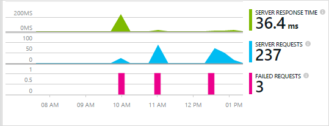
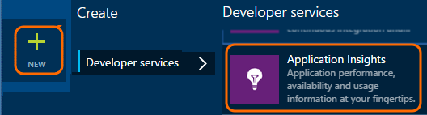
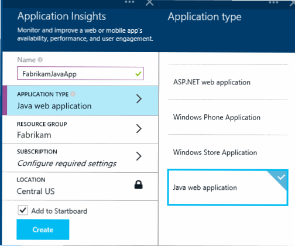
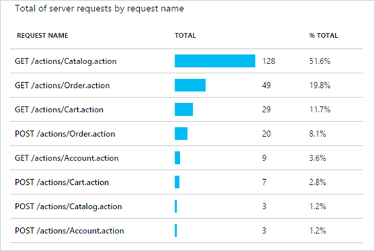
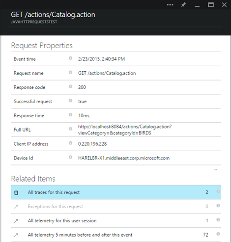
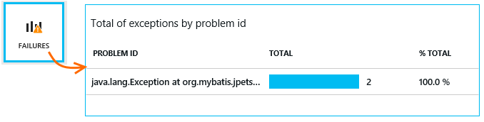
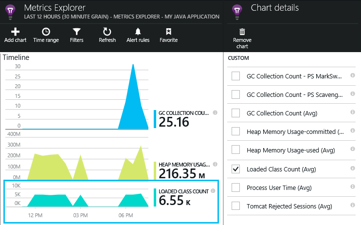

<properties
	pageTitle="Application Insights for a Java web app"
  description="Application Insights for a Java web app"
  services="visual-studio-online"
  documentationCenter = ""
  authors="terryaustin"
  manager="terryaustin"
  editor="terryaustin" /> 


# Application Insights for a Java web app


*Application Insights is in Preview.*


Application Insights is an extensible analytics service that helps you understand the performance and usage of your live application. Use it to detect and diagnose performance issues and exceptions, and [write code](https://azure.microsoft.com/documentation/articles/app-insights-api-custom-events-metrics/) to track what users do with your app.





[Application Insights web tests](https://azure.microsoft.com/documentation/articles/app-insights-monitor-web-app-availability/) monitor your application's availability.


You'll need:


- Oracle JRE 1.6 or later, or Zulu JRE 1.6 or later

- A subscription to [Microsoft Azure](https://azure.microsoft.com/). (You could start with the [free trial](https://azure.microsoft.com/pricing/free-trial/).)


## 1. Get an Application Insights instrumentation key


1. Sign in to the [Microsoft Azure Portal](https://portal.azure.com)

2. Create a new Application Insights resource




3. Set the application type to Java web application.




4. Find the instrumentation key of the new resource. You'll need to paste this into your code project shortly.


## 2. Add the Application Insights SDK for Java to your project


*Choose the appropriate way for your project.*


#### If you're creating a Dynamic Web project in Eclipse...


Use the [Application Insights SDK for Java plug-in](https://azure.microsoft.com/documentation/articles/app-insights-java-eclipse/).


#### If you're using Maven...


If your project is already set up to use Maven for build, merge the following snippet of code to your pom.xml file.


Then refresh the project dependencies, to get the binaries downloaded.


```

&lt;repositories&gt;
   &lt;repository&gt;
      &lt;id&gt;central&lt;/id&gt;
      &lt;name&gt;Central&lt;/name&gt;
      &lt;url&gt;http://repo1.maven.org/maven2&lt;/url&gt;
   &lt;/repository&gt;
&lt;/repositories&gt;

&lt;dependencies&gt;
  &lt;dependency&gt;
    &lt;groupId&gt;com.microsoft.azure&lt;/groupId&gt;
    &lt;artifactId&gt;applicationinsights-web&lt;/artifactId&gt;
    &lt;!-- or applicationinsights-core for bare API --&gt;
    &lt;version&gt;[1.0,)&lt;/version&gt;
  &lt;/dependency&gt;
&lt;/dependencies&gt;

```


- *Build or checksum validation errors? Try using a specific version, such as:*`&lt;version&gt;1.0.n&lt;/version&gt;`. You'll find the latest version in the [SDK release notes](https://azure.microsoft.com/documentation/articles/app-insights-release-notes-java/) or in our [Maven artifacts](https://search.maven.org/#search%7Cga%7C1%7Capplicationinsights).

- *To update to a new SDK*

 - Refresh your project's dependencies.


#### If you're using Gradle...


If your project is already set up to use Gradle for build, merge the following snippet of code to your build.gradle file.


Then refresh the project dependencies, to get the binaries downloaded.


```

repositories {
  mavenCentral()
}

dependencies {
  compile group: 'com.microsoft.azure', name: 'applicationinsights-web', version: '1.+'
  // or applicationinsights-core for bare API
}

```


- *Build or checksum validation errors? Try using a specific version, such as:*`version:'1.0.n'`. *You'll find the latest version in the [SDK release notes](https://azure.microsoft.com/documentation/articles/app-insights-release-notes-java/).*

- *To update to a new SDK*

 - Refresh your project's dependencies.


#### Otherwise ...


Manually add the SDK:


1. Download the [Application Insights SDK for Java](https://dl.msopentech.com/lib/PackageForWindowsAzureLibrariesForJava.html)

2. Extract the binaries from the zip file, and add them to your project.


Questions...


- *What's the relationship between the `-core` and `-web` components in the zip?*


 - `applicationinsights-core` gives you the bare API. You always need this.

 - `applicationinsights-web` gives you metrics that track HTTP request counts and response times. You can omit this if you don't want this telemetry automatically collected - for example if you want to write your own.

- *To update the SDK*


 - Download the latest [Application Insights SDK for Java](http://dl.msopentech.com/lib/PackageForWindowsAzureLibrariesForJava.html) and replace the old ones.

 - Changes are described in the [SDK release notes](https://azure.microsoft.com/documentation/articles/app-insights-release-notes-java/).


## 3. Add an Application Insights xml file


Add ApplicationInsights.xml to the resources folder in your project, or otherwise make sure it is added to your project’s deployment class path. Copy into it the following XML.


Substitute the instrumentation key that you got from the Azure portal.


```

&lt;?xml version="1.0" encoding="utf-8"?&gt;
&lt;ApplicationInsights xmlns="http://schemas.microsoft.com/ApplicationInsights/2013/Settings" schemaVersion="2014-05-30"&gt;


  &lt;!-- The key from the portal: --&gt;

  &lt;InstrumentationKey&gt;** Your instrumentation key **&lt;/InstrumentationKey&gt;


  &lt;!-- HTTP request component (not required for bare API) --&gt;

  &lt;TelemetryModules&gt;
    &lt;Add type="com.microsoft.applicationinsights.web.extensibility.modules.WebRequestTrackingTelemetryModule"/&gt;
    &lt;Add type="com.microsoft.applicationinsights.web.extensibility.modules.WebSessionTrackingTelemetryModule"/&gt;
    &lt;Add type="com.microsoft.applicationinsights.web.extensibility.modules.WebUserTrackingTelemetryModule"/&gt;
  &lt;/TelemetryModules&gt;

  &lt;!-- Events correlation (not required for bare API) --&gt;
  &lt;!-- These initializers add context data to each event --&gt;

  &lt;TelemetryInitializers&gt;
    &lt;Add   type="com.microsoft.applicationinsights.web.extensibility.initializers.WebOperationIdTelemetryInitializer"/&gt;
    &lt;Add type="com.microsoft.applicationinsights.web.extensibility.initializers.WebOperationNameTelemetryInitializer"/&gt;
    &lt;Add type="com.microsoft.applicationinsights.web.extensibility.initializers.WebSessionTelemetryInitializer"/&gt;
    &lt;Add type="com.microsoft.applicationinsights.web.extensibility.initializers.WebUserTelemetryInitializer"/&gt;
    &lt;Add type="com.microsoft.applicationinsights.web.extensibility.initializers.WebUserAgentTelemetryInitializer"/&gt;

  &lt;/TelemetryInitializers&gt;
&lt;/ApplicationInsights&gt;

```


- The instrumentation key is sent along with every item of telemetry and tells Application Insights to display it in your resource.

- The HTTP Request component is optional. It automatically sends telemetry about requests and response times to the portal.

- Events correlation is an addition to the HTTP request component. It assigns an identifier to each request received by the server, and adds this as a property to every item of telemetry as the property 'Operation.Id'. It allows you to correlate the telemetry associated with each request by setting a filter in [diagnostic search](https://azure.microsoft.com/documentation/articles/app-insights-detect-triage-diagnose/).


## 4. Add an HTTP filter


The last configuration step allows the HTTP request component to log each web request. (Not required if you just want the bare API.)


Locate and open the web.xml file in your project, and merge the following snippet of code under the web-app node, where your application filters are configured.


To get the most accurate results, the filter should be mapped before all other filters.


```

&lt;filter&gt;
  &lt;filter-name&gt;ApplicationInsightsWebFilter&lt;/filter-name&gt;
  &lt;filter-class&gt;
    com.microsoft.applicationinsights.web.internal.WebRequestTrackingFilter
  &lt;/filter-class&gt;
&lt;/filter&gt;
&lt;filter-mapping&gt;
   &lt;filter-name&gt;ApplicationInsightsWebFilter&lt;/filter-name&gt;
   &lt;url-pattern&gt;/*&lt;/url-pattern&gt;
&lt;/filter-mapping&gt;

```


#### If you're using MVC 3.1 or later


Edit these elements to include the Application Insights package:


```

&lt;context:component-scan base-package=" com.springapp.mvc, com.microsoft.applicationinsights.web.spring"/&gt;

&lt;mvc:interceptors&gt;
    &lt;mvc:interceptor&gt;
        &lt;mvc:mapping path="/**"/&gt;
        &lt;bean class="com.microsoft.applicationinsights.web.spring.RequestNameHandlerInterceptorAdapter" /&gt;
    &lt;/mvc:interceptor&gt;
&lt;/mvc:interceptors&gt;

```


#### If you're using Struts 2


Add this item to the Struts configuration file (usually named struts.xml or struts-default.xml):


```

&lt;interceptors&gt;
   &lt;interceptor name="ApplicationInsightsRequestNameInterceptor" class="com.microsoft.applicationinsights.web.struts.RequestNameInterceptor" /&gt;
 &lt;/interceptors&gt;
 &lt;default-interceptor-ref name="ApplicationInsightsRequestNameInterceptor" /&gt;

```


(If you have interceptors defined in a default stack, the interceptor can simply be added to that stack.)


## 5. Install on the server


On Windows servers, install:


- [Microsoft Visual C++ Redistributable](https://www.microsoft.com/download/details.aspx?id=40784)


(This enables performance counters.)


## 6. Run your application


Either run it in debug mode on your development machine, or publish to your server.


## 7. View your telemetry in Application Insights


Return to your Application Insights resource in [Microsoft Azure Portal](https://portal.azure.com).


HTTP requests data will appear on the overview blade. (If it isn't there, wait a few seconds and then click Refresh.)


Click through any chart to see more detailed metrics.





And when viewing the properties of a request, you can see the telemetry events associated with it such as requests and exceptions.





[Learn more about metrics.](https://azure.microsoft.com/documentation/articles/app-insights-metrics-explorer/)


#### Smart address name calculation


Application Insights assumes the format of HTTP requests for MVC applications is: `VERB controller/action`


For example, `GET Home/Product/f9anuh81`, `GET Home/Product/2dffwrf5` and `GET Home/Product/sdf96vws` will be grouped into `GET Home/Product`.


This enables meaningful aggregations of requests, such as number of requests and average execution time for requests.


## Exceptions and request failures


Exceptions not handled by your code are collected:





To collect data on other exceptions, you have two options:


- [Insert calls to TrackException in your code](https://azure.microsoft.com/documentation/articles/app-insights-api-custom-events-metrics/#track-exception).

- [Install the Java Agent on your server](https://azure.microsoft.com/documentation/articles/app-insights-java-agent/). You specify the methods you want to watch.


## Monitor method calls and external dependencies


[Install the Java Agent](https://azure.microsoft.com/documentation/articles/app-insights-java-agent/) to log specified internal methods and calls made through JDBC, with timing data.


## Performance counters


Click the Servers tile, and you'll see a range of performance counters.


### Customizing performance counter collection


To disable collection of the standard set of performance counters, add the following snippet under the root node of the ApplicationInsights.xml file:


```

&lt;PerformanceCounters&gt;
   &lt;UseBuiltIn&gt;False&lt;/UseBuiltIn&gt;
&lt;/PerformanceCounters&gt;

```


### Collecting additional performance counters


You can specify additional performance counters to be collected.


#### JMX counters (exposed by the Java Virtual Machine)


```

&lt;PerformanceCounters&gt;
  &lt;Jmx&gt;
    &lt;Add objectName="java.lang:type=ClassLoading" attribute="TotalLoadedClassCount" displayName="Loaded Class Count"/&gt;
    &lt;Add objectName="java.lang:type=Memory" attribute="HeapMemoryUsage.used" displayName="Heap Memory Usage-used" type="composite"/&gt;
  &lt;/Jmx&gt;
&lt;/PerformanceCounters&gt;

```


- `displayName` – The name displayed in the Application Insights portal.

- `objectName` – The JMX object name.

- `attribute` – The attribute of the JMX object name to fetch

- `type` (optional) - The type of JMX object’s attribute:

 - Default: a simple type such as int or long.

 - `composite`: the perf counter data is in the format of 'Attribute.Data'

 - `tabular`: the perf counter data is in the format of a table row


#### Windows performance counters


Each [Windows performance counter](https://msdn.microsoft.com/library/windows/desktop/aa373083.aspx) is a member of a category (in the same way that a field is a member of a class). Categories can either be global, or can have numbered or named instances.


```

&lt;PerformanceCounters&gt;
  &lt;Windows&gt;
    &lt;Add displayName="Process User Time" categoryName="Process" counterName="%User Time" instanceName="__SELF__" /&gt;
    &lt;Add displayName="Bytes Printed per Second" categoryName="Print Queue" counterName="Bytes Printed/sec" instanceName="Fax" /&gt;
  &lt;/Windows&gt;
&lt;/PerformanceCounters&gt;

```


- displayName – The name displayed in the Application Insights portal

- categoryName – The performance counter category (performance object) with which this performance counter is associated

- counterName – The name of the performance counter

- instanceName – The name of the performance counter category instance, or an empty string (""), if the category contains a single instance. If the categoryName is Process, and the performance counter you'd like to collect is from the current JVM process on which your app is running, specify `"__SELF__"`.


Your performance counters are visible as custom metrics in [Metrics Explorer](https://azure.microsoft.com/documentation/articles/app-insights-metrics-explorer/).





### Unix performance counters


- [Install collectd with the Application Insights plugin](https://azure.microsoft.com/documentation/articles/app-insights-java-collectd/) to get a wide variety of system and network data.


## Get user and session data


OK, you're sending telemetry from your web server. Now to get the full 360-degree view of your application, you can add more monitoring:


- [Add telemetry to your web pages](https://azure.microsoft.com/documentation/articles/app-insights-web-track-usage/) to monitor page views and user metrics.

- [Set up web tests](https://azure.microsoft.com/documentation/articles/app-insights-monitor-web-app-availability/) to make sure your application stays live and responsive.


## Capture log traces


You can use Application Insights to slice and dice logs from Log4J, Logback or other logging frameworks. You can correlate the logs with HTTP requests and other telemetry. [Learn how](https://azure.microsoft.com/documentation/articles/app-insights-java-trace-logs/).


## Send your own telemetry


Now that you've installed the SDK, you can use the API to send your own telemetry.


- [Track custom events and metrics](https://azure.microsoft.com/documentation/articles/app-insights-api-custom-events-metrics/) to learn what users are doing with your application.

- [Search events and logs](https://azure.microsoft.com/documentation/articles/app-insights-diagnostic-search/) to help diagnose problems.


## Questions? Problems?


[Troubleshooting Java](https://azure.microsoft.com/documentation/articles/app-insights-java-troubleshoot/)


