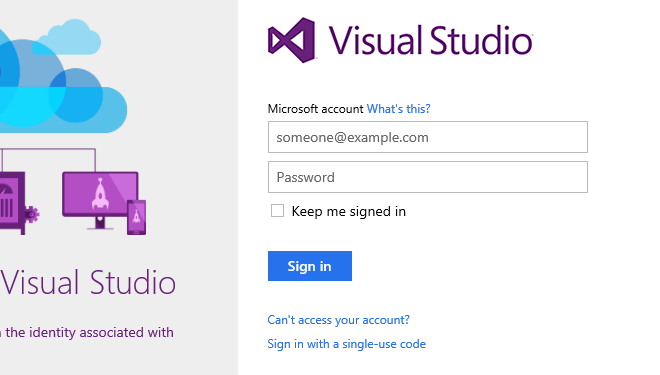
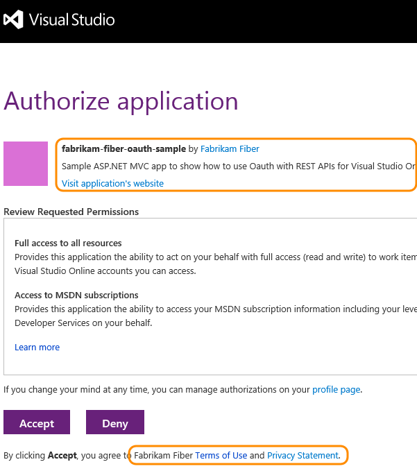
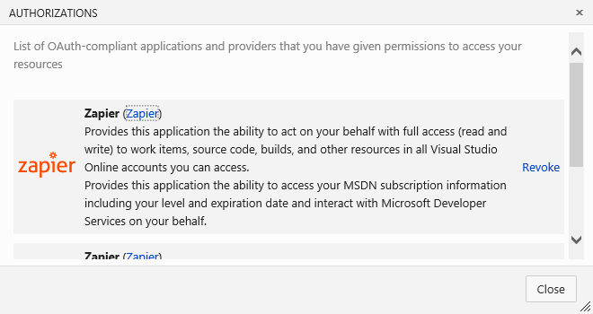

# Authorize other services to access your Visual Studio Online account

When you use a service that's integrated with Visual Studio Online,
we use the industry-standard OAuth 2.0 authorization framework to provide safe,
secure access to your resources by those other services.
With OAuth, you grant a service the authorization to access your Visual Studio Online
resources such as work items, source code, build results.

- Authorizations are bound to your credentials,
so the service can use the authorization to access resources
in any Visual Studio Online account that you have access to.
- Use your Microsoft account (like `me@live.com`) or your work account
(your account in Azure AD - like `me@my-workplace.com`) to authorize the service.
- The service that you authorize never has access to your Visual Studio Online credentials.
- Revoke any authorizations that you've granted to other services.

## Authorize a service

A typical authorization flow might go like this:

1. You're using a service that uses Visual Studio Online resources,
so the service requests authorization from Visual Studio Online.
2. If you're not already signed in, Visual Studio Online will prompt you for your credentials.

3. After you've signed in, you get the Visual Studio Online authorization approval page.

At this point in time, services can only request full access to all of the resources that are available to you through the REST APIs, so don't be surprised that the authorization request is not more specific.
4. You review the request and approve the authorization.
5. The authorized service uses that authorization to access resources in your Visual Studio account.

To ensure an authorization request is legitimate:

- Look for the Visual Studio Online branding across the top of the authorization approval page.
- Ensure the authorization approval page URL begins with `https://app.vssps.visualstudio.com`.
- Pay attention to any HTTPS-related security warnings in your browser.
- Remember that other services do not ask for your credentials directly. They let you provide them to Visual Studio Online through the Visual Studio Online authorization approval page.

## Manage authorizations

To see the services that you've authorized to access your account,
go to [https://app.vssps.visualstudio.com/Profile/View](https://app.vssps.visualstudio.com/Profile/View)
and follow the **Manage applications** link.

You can revoke any authorizations here and the service will no longer be able to access your account on your behalf.

