<properties
	pageTitle="Zendesk with Visual Studio Online"
  description="Zendesk with Visual Studio Online"
  services="visual-studio-online"
  documentationCenter = ""
  authors="terryaustin"
  manager="terryaustin"
  editor="terryaustin" /> 

# Zendesk with Visual Studio Online

If you use Zendesk to support your customers, 
you can create work items in Visual Studio Online directly from your Zendesk tickets.
Then you can configure Visual Studio Online to update the Zendesk ticket when the work item is updated.

## Set up Visual Studio Online for Zendesk

1. Download the .zip file that contains the Visual Studio Online for Zendesk app from [CodePlex](https://vsozendesk.codeplex.com/).
2. If you don't have a Zendesk account, [get one](http://zendesk.com/).
3. Go to your Zendesk administration page to mange your apps.

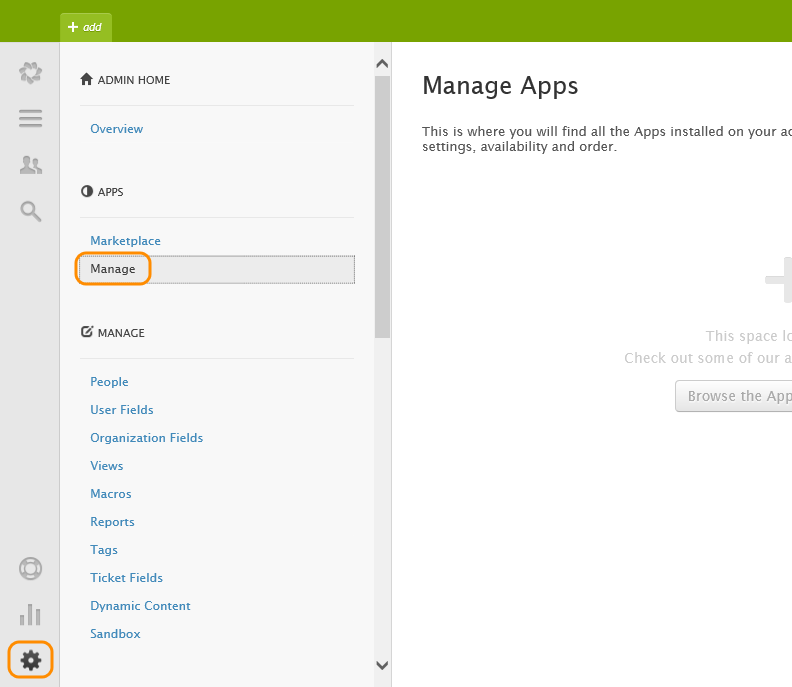
4. Upload the Visual Studio Online for Zendesk app that you downloaded from CodePlex.

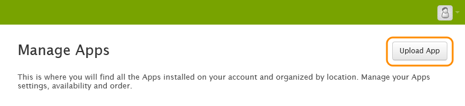
5. Install the app.

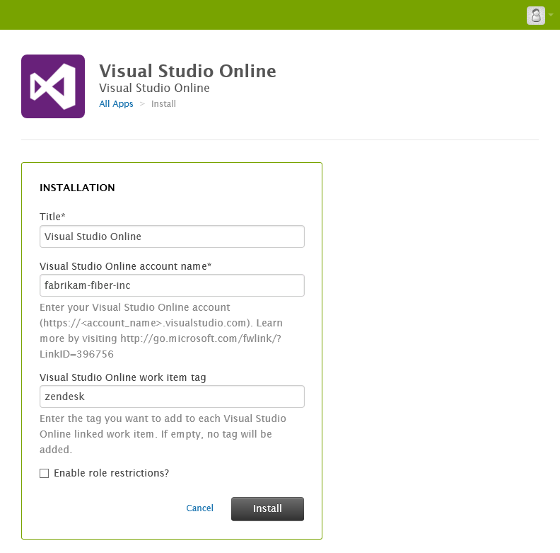

If you use a work item tag, work items you create from Zendesk will have that tag. Later, you can use it to find items that were created from Zendesk.
6. **Enable alternate credentials** for your Visual Studio Online profile. If you haven't done that, look at how that's done here.

## Create a work item from Zendesk

1. Go to a ticket in Zendesk and log in to the Visual Studio Online for Zendesk app.

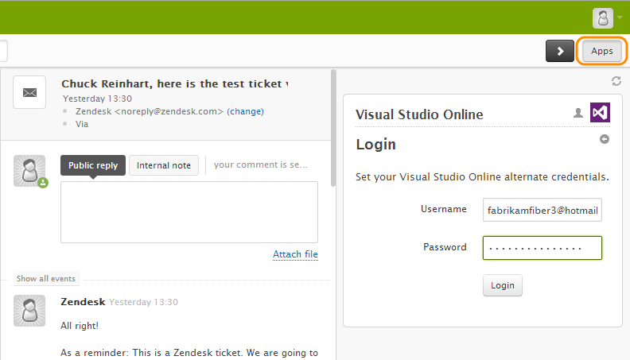
2. Add a work item to Visual Studio Online based on this ticket.

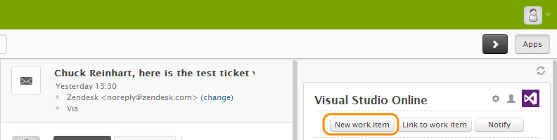
3. Create the work item.

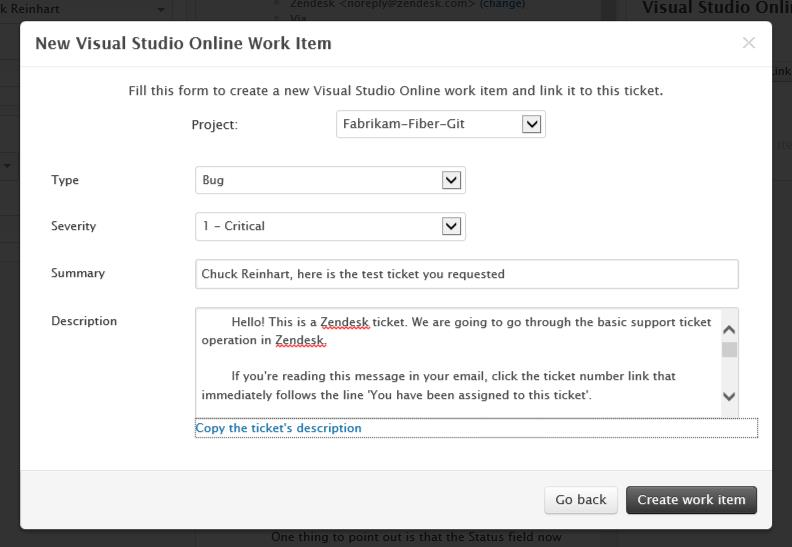
4. Open the work item in Visual Studio Online directly from Zendesk.

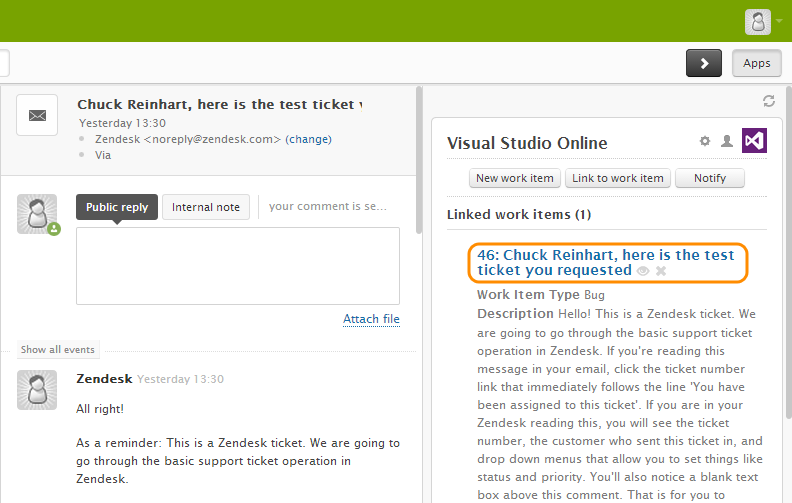

In Visual Studio Online, the work item is tagged with the tag you set up , and it's linked back to the ticket in Zendesk.

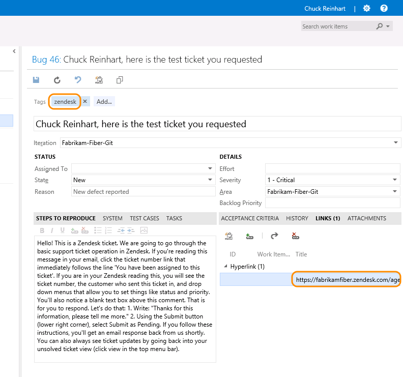

## Configure Visual Studio Online to update Zendesk tickets

Close the loop by configuring Visual Studio Online to update the Zendesk tickets whenever there's a change in the work items that were created from Zendesk.

1. Go to the your Zendesk API administration page.

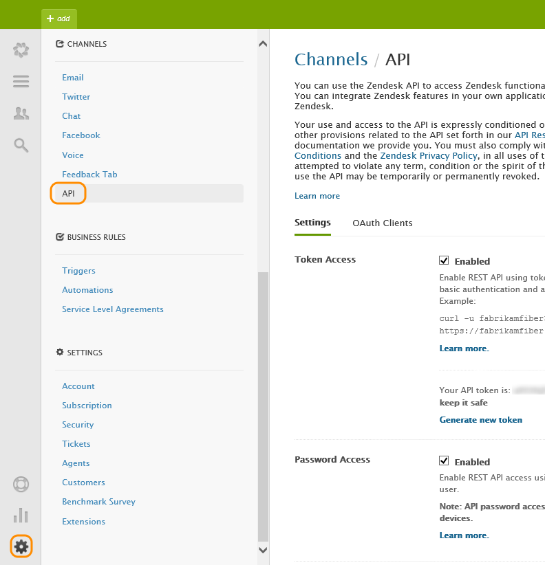
2. Enable token access and copy your token.

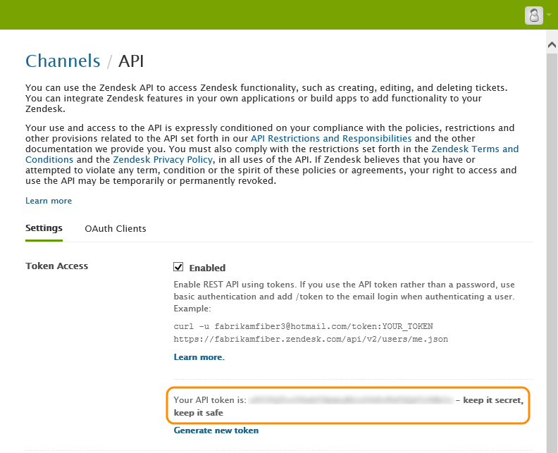
3. Go to a team project in your Visual Studio Online account and open the project adminstration page.

4. On the service hooks tab, add a service hook.

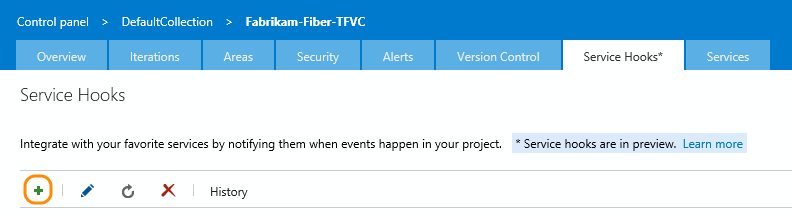
5. Start configuring Zendesk.

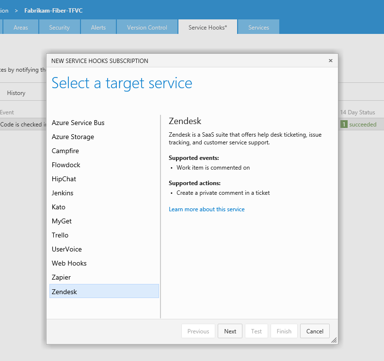
6. Use the **Work item is commented on** event.
You can filter for comments, too.
For example, you can only act on comments that contain the string "Zendesk:"
and only those comments will be reflected back to Zendesk.

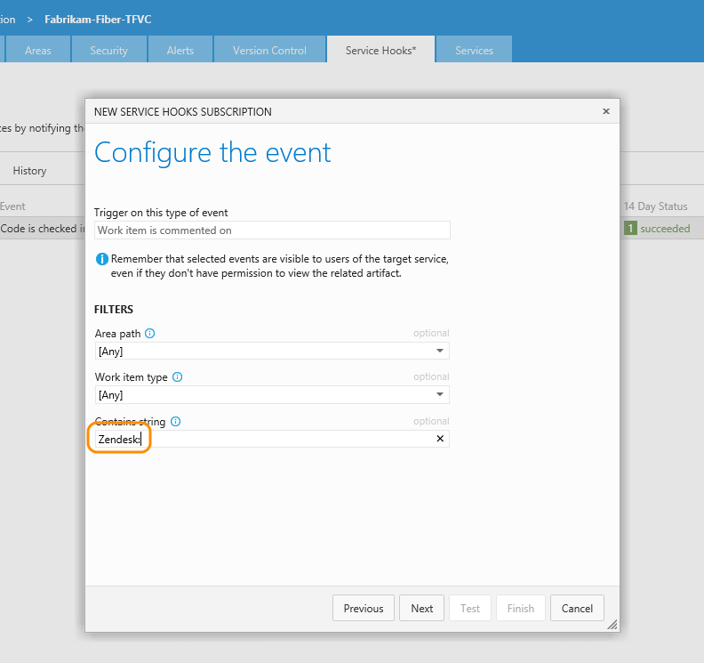
7. Configure the action that Zendesk will take in response to that event. This is where you provide the Zendesk access token.

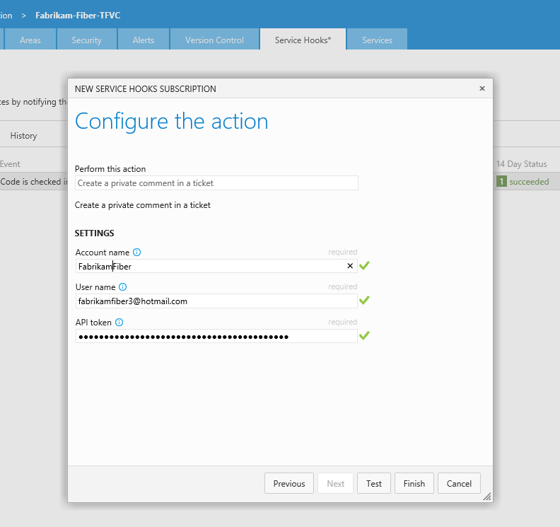

Now when you update the work item, a private comment will be added to the Zendesk ticket.

## Q &amp; A

#### Q: Can I programmatically create subscriptions?

A: Yes, use the [REST APIs](https://www.visualstudio.com/integrate/get-started/service-hooks/create-subscription).
