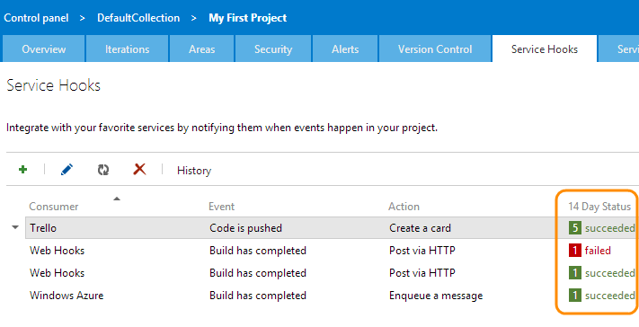
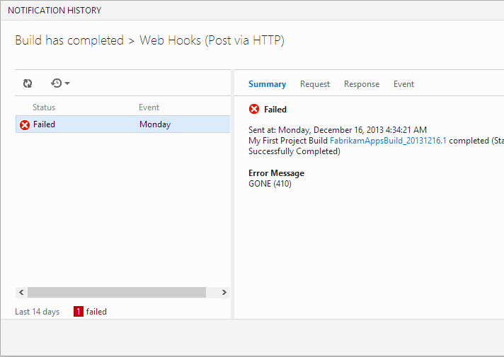

<properties
	pageTitle="Troubleshoot a service hooks issue"
  description="Troubleshoot a service hooks issue"
  services="visual-studio-online"
  documentationCenter = ""
  authors="terryaustin"
  manager="terryaustin"
  editor="terryaustin" /> 

# Troubleshoot a service hooks issue

## View activity and debug problems


The Service Hooks tab in the web access admin shows your the recent activity (last 14 days)
for each subscription, and whether a subscription is enabled, disabled, or restricted.


Detailed history about a subscription can be accessed,
as well as detailed request/response data
(useful for debugging a problematic service or subscription).


1. To view the activity and status of your subscriptions,
go to the Service Hooks tab.



2. To view detailed activity for a subscription, including full request, response,
and event payload data, select a subscription in the table and click **History**.




## Q &amp; A

#### Q: What does the status Enabled (restricted) mean?


A: A subscription becomes restricted if too many failures occur.


#### Q: What should I try if a service hook is not working?


A: Check these:


- Confirm the subscription is enabled.
- Confirm the subscription settings are correct (both event filters and actions).
- Look at the History, especially if there are failures.

#### Q: Can I grant a regular project user the ability to view and manage service hook subscriptions for a project?


A: Use tfssecurity.exe from the command line, for example:


```
tfssecurity /a+ /collection: https://fabrikam-fiber-inc.visualstudio.com/DefaultCollection ServiceHooks PublisherSecurity/abcdef00-abcd-0000-0000-abcdef000000 EditSubscriptions n:fabrikamfiber4@hotmail.com ALLOW
```


**Note:** The GUID represents the team project ID which can be retrieved using the [Projects](https://www.visualstudio.com/integrate/api/tfs/projects) REST API.


#### Q: Can I programmatically create subsciptions?


A: Yes, use [REST APIs](https://www.visualstudio.com/integrate/get-started/service-hooks/create-subscription).
