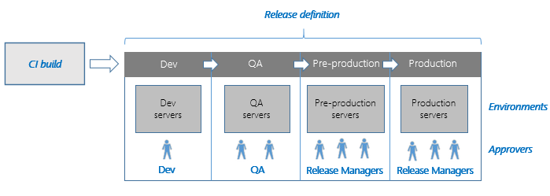

<properties
	pageTitle="Automate and manage your deployments with Release Management"
  description="Automate and manage your deployments with Release Management"
  services="visual-studio-online"
  documentationCenter = ""
  authors="terryaustin"
  manager="terryaustin"
  editor="terryaustin" /> 

  

 
See also [https://msdn.microsoft.com/Library/vs/alm/release/overview](https://msdn.microsoft.com/Library/vs/alm/release/overview)  

# Automate and manage your deployments with Release Management

Support a rapid release cadence and manage simultaneous releases. 
Set up release paths that represent your stages from development to 
production. Run actions to deploy your app to an environment for that 
stage. Add approvers to sign off that the app has successfully passed 
each stage. Start your release process manually or from a build. 
Then track your releases as they move through your release path.

Release Management is available in two forms:

- The preview of the **"vNext"** version that is currently available as a service within Visual Studio
Online.

- The **server and client** version. The client runs inside Visual Studio 
and interfaces with a server running on a central build server. It is
typically used with Team Foundation Server, although this is not a
requirement. The server and client version is available for 
Visual Studio 2015 and Visual Studio 2103.

Both versions use deployment agents to configure the target servers, and 
to deploy applications and other artifacts. When you connect to Visual 
Studio Online from the Release Management client, or use the vNext version 
in Visual Studio Online, you can take advantage 
of a built-in hosted agent for deployments to Microsoft Azure environments.

 
For more information:

- Go **[here](https://msdn.microsoft.com/Library/vs/alm/release/overview-rmpreview)** 
if you are using the "vNext" version of Release Management as a 
service in Visual Studio Online.

- Go **[here](https://msdn.microsoft.com/Library/vs/alm/release/overview-rm2015)** 
if you are using the server and client version of Release 
Management in Visual Studio 2015 and Team Foundation Server.

- Go **[here](https://msdn.microsoft.com/library/dn217874%28v%3Dvs.120%29.aspx)** 
if you are using the server and client version of Release 
Management in Visual Studio 2013 and Team Foundation Server.

