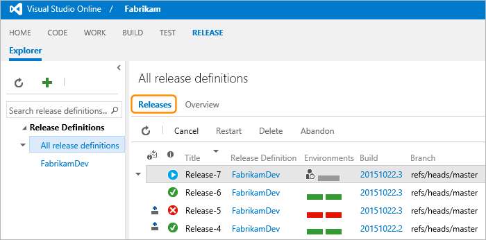

  
 
See also [https://msdn.microsoft.com/Library/vs/alm/release/overview-rmpreview](https://msdn.microsoft.com/Library/vs/alm/release/overview-rmpreview)  

# Release Management for Visual Studio Online

Release Management is a service in Visual Studio Online (VSO) 
that helps you automate the deployment and testing
of your software in multiple environments. Using Release Management, you
can either fully automate the delivery of your software all the way to 
production, or set up semi-automated processes with approvals and 
on-demand deployments. It is an essential element of DevOps that helps 
your team **continuously deliver** software to your customers at a faster 
pace and with lower risk.

VSO is a **highly scalable, high quality, proven system** that is
suitable for enterprise and large organizations, yet still offers seamless 
integration and automation opportunities in application lifecycle 
management to agile teams. Release Management, being part of VSO, 
can be used by all kinds of software developers for continuous automated 
deployment, or by large enterprises to improve efficiency and collaboration
between various teams that participate in release processes.

To use Release Management, you create **release definitions**, in which 
you specify the automation steps that should be run in each environment. 
These automation steps can be to deploy your software or to run tests 
against it. You can group multiple environments in each definition to 
model your software lifecycle. You can then set up the deployment in each 
environment to be automatically triggered upon completion of a build, or 
on successful deployment to a previous environment.

 
Find out more **[here](https://msdn.microsoft.com/Library/vs/alm/release/overview-rmpreview)**.

## Differences between this version and the server and client version for Visual Studio

This version of Release Management takes some of the best ideas from 
the previous version, but has been implemented from the ground up in 
a new architecture that supports:

- **Fewer concepts**. "Release Paths" and "Release Templates" have been 
replaced by a single concept called ***release definitions***. 
Using release definitions, you can define both the "path" (the 
series of environments and approvals that your applications needs 
to go through) as well as the "template" (the sequence of automation 
steps that should be executed in each environment). Furthermore, the 
concepts of "stages" and "environments" have been combined into a 
single concept named ***environments***.
- **Team projects**. The RELEASE hub is integrated into Team Projects. 
However, you can still deploy builds that are generated by other team 
projects.
- **REST APIs**. The service now exposes REST APIs that you can use to 
integrate with your own workflows. These APIs are similar to those 
exposed by others services in VSO.
- **Distributed Tasks**. The previous version of Release Management was 
based on XAML workflows and tasks that were hard to extend and maintain. 
This version is based on the same distributed task execution 
infrastructure as the BUILD service. All the tasks in your Build and 
Release Management flows are executed on a pool of agents, which monitor 
your VSO account for pending tasks. The communication from the agent to 
VSO is one-way over HTTPS.
- **Integrated security**. The security infrastructure of Release Management is 
different from the previous version in that it does not manage its own 
groups and permissions. New permissions are introduced in VSO for 
Release Management, such as "Create release definitions", "Create 
releases", and "Manage approvers". Default values for these permissions 
are set for specific groups at the team project level. These permissions 
can then be overridden for the groups or individual users, for a 
specific release definition or for a specific environment within a 
release definition.

 
Find out more **[here](https://msdn.microsoft.com/Library/vs/alm/release/overview-rmpreview)**.

