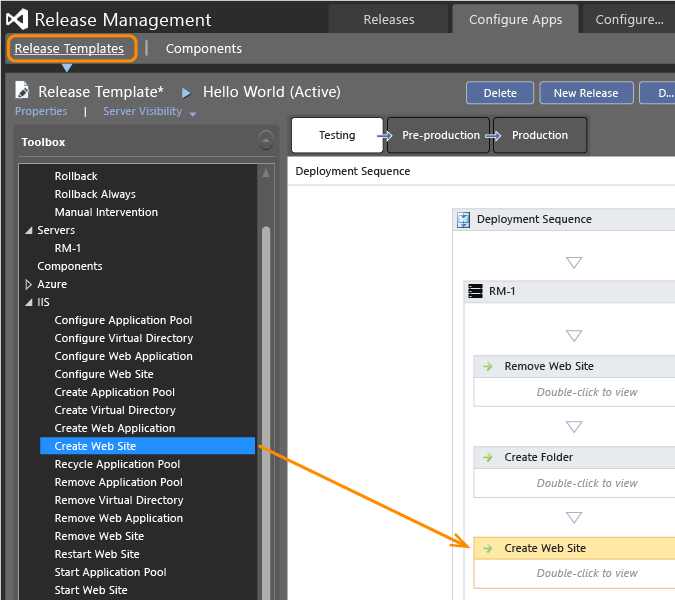

  
 
See also [https://msdn.microsoft.com/library/dn217874(v=vs.120).aspx](https://msdn.microsoft.com/library/dn217874%28v%3Dvs.120%29.aspx)  

# Release Management for Visual Studio 2013 and TFS

Improve the process of managing the release of your app. Deploy your app to a specific 
environment for each separate stage. 
Manage the steps in the process with approvals for each step.

 
Find out more **[here](https://msdn.microsoft.com/library/dn217874%28v%3Dvs.120%29.aspx)**.

You can connect to Release Management Server running on an on-premises server,
or you can connect directly to Visual Studio Online. Then you add stages for each step you
need in the release process of your app.

With Visual Studio 2013 Update 3 or later, you can use 
Windows PowerShell, Windows PowerShell Desired State Configuration (DSC), 
or Chef to deploy to a server without a deployment agent. 
If you already deploy using any of these tools, 
you can use the same scripts with Release Management. Or you can use deployment agents 
to deploy to a server.

Use use a sequence of release actions to perform the deployment. 
Use any of the predefined release actions listed in the 
toolbox, or create your own custom release actions.

Then you can create and run your release.

 
Find out more **[here](https://msdn.microsoft.com/library/dn217874%28v%3Dvs.120%29.aspx)**.

