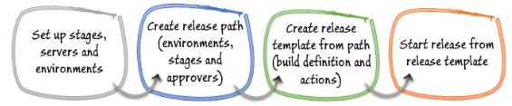
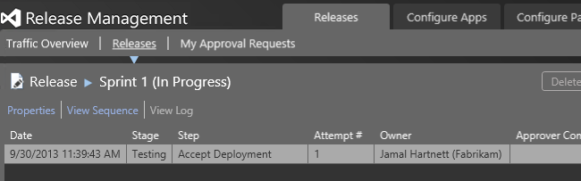

<properties
	pageTitle="Release Management for Visual Studio 2015 and TFS"
  description="Release Management for Visual Studio 2015 and TFS"
  services="visual-studio-online"
  documentationCenter = ""
  authors="terryaustin"
  manager="terryaustin"
  editor="terryaustin" /> 

  
 
See also [https://msdn.microsoft.com/Library/vs/alm/release/overview-rm2015](https://msdn.microsoft.com/Library/vs/alm/release/overview-rm2015)  

# Release Management for Visual Studio 2015 and TFS

Manage the release of your app by deploying it to a specific 
environment for each separate release step, and by controlling 
the process through approvals for each step.

This version of Release Management for Visual Studio 2015 is very similar to the previous version, but 
offers improved performance in the following areas:

- The release management client launch page, which shows an overview of the release process and notifications.
- Rendering and interactivity in other release management client pages, through additional caching.
- Synchronization of Active Directory and TFS security groups.
- Creation of new releases.

 
Find out more **[here](https://msdn.microsoft.com/Library/vs/alm/release/overview-rm2015)**.

With Release Management for Visual Studio 2105 you have the following options for managing your releases:

- **Use Release Management as a service in Visual Studio Online**. 
You need a Visual Studio Online account. 
You cannot use Chef and you can deploy only to vNext environments based on Azure IaaS services.
- **Use an on-premises server**. You need to install Release Management Server.

In both options, you'll use the Release Management Client to set up and run your releases. 
If you manage your releases with an on-premises server, you install the client on the machine 
that hosts Release Management Server.

A guide and checklist helps you set up your environment.

Then you add stages for each step you need in the release process of 
your app, and add a sequence of release actions to perform the deployment. 
Use any of the predefined release actions listed in the 
toolbox, or create your own custom release actions.

Then you can create and run your releases.

 
Find out more **[here](https://msdn.microsoft.com/Library/vs/alm/release/overview-rm2015)**.

