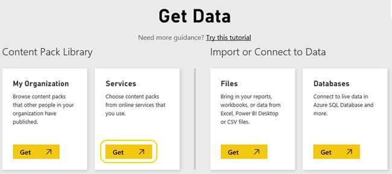
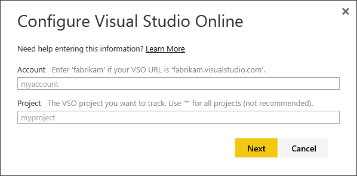
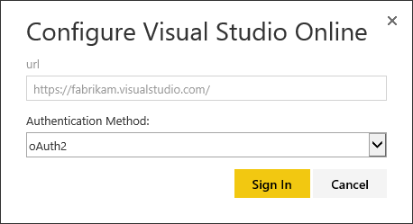
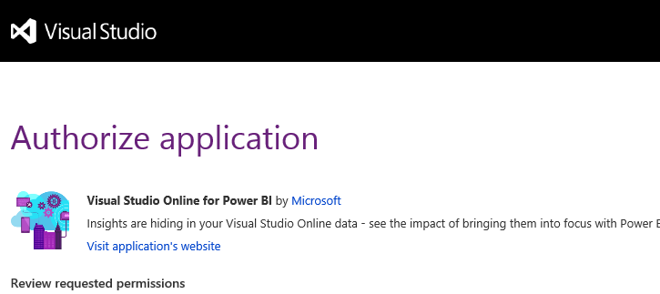
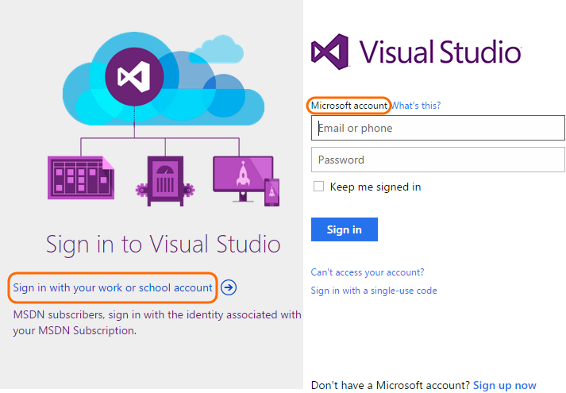

<properties
	pageTitle="Connect Power BI to Visual Studio Online"
  description="Connect Power BI to Visual Studio Online"
  services="visual-studio-online"
  documentationCenter = ""
  authors="terryaustin"
  manager="terryaustin"
  editor="terryaustin" /> 

# Connect Power BI to Visual Studio Online

You can gain insight and analyze the progress and quality of your project by connecting Power BI to the data collected and stored for Visual Studio Online. Currently, you can access data collected for source control, builds, and work item tracking. Over the next several months, the data you'll have access to will grow and we'll update this page to reflect what's currently available.

For a list of currently available data, see [What's available in the Power BI Visual Studio Online Connector](vso-pbi-whats-available-vs.md).

## Authorize Power BI to access your account data

Your first step requires you to authorize Power BI to access your Visual Studio Online account. Choose between one of these two connection scenarios when connecting to Power BI:

- **Scenario #1:**You use the same Azure Active Directory (AAD) account to log in to Visual Studio Online and Power BI.

- **Scenario #2:**You use an MSA (Microsoft account/LiveID) to log in to Visual Studio Online or you use different AAD credentials to log into Visual Studio Online than you use to log into Power BI.

### Scenario #1: Log in using AAD

1. Open a web browser and go to [http://powerbi.com](http://powerbi.microsoft.com/).

2. Click **Sign In** in the upper right corner to log in to Power BI.

3. In the lower left corner, click **Get Data**.

> **Note:**  If you don't have a Power BI account you can create one by entering your email address and click **Use it free**.

4. Click **Get** under **Services** on the Get Data page.

5. Select the Visual Studio Online connector and click **Connect**.

6. Enter the names of the account and team whose data you want to connect to and click **Next**.

> **Important:**  For the **Account**, *do not include***visualstudio.com** (if the account is "corpx.visualstudio.com" just enter "corpx").

> **Note:**  Wildcards are supported for the **Project** name. You could enter "*" for every project in the account or, if you had projects with these names "Test1", "Test2", "Test3", "App1", "App2" and entered "Test*" Power BI will retrieve data for the projects Test1, Test2 and Test3. However, you cannot enter something like "T\*st".

7. The next step specifies the authentication method. Only oAuth2 is supported. Click **Sign In** to continue.

> **Important:**  You won't be able to connect if your account administrator disabled third party application access via OAuth.   

> When enabled, it appears as follows on the Administration &gt; Control panel &gt; Settings page:   

>   

>   

>   

> 

> 

>  Contact your account administrator to determine if it needs to be enabled.

8. Successful authorization displays the following authorization dialog which allows Power BI to retrieve data from your account. Scroll down to the bottom and click **Accept**.

9. Once Power BI is authorized, data will begin to load and you'll be presented with a loading screen until the data is complete. Depending on how much data there is, it may take a few minutes to as long as 30 minutes to complete the data load.

At this point you can close your browser and come back to Power BI later. Power BI data refreshes every 24 hours by default. If you have a paid Power BI account, you can refresh the data as frequently as every hour.

### Scenario #2: Log in when you use different credentials for Visual Studio Online and Power BI

If you are using a Microsoft Account or different AAD credentials than you use for Power BI, you will need to supply those credentials to VS Online to get access to the data. This can happen in one of two ways. Either, the connect experience will prompt you for the credentials or, if you access VS Online often, your browser may have your most recent credentials cached. If the cached credentials match the account you are connecting to, it will work seamlessly, however, this caching can be confusing if the last account/username you used isn't the one you need to enable Power BI to access the VS Online data. This can lead to Access Denied errors. If you are getting access denied errors without any prompt for credentials, then you should use In Private in IE or Incognito in Chrome to bypass the cache.

If your cached credentials work, you won't get prompted. If you don't have cached credentials, then you will be prompted to login to VS Online. If you are using a Microsoft account enter your credentials on the right hand side of the dialog. If you are using AAD credentials, click the **Sign in with your work or school account** link on the left hand side of the dialog.

> **Important:**  There is a situation that can occur where Power BI will still try to use your cached credentials even though they are different than the credentials you used when logging onto Power BI. In this case, the Visual Studio Online Authorize dialog will still be displayed however, you'll be logged on as the wrong user. To correct this situation, do the following:   

>   

> - Click **Sign out** in the Authorize application page  

> - Close the page and click **Sign In** again on the Power BI Configure Visual Studio Online dialog  

> - You will then be prompted to enter your VS Online credentials and everything will work as normal.

## Related Power BI connection notes

Always check into updates of [What's available in the Power BI Visual Studio Online Connector](vso-pbi-whats-available-vs.md) to learn about the latest data and changes made to the Visual Studio Online Connector.

To understand the default reports available, see [Create reports with data from Visual Studio Online using Power BI](report-on-vso-with-power-bi-vs.md).

To get started using Power BI, see the [knowledge base of articles](https://support.powerbi.com/).

