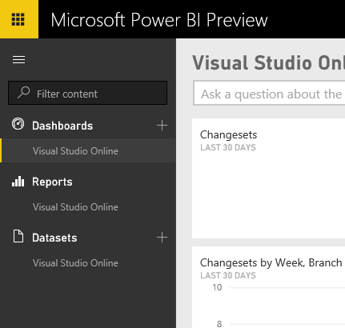

<properties
	pageTitle="Create Power BI dashboards and reports"
  description="Create Power BI dashboards and reports"
  services="visual-studio-online"
  documentationCenter = ""
  authors="terryaustin"
  manager="terryaustin"
  editor="terryaustin" /> 

# Create Power BI dashboards and reports

You can create dashboards, individual reports, or explore data collected for your Visual Studio Online account once you [connect to Power BI](connect-vso-pbi-vs.md). As the Power BI data model for Visual Studio Online grows to include more features you'll have access to more advanced reporting. As Power BI is upgraded, it will provide you with additional visualizations and capabilities over time without any upgrades.

Prior to working with Visual Studio Online data, review [Power BI Preview - basic concepts](https://support.powerbi.com/knowledgebase/articles/487029-power-bi-preview-basic-concepts).

## Get started

After getting connected to VSO you will see an initial dashboard. On the left side of the screen you will notice Dashboards, Reports and Datasets.

These are related in the following way: Dashboards contain charts that are based on Power Q&amp;A or charts contained in a report. Reports contain charts based on data contained in the dataset.

Currently, a report can be based on a single dataset. You can create as many reports based on a dataset as you want. Dashboards can contain charts from one or more reports or Power Q&amp;A questions.

> **Note:**  Consider renaming the dataset, report and dashboard immediately after the data finishes loading. Every time you click **Get Data**, new data is imported with the name "Visual Studio Online"  and another dataset, report and dashboard is created. This can become confusing very quickly.   
>  
> A good habit is to rename the datasets based on either the account or the project name. For example, using Fabrikam as the account or Fabrikam.projectA to differentiate a project will make using Power BI much easier.

## Work with datasets

Refer to Power BI [Explore the dataset](http://support.powerbi.com/knowledgebase/articles/475159-explore-a-dataset) for information on working with datasets.

## Work with reports

Reports are at the heart of Power BI and provide the basis for dashboards. Dashboards are the shareable component of Power BI. See the Power BI documentation on [Reports](http://support.powerbi.com/knowledgebase/articles/425684-reports-in-power-bi) for more information.

### Understand the default report

The Visual Studio Online content pack generates a single report with several pages.

| Report page | Description |
| --- | --- |
| Open Bug Status | This is a general bug status report which is applicable to all three of the [out-of-the-box processes (Agile, CMMI, and Scrum](https://msdn.microsoft.com/Library/vs/alm/Work/guidance/choose-process). All charts exclude closed bugs (State=Closed or Done).  |
| Git Activity | Provides source control file information for a team project created to use Git. Report pages show data from the last 30 days only. |
| (Team Foundation) Version Control | Provides source control file information  for a team project created to use Team Foundation version control (TFVC).   |
| Builds (Xaml) | Information related to automated builds. This does not include the latest build engine released with TFS 2015 (formerly Build v.Next). |
| Agile Project Status \*  |  basic report that details data pertinent to a team project created with a version of the [Agile process](https://msdn.microsoft.com/library/dd380647.aspx).  |
| Scrum Project Status \*  |  basic report that details data pertinent to a team project created with a version of the [Scrum process](https://msdn.microsoft.com/library/ff731587.aspx).  |
| CMMI Project Status \*  | A basic report that details data pertinent to a team project created with a version of the [CMMI process](https://msdn.microsoft.com/library/dd997574.aspx).  |
| Pull Requests | Provides information related specifically to pull requests for a team project created to use Git. |

\*  Delete any project status report pages that don't apply to your particular situation and update the dashboard as appropriate.

### Edit the default report

For information on how to edit the default report, see the Power BI documentation [here](https://support.powerbi.com/knowledgebase/articles/425684-reports-in-power-bi-preview).

## Work with Dashboards

See the Power BI [documentation](https://support.powerbi.com/knowledgebase/articles/424868-dashboards-in-power-bi-preview) for help in creating and managing Dashboards.

