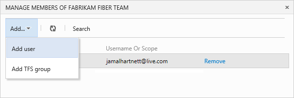

<properties
	pageTitle="Add team members"
  description="Add team members"
  services="visual-studio-online"
  documentationCenter = ""
  authors="terryaustin"
  manager="terryaustin"
  editor="terryaustin" /> 

# Add team members

Now you have a team project, you can use Visual Studio Online to share your work. 
You can all work on the same code, create backlog items and bugs, track the team 
status, and more.

1. If you're not signed in to your Visual Studio Online account (youraccount.visualstudio.com), sign in now.
2. On your account overview page, select your team project. To find your team 
project, use Browse.

3. Manage team members from the team project home page.

4. Add users to your team.

Use their sign-in addresses or display names. Add them one at a time or all at the same time.

Your team must sign in with Microsoft accounts unless your Visual Studio Online account
uses a directory to control access. If it does, users must be directory members to get access.
[How do I find out whether my account uses a directory?](assign-licenses-to-users-vs.md#ConnectedDirectory)

If you have directory administrator access, you can [add usrs to
the directory](https://msdn.microsoft.com/library/azure/hh967632.aspx). If not,
work with the directory administrator to add users. Find out more about [controlling access    with a directory.](manage-organization-access-for-your-account-vs.md)

Now these users are members of your team. Each team member gets an invitation 
email that links to your Visual Studio Online account. They can use this link 
to sign in and access the team project.

First-time users who sign in to Visual Studio Online might be asked for 
extra details to personalize their experience.

## Try this next

- [Create a team project](connect-to-visual-studio-online.md) to store your code.
- [Create a backlog](../workcreate-your-backlog-vs.md) to plan, organize, and track your work.

## Q&amp;A

#### Q:    Why can’t I add more team members to my Visual Studio Online account?

A:    Each new member gets the next available license. After all 5 free licenses 
are assigned, you have to [pay for additional users](get-more-user-licenses-vs.md) 
or add [eligible MSDN subscribers](assign-licenses-to-users-vs.md). Find out more 
about [assigning licenses](assign-licenses-to-users-vs.md) when you add users.

#### Q:    Why can't some users sign in?

A:    This might happen because:

- They don't have an active and valid license [assigned to them](assign-licenses-to-users-vs.md).
- You must sign in with Microsoft accounts unless your Visual Studio Online account uses a 
directory to control access. If it does, users must be in the directory to sign in. 
[How do I find out whether my account uses a directory?](assign-licenses-to-users-vs.md#ConnectedDirectory)
If you have directory administrator access, you can add users to the directory. If you don't, 
work with the directory administrator to add them. Find out more about 
[controlling access with a directory.](manage-organization-access-for-your-account-vs.md)

#### Q:    How do I remove users from my Visual Studio Online account?

A:    Follow these steps to [delete users](assign-licenses-to-users-vs.md#deleteuser) across all 
team projects in your account. You'll have to manually remove any Visual Studio Online licenses 
that you bought but don't need anymore. If you don't, you'll continue getting charged.
