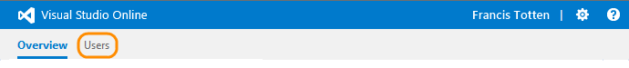
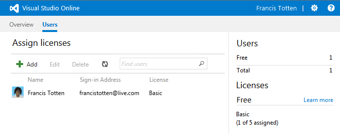
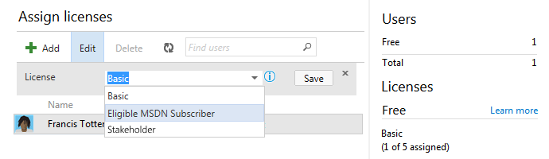
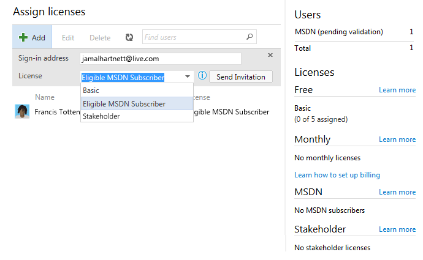
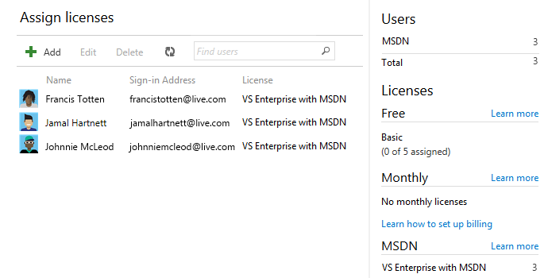
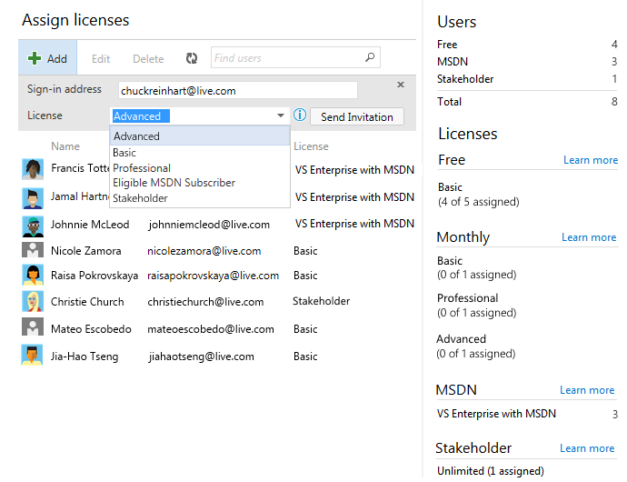
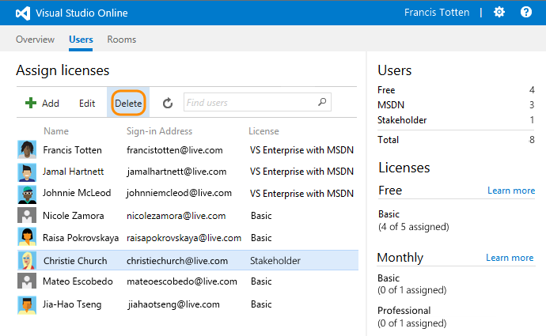
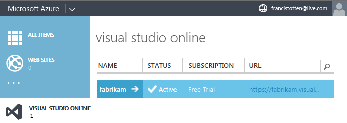
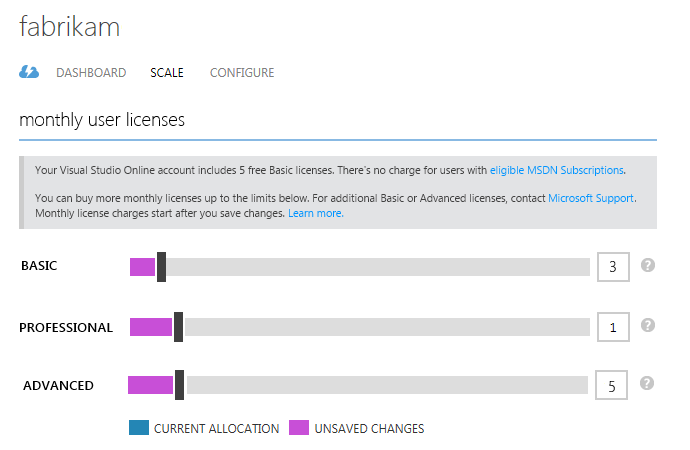
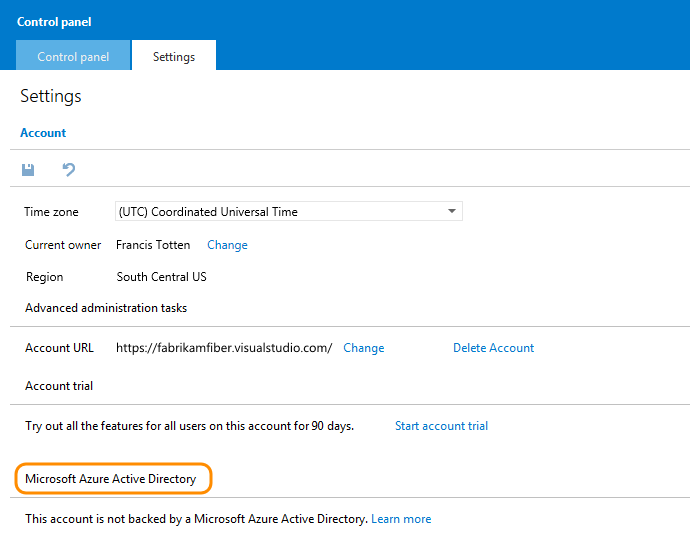

<properties
	pageTitle="Add users and assign licenses in Visual Studio Online"
  description="Add users and assign licenses in Visual Studio Online"
  services="visual-studio-online"
  documentationCenter = ""
  authors="terryaustin"
  manager="terryaustin"
  editor="terryaustin" /> 

# Add users and assign licenses in Visual Studio Online

Assign licenses to your team members when you add them to your Visual Studio Online account.
That way, you can make sure they get the correct access, services, and features they need.

## What licenses does my team need?

Each team member needs an eligible MSDN subscription, a Visual Studio Online monthly license, 
or a Stakeholder license. You get 5 free Basic monthly licenses with your Visual Studio Online account. 
You can also add unlimited Stakeholders and eligible MSDN subscribers at no extra charge.

For example, team members can use the 
[Stakeholder license](https://www.visualstudio.com/pricing/visual-studio-online-feature-matrix-vs) 
if they just need to work on your backlog. This includes creating work items and queries, 
and editing these items too.

If you have to pay for more users, you can buy more monthly licenses in the 
[Azure management portal](https://manage.windowsazure.com) 
or the [Azure portal](https://portal.azure.com) 
after you [set up billing](set-up-billing-for-your-account-vs.md) with an Azure subscription.

Learn more about [licenses and pricing](https://www.visualstudio.com/products/visual-studio-online-overview-vs), 
or about [licenses and features](https://www.visualstudio.com/pricing/visual-studio-online-feature-matrix-vs) 
for Visual Studio Online.

## Review your license

When you create your Visual Studio Online account, you automatically get a 
[Basic](https://www.visualstudio.com/pricing/visual-studio-online-feature-matrix-vs) 
monthly license. But you can change this, if you have a different license.

1. Sign in as the account owner or project collection administrator
to your Visual Studio Online account (`http://{youraccount}.visualstudio.com`).

2. View your licenses.

3. Edit your license. Save your changes when you're done.

Visual Studio Online validates your license the next time you sign in. 
[Why won't my subscription validate?](assign-licenses-to-users-vs.md#ValidateMSDNSubscription)

For example, Francis has a Visual Studio Enterprise with MSDN subscription,
which includes Visual Studio Online as a benefit. So, she changes her license 
from Basic to Eligible MSDN Subscriber. This also frees up a Basic license.

4. Add yourself to a team project, if you want. [Learn more](add-team-members-vs.md)

## Add your team and their licenses

To give your team access to your Visual Studio Online account, 
add your team members to your account and assign them licenses.

1. Sign in as the account owner or project collection administrator 
to your Visual Studio Online account (`http://{youraccount}.visualstudio.com`).

2. Is your account associated with an organization, like a company or school?

If you're not sure, find out whether your account 
[uses your organization's directory](assign-licenses-to-users-vs.md#ConnectedDirectory) 
to control who can get account access.

 - **No**: Your team will use Microsoft accounts 
(for example, @outlook.com or @hotmail.com) to sign in.

 - **Yes**: Only users in the directory can get access. 
Your team will use their work or school accounts 
(for example, @fabrikam.com) to sign in.

3. View your licenses.

4. Now add the sign-in addresses for your team members. You can add:

 - Unlimited users who have [eligible MSDN subscriptions](assign-licenses-to-users-vs.md#EligibleMSDNSubscriptions)

Visual Studio Online validates these subscriptions after users sign in.

 - Unlimited [**stakeholders**](https://www.visualstudio.com/pricing/visual-studio-online-feature-matrix-vs)
who just need to work with your backlog, for example, create or edit work items and queries.
Learn more about [working as a stakeholder](https://msdn.microsoft.com/Library/vs/alm/work/connect/work-as-a-stakeholder).

 - Up to 5 additional users with free [Basic licenses](https://www.visualstudio.com/pricing/visual-studio-online-feature-matrix-vs)

For Visual Studio Online accounts that use a directory, you can choose names from that directory when you add users.

5. If your team doesn't have [eligible MSDN subscriptions](assign-licenses-to-users-vs.md#EligibleMSDNSubscriptions),
or if they need access to additional features, you can buy Visual Studio Online monthly licenses.

 1. [Set up billing](set-up-billing-for-your-account-vs.md) for your 
Visual Studio Online account with an Azure subscription.

 2. Sign in to the [Azure management portal](https://manage.windowsazure.com) 
or the [Azure portal](https://portal.azure.com) to [buy more licenses](get-more-user-licenses-vs.md).

 3. Go to the **Users** hub.

 4. Add users and assign their licenses, or update their current licenses. 
Save your changes after editing a license.

For example, suppose you set up billing for your account. You then bought 
more licenses: 1 Basic, 1 Professional, and 1 Advanced. Now you'll assign them.

6. Now add these users to team projects as necessary. [Learn more](add-team-members-vs.md)

## Remove users from your account

When users don't need access to your Visual Studio Online account anymore, remove them.

1. Sign in as the account owner or project collection administrator
to your Visual Studio Online account (`http://{youraccount}.visualstudio.com`).

2. Delete the user and their license assignment.

3. If the deleted user has a Visual Studio Online license, you can now reassign that license. 
Or, if you bought this license through Azure, and you don't need this license anymore,
reduce your licenses in the [Azure management portal](https://manage.windowsazure.com/)
or the [Azure portal](https://portal.azure.com). That way, 
you're not charged for this license in the next billing cycle.

 1. Sign in as the Visual Studio Online account owner to the [Azure management portal](https://manage.windowsazure.com/) or the [Azure portal](https://portal.azure.com).

 2. Select your Visual Studio Online account.

 3. View your purchased licenses.

 4. Reduce your licenses, then save your changes.

## Try this next

- [Set up billing](set-up-billing-for-your-account-vs.md) for your Visual Studio Online 
account to buy more user licenses or resources, like build or load testing capacity.

## Q&amp;A

#### Q:  Why can't I assign licenses?

A:  Only the Visual Studio Online account owner and project collection administrators 
can assign licenses.

#### Q:  Which MSDN subscriptions are eligible?

A:  These MSDN subscriptions include Visual Studio Online at no extra charge:

- Visual Studio Enterprise with MSDN

- Visual Studio Test Professional with MSDN

- Visual Studio Professional with MSDN

- MSDN Platforms

You can also use these subscriptions when you get them through the BizSpark program 
or Microsoft Partner Network (MPN). Or you can use a Visual Studio Online monthly license 
instead. You get 5 free Basic licenses with your Visual Studio Online account.

Subscriptions that aren't eligible: MSDN Operating Systems, MSDN Essentials, and 
Visual Studio Professional (MPN). Visual Studio Professional (MPN) is the subscription 
offered to Microsoft Action Pack partners in the Microsoft Partner Network and was 
formerly called "MSDN for Action Pack."

Find out more about 
[Visual Studio Online with MSDN subscriptions here](https://www.visualstudio.com/pricing/visual-studio-online-feature-matrix-vs).

#### Q:  What's the difference between the Visual Studio Online licenses and MSDN subscriptions?

A:  Here's how they compare:

- Visual Studio Online Basic has the same features as Visual Studio Professional with MSDN.

- Visual Studio Online Advanced has the same features as all the other eligible MSDN subscriptions, 
and also includes a monthy subscription to Visual Studio Test Professional 2015 or later.

- Visual Studio Online Professional is the same as Visual Studio Online Basic, and includes 
a monthly subscription to the Visual Studio Professional IDE.

Find out more about 
[Visual Studio Online with MSDN subscriptions here](https://www.visualstudio.com/pricing/visual-studio-online-feature-matrix-vs).

#### Q:  When do I select "Eligible MSDN Subscriber"?

A:  Select this license when the user has an active and 
[eligible MSDN subscription](assign-licenses-to-users-vs.md#EligibleMSDNSubscriptions) 
and when you have the sign-in address that's linked to this subscription. 
If you select "Eligible MSDN Subscriber", but the user doesn't have an 
eligible MSDN subscription, they can only 
[work as a stakeholder](https://msdn.microsoft.com/Library/vs/alm/work/connect/work-as-a-stakeholder).

If the user has a different sign-in address for Visual Studio Online and for their 
MSDN subscription, they must make sure that their Visual Studio Online sign-in address 
is associated with their subscription on their 
[MSDN My Account page](https://msdn.microsoft.com/subscriptions/manage/). 
Find out how to [change the Microsoft account](https://msdn.microsoft.com/subscriptions/dd365189.aspx#changeaccount) 
associated with your subscription.

#### Q:  Why do I have to add users to a directory?

A:  Your Visual Studio Online account uses a directory to control access. 
All users must be in the directory to get access.

If you're a directory administrator, you can 
[add users to the directory](https://msdn.microsoft.com/library/azure/hh967632.aspx). 
If you're not, work with your directory administrator to add users. 
Find out more about [controlling access with a directory](manage-organization-access-for-your-account-vs.md).

#### Q:  Why won't my MSDN subscription validate?

A:  If your subscription is new, there might be a delay. Make sure that your 
subscription is [eligible](assign-licenses-to-users-vs.md#EligibleMSDNSubscriptions), active, and that it's linked to 
your Visual Studio Online sign-in address. If you're not sure, check your 
[MSDN My Account page](https://msdn.microsoft.com/subscriptions/manage/). 
Or try these sign-in 
[troubleshooting tips](http://blogs.msdn.com/b/visualstudioalm/archive/2014/03/19/visual-studio-online-best-practices-troubleshooting-issues-with-the-quot-eligible-msdn-subscriber-license-type.aspx). 
If you need more help, contact [Support](https://www.visualstudio.com/support/support-overview-vs).

#### Q:  What happens if I add people outside of the Users hub?

A:  They'll get the next available license in this order: Advanced, Basic, 
Professional, Stakeholder. Although you can change these licenses, 
add your users through the Users hub. You can then control how licenses are assigned. 
You can't add users outside of the Users hub if you don't have available licenses.

#### Q:  What happens if a user's subscription expires?

A:  If no other licenses are available, they'll 
[work as a stakeholder](https://msdn.microsoft.com/Library/vs/alm/work/connect/work-as-a-stakeholder). 
To restore their license, they must renew their subscription.

#### Q:  My user can't see certain features anymore. What happened?

A:  This happens when their assigned license isn't valid anymore, and no other 
licenses are available. They'll continue [working as a stakeholder](https://msdn.microsoft.com/Library/vs/alm/work/connect/work-as-a-stakeholder). 
If their MSDN subscription expired, they must renew it to restore their features. 
If their Visual Studio Online license is inactive, check that you still have an active 
credit card for billing your Azure subscription.

#### Q:  How do I find out if my Visual Studio Online account uses a directory to control access?

A:  Here's how:

1. Go to your account's control panel.

2. Go to your account settings. Check whether your account uses a directory to control access.

Find out more about [setting up work access](manage-organization-access-for-your-account-vs.md)
for your account with a directory. That way, you can only add users 
from your company's directory.

#### Q:  My account uses a directory to manage access. Can I just delete users from the directory?

A:  Yes, but this removes their access to all Visual Studio Online accounts and other assets 
associated with that directory. You must be the directory administrator to 
[delete a user from the directory](manage-organization-access-for-your-account-vs.md#DeleteDirectoryMembers).

