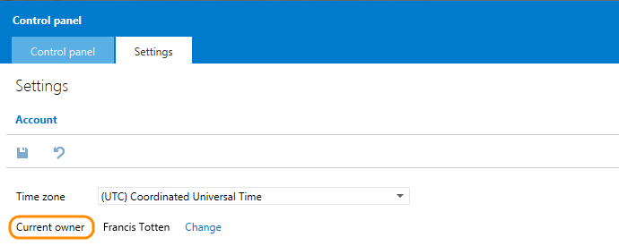
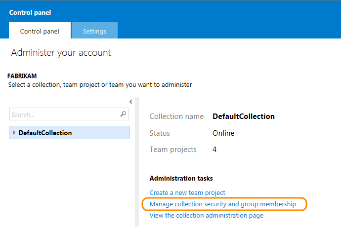
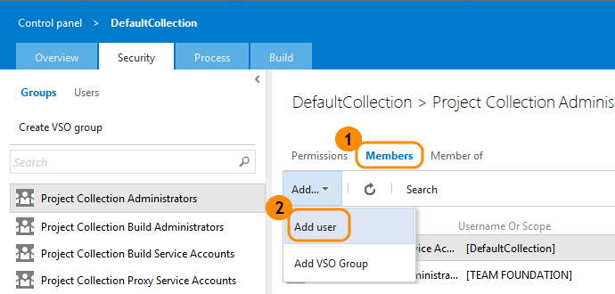
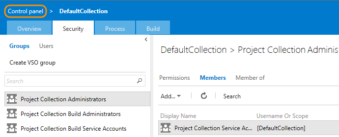
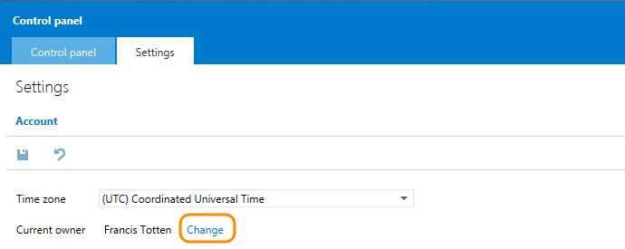
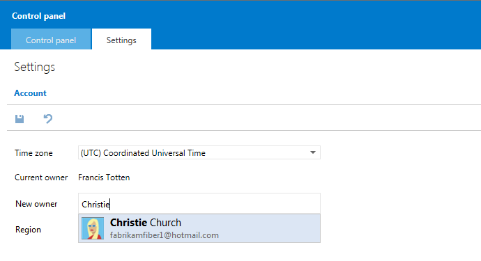
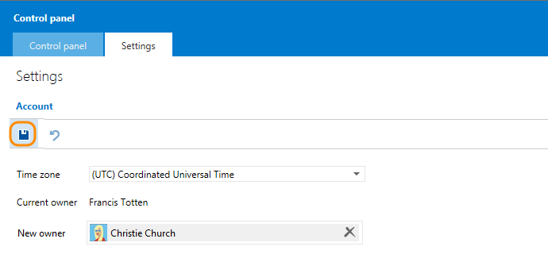

# Change Visual Studio Online account owner

When roles and responsibilities change, you might also have to change 
your Visual Studio Online account owner to another person. 
There's certain actions that only the account owner can perform, 
so make sure to keep your account ownership updated. 
Many people can contribute to projects, but there can be only one account owner.

## Find the account owner

1. Sign in to your Visual Studio Online account (`https://{youraccount}.visualstudio.com`).
2. Go to your account's control panel.

3. Review your account settings to find the current account owner.

## Change the account owner

1. Make sure that the new owner:

 - Has a Microsoft account, like @outlook.com or @hotmail.com, 
if your team uses Microsoft accounts to sign in. Or, 
they have a work account or school account, like @fabrikam.com,
if your Visual Studio Online account controls access with Azure AD. 
[Learn more about Azure AD](https://azure.microsoft.com/en-us/documentation/articles/sign-up-organization/).
 - Has been added to your Visual Studio Online account 
and has signed in to the Visual Studio Online service. 
[Learn more about adding users](https://www.visualstudio.com/get-started/setup/assign-licenses-to-users-vs).

Otherwise, you won't find this person in the potential account owners list.
2. Sign in as the current owner or a project collection administrator
for your Visual Studio Online account (`https://{youraccount}.visualstudio.com`).
Only these people can change the account owner.
3. Go to your account's control panel.

4. Go to your account's security settings.

5. Check if the new owner is a project collection administrator. If they're not, 
add them to that group so they can also ressign ownership, if necessary.

6. Go back to your account settings.

7. Change the account owner.

8. Search for the new owner, then select them.

The new owner might not appear in this list immediately, if you recently added them to your account.
[Can't find the person you want?](https://www.visualstudio.com/get-started/setup/change-account-ownership-vs#NoNewOwner)
9. Save your changes.

The previous owner is no longer the account owner. 
The new account owner now has those responsibilities and permissions.

## Q&amp;A

#### Q: Why can't I change the account owner?

A: Only the current owner or a project collection administrator can change the account owner.

#### Q: Can I reverse the account owner change?

A: Yes, if you're a project collection administrator.

#### Q: I can't find the user I want to make the new owner?

A: This might happen because:

- They haven't signed in to Visual Studio Online. 
They must also create a Visual Studio profile and agree to the Terms of Service.
- They're not a member of your Visual Studio Online account, 
or don't have a valid and active license for your account. 
[Learn more about adding them to your account](https://www.visualstudio.com/get-started/setup/assign-licenses-to-users-vs).
- If your account uses Azure Active Directory to control access, 
directory members won't appear in the potential account owners 
list until they meet the previous requirements.
- If you recently added this person to your account, you might experience delays
up to 1 hour before they appear in the potential account owners list.

#### Q: Why did you ask for extra information when I signed in?

A: If our Terms of Service have changed since you last signed in, you might be 
asked to agree and confirm that your information is up to date.

#### Q: Can I change the account URL as well as the account owner?

A: Only the account owner can change the URL. If you're the account owner, find out how to 
[change the account URL here](https://www.visualstudio.com/get-started/setup/rename-vso-account-vs).

#### Q: What happens if I'm the account owner and I forget my password?

A: You can [recover your Microsoft account or password here](https://account.live.com/ResetPassword.aspx).

#### Q: What makes the account owner different than other account users?

A: The account owner manages payments and licenses for account users. They should also 
be the same person who manages billing for the account through the 
[Azure management portal](https://manage.windowsazure.com/).

Account owners also have permissions to perform these tasks:

- Manage user licenses
- Get more build or load testing capacity
- Rename the account URL
- Change the account ownership

In contrast, project collection administrators can manage user licenses 
and change the account ownership, but they can't rename the account URL.

Want to know more about licensing, or capacity for build and load testing? 
Learn more about [pricing](https://go.microsoft.com/fwlink/?LinkId=324495),
or how to [set up billing for your account](https://www.visualstudio.com/get-started/setup/set-up-billing-for-your-account-vs).
