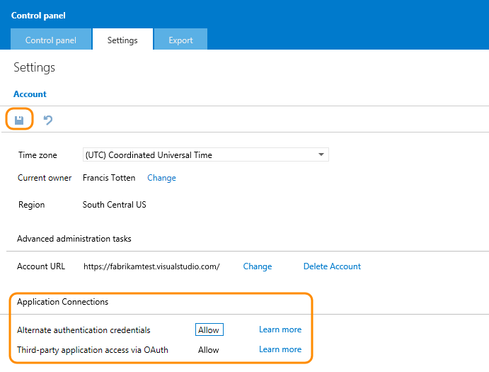

# Change application access policies for your account

Visual Studio Online provides the capability for other apps to integrate 
with its services and have access to the resources stored in your Visual 
Studio Online account. These apps can use personal access tokens or OAuth 2.0 
authorization framework to access these resources. Personal access tokens are 
a more convenient and secure replacement for alternate authentication credentials. 
If you decide to limit this access to your Visual Studio Online account, 
you must specifically set these restrictions for each of the authentication methods. 
By default, access is allowed to the resources in your account.

1. Sign in as the account owner to your Visual Studio Online account (`https://{youraccount}.visualstudio.com`).
Only account owners can change this access.
2. Go to your account's control panel.

3. Review the application connection settings, and change the settings 
based on your security policies.

If you limit access for alternate authentication credentials or access for OAuth, 
any users in your account will not be able to use the alternate authentication 
credentials or the OAuth authorizations.

Any application that could previously access your account using 
alternate authentication credentials or OAuth will receive an authentication 
error and will be unable to access the account.

## Q&amp;A

#### Q:   Where can I find more information about personal access tokens, OAuth, and alternate authentication credentials?

A:  Personal access tokens are a more convenient and secure replacement for alternate authentication credentials. 
You can use these tokens with command-line tools and to access APIs. You can create a token and limit its use to:

- The token's lifetime
- A Visual Studio Online account
- [Scopes](https://www.visualstudio.com/integrate/get-started/auth/oauth#scopes) of activities that this token authorizes

Learn more about [OAuth authentication](https://www.visualstudio.com/integrate/get-started/auth/oauth). And learn about 
[alternate authentication credentials](https://www.visualstudio.com/integrate/get-started/auth/overview) too.

#### Q:  If I turn off alternate authentication credentials for one of my Visual Studio Online accounts, will it affect all of them?

A:  No. When you turn off alternate authentication credentials for an account 
(myaccount1.VisualStudio.com, for example), you can still use alternate authentication credentials 
in the other accounts that you own (myaccount2.VisualStudio.com).

#### Q:  If I deny access to alternate authentication credentials and then allow access again will the apps that need access continue to work?

A:  Yes. The apps can then use your alternate authentication credentials again.

#### Q:  If I deny access for OAuth authentication and then allow access again will the apps that need access continue to work?

A:  Yes. The apps can then use your existing OAuth tokens again.

#### Q:  What apps are currently integrated into Visual Studio Online?

A:  You can find the [current list of apps](https://www.visualstudio.com/explore/vso-integrations-directory-vs).
