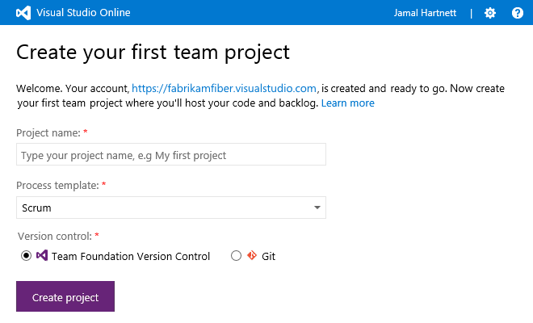
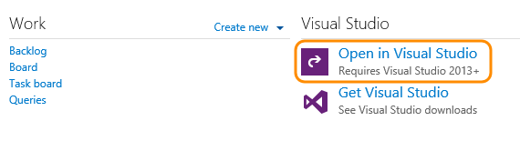
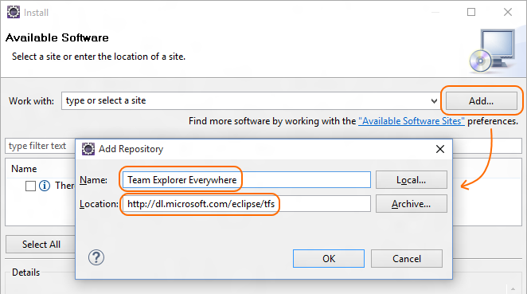
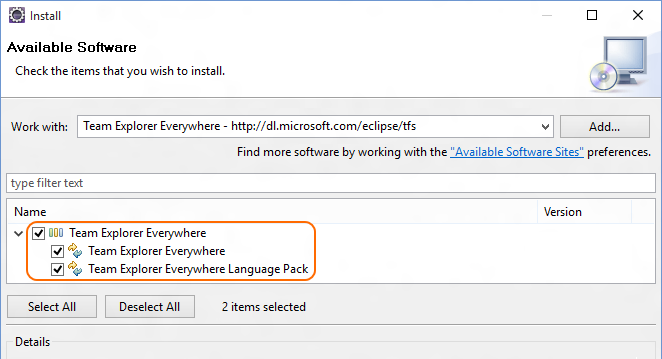
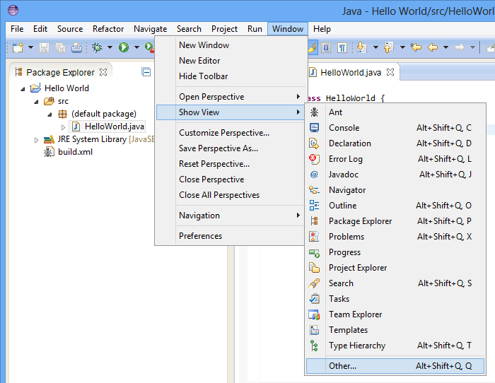
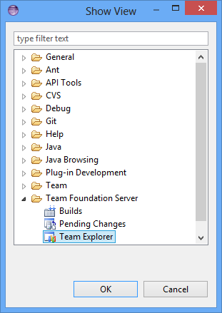
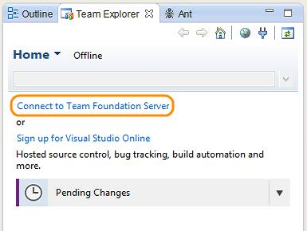
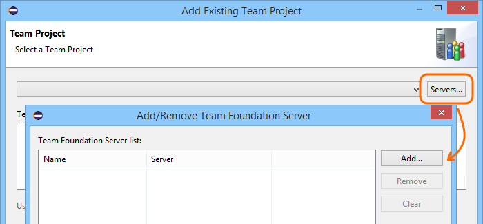
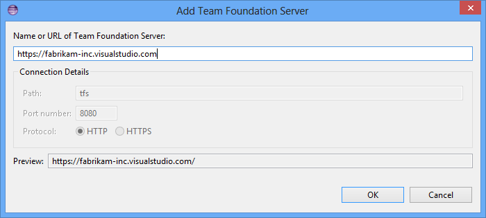
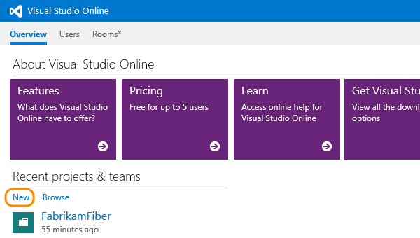

<properties
	pageTitle="Connect to Visual Studio Online"
  description="Connect to Visual Studio Online"
  services="visual-studio-online"
  documentationCenter = ""
  authors="terryaustin"
  manager="terryaustin"
  editor="terryaustin" /> 

# Connect to Visual Studio Online

After you create a Visual Studio Online account, create your first team project to store 
your code.

Before you start, if you don't have a Visual Studio Online account, [create it first](https://www.visualstudio.com/get-started/setup/sign-up-for-visual-studio-online).

## Create your first team project

1. If you're not signed in to your Visual Studio Online account 
(`http://{youraccount}.visualstudio.com`), sign in now.
2. Name your project. Select a process template to manage your work. Then choose 
your version control provider.

Q: Which process template should I choose? A: See [Work with team project artifacts, choose a process template](https://msdn.microsoft.com/library/ms400752.aspx).

Q: Which version control should I choose? A:

 - Choose Git to work in a decentralized version control system that provides lightweight branches and a good experience while working offline.
 - Choose Team Foundation Version Control (TFVC) to work in a centralized version control system that provides a good experience even if the codebase is massive.
 - Still not sure? See [Which version control system should I use?](https://msdn.microsoft.com/Library/vs/alm/code/overview#tfvc_or_git_summary)
3. Connect and share your code:

 - [Using Visual Studio](https://www.visualstudio.com/get-started/setup/connect-to-visual-studio-online#vs)
 - [Using Eclipse](https://www.visualstudio.com/get-started/setup/connect-to-visual-studio-online#eclipse)
 - [Using Xcode](https://www.visualstudio.com/get-started/setup/connect-to-visual-studio-online#xcode)

## Connect and share code from Visual Studio

If you haven't already, install 
[Visual Studio 2015](https://go.microsoft.com/fwlink/?LinkId=309297&amp;clcid=0x409&amp;slcid=0x409).

1. Open Visual Studio from your team project's page.

2. The next step depends on the kind of team project you created:

 - [Develop and share your code in Git using Visual Studio](https://www.visualstudio.com/get-started/code/share-your-code-in-git-vs)
 - [Develop and share your code in TFVC using Visual Studio](https://www.visualstudio.com/get-started/code/share-your-code-in-tfvc-vs#workspace)

## Connect and share code from Eclipse

### Install the Team Explorer Everywhere plug-in for Eclipse

1. If you haven't already, [install Eclipse](http://go.microsoft.com/fwlink/?LinkID=247298).
2. Open Eclipse and on the Help menu, select Install New Software.
3. Add a repository for Team Explorer Everywhere.

4. Select the "Team Explorer Everywhere" features.

5. Accept the terms of the license agreement and restart Eclipse when prompted.

### Connect to your team project

1. Display the team explorer.

2. Connect to Team Foundation Server.

3. Add the server.

Enter your Visual Studio Online account (`http://{youraccount}.visualstudio.com`).

**Q:** I don't know my account URL. Where can I find it? **A:**[Sign in to your Visual Studio profile](http://go.microsoft.com/fwlink/?LinkID=309329) to see a list of your accounts.
4. Connect to the team project.

### Share your code

The next step depends on the kind of team project you created:

- [Share your code in Git using Eclipse](https://www.visualstudio.com/get-started/code/share-your-code-in-git-eclipse)
- [Share your code in TFVC using Eclipse](https://www.visualstudio.com/get-started/code/share-your-code-in-tfvc-eclipse)

## Connect and share code from Xcode

The next step depends on the kind of team project you created:

- [Share your code in Git using Xcode](https://www.visualstudio.com/get-started/code/share-your-code-in-git-xcode)
- [Share your code in TFVC using Xcode](https://www.visualstudio.com/get-started/code/share-your-code-in-tfvc-xcode)

## Q&amp;A

#### Q:    Why are some features not available with my account?

A:    These features require a license:

- [Web-based test case management](https://www.visualstudio.com/get-started/test/create-a-test-plan-vs)

You can [try these features for free](https://www.visualstudio.com/get-started/setup/try-additional-features-vs). 
Or, [get licenses](https://www.visualstudio.com/get-started/setup/get-more-user-licenses-vs) that give you access to these features.

#### Q:    Why doesn't Visual Studio launch when I click "Open in Visual Studio" on my team project page?

A:    This link requires [Visual Studio 2013](http://go.microsoft.com/fwlink/p/?LinkId=254509) 
or later. It doesn't launch earlier versions of Visual Studio.

#### Q:    Can I use earlier versions of Visual Studio to connect to Visual Studio Online?

A:    Yes, you can use Visual Studio 2013 or 2012. You can also use Visual Studio 2010, 
but you'll need to install [Service Pack 1](https://www.microsoft.com/download/details.aspx?id=23691) 
and [KB2662296](http://support.microsoft.com/kb/2662296) first. Or, you can use Visual 
Studio 2008 SP1, with [this GDR update](http://support.microsoft.com/kb/2673642). 
Launch Visual Studio, then connect to Visual Studio Online using your account URL, 
and select your team project.

#### Q:    Can I create more than one team project?

A:    Yes, this keeps work separate when you have development projects for different teams. 
To create a new team project, go to your Visual Studio Online account's Overview page.

#### Q:    Can I delete a team project that I've created?

A:    Yes, you can [delete a team project](https://msdn.microsoft.com/library/ff357756.aspx) 
that you don't use anymore.

#### Q:    Can I edit the Welcome portal for my team project?

A:    Yes, the Welcome portal is authored in a Markdown file. You can edit the Markdown 
file directly from your team project's Welcome portal page. For details on writing 
Markdown, look at [John Gruber's Markdown site](http://daringfireball.net/projects/markdown/).

#### Q: Where can I learn more about Team Explorer Everywhere for Eclipse?

A: [Team Foundation Server plug-in for Eclipse](https://msdn.microsoft.com/library/gg413285.aspx)
