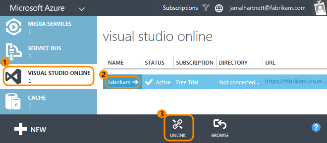
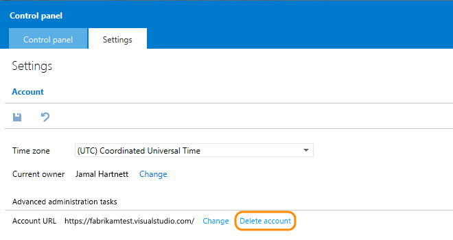
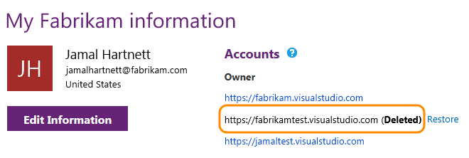
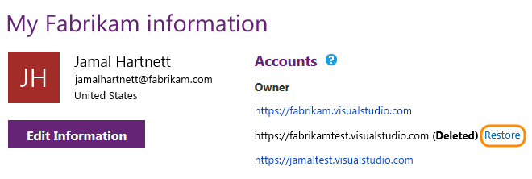
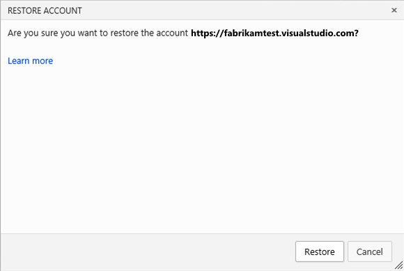
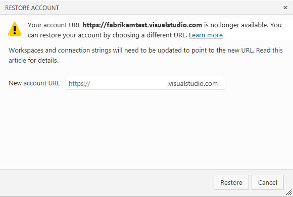

<properties
	pageTitle="Delete or restore your account"
  description="Delete or restore your account"
  services="visual-studio-online"
  documentationCenter = ""
  authors="terryaustin"
  manager="terryaustin"
  editor="terryaustin" /> 

# Delete or restore your account

If you don't need your Visual Studio Online account, you can delete it. 
If you change your mind in 90 days, you can 
[restore your account](delete-or-recover-your-account-vs.md#undelete). 
After 90 days, your account and data are permanently deleted.

When you delete your account:

- All users lose access to account services and resources immediately.

- Your account URL is available for anyone to use. It might take up to 1 hour 
before your account URL is available again.

- Your account is disabled and appears deleted in your profile for 90 days.

- If your account is linked to an Azure subscription, you must unlink it first
before deleting your account. You're still charged for any user licenses and
resources used in this billing cycle. Billing stops after the current cycle ends.

## Delete your account

1. If your account is linked to an Azure subscription, 
[sign in to the Azure Management Portal](http://manage.windowsazure.com/) 
as the subscription administrator. Unlink your account.

2. Sign in to *youraccount*.visualstudio.com as the account owner.

3. Go to your account's control panel.

4. Delete your account.

You'll be redirected to visualstudio.com, but you'll stay signed in. 
Your account appears deleted on your account list.

## Restore your account

Your account is disabled for 90 days after you delete it. If you change your 
mind during this time, you can restore your account. 
After 90 days, your account and data are permanently deleted.

1. Sign in to your Visual Studio Online account (*youraccount*.visualstudio.com) as the account owner.

2. Restore your account.

 - If your account URL is still available, you can restore your account.

 - If your account URL is not available, provide a new URL.

3. After your account is restored:

- If billing was set up for your account, you'll have to set it up again. Just 
[relink your account](set-up-billing-for-your-account-vs.md) to an Azure subscription.

- If your account was using a directory to control user access, you don't 
have to reconnect it again.

