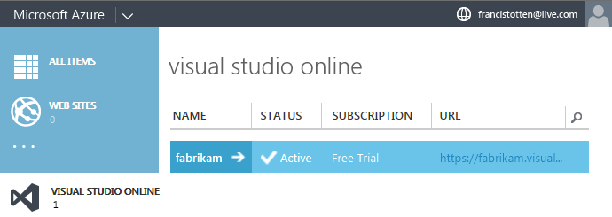
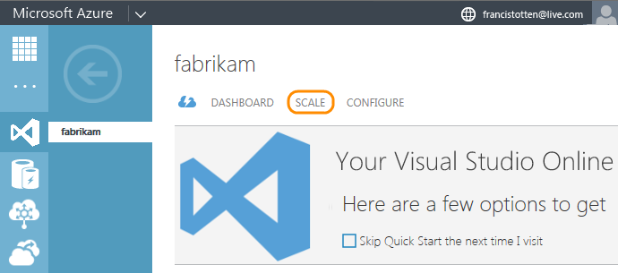
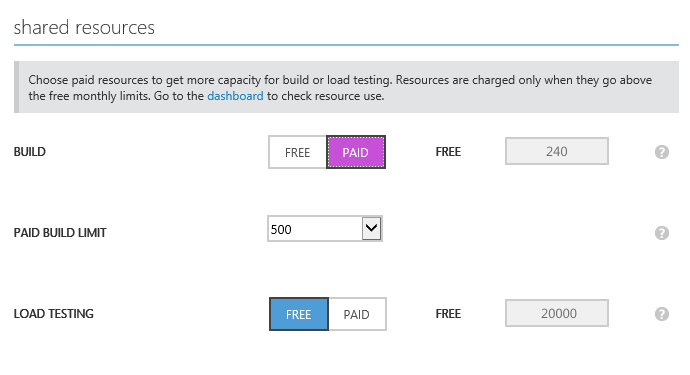
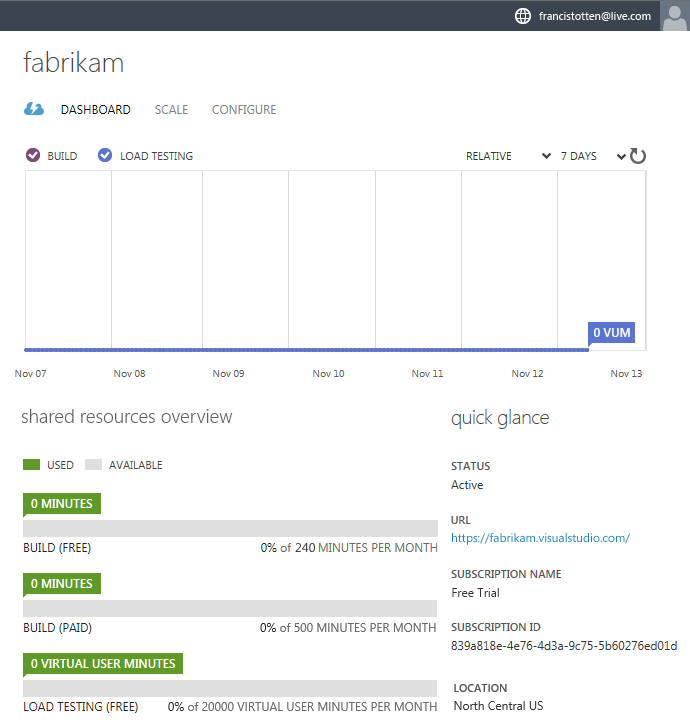
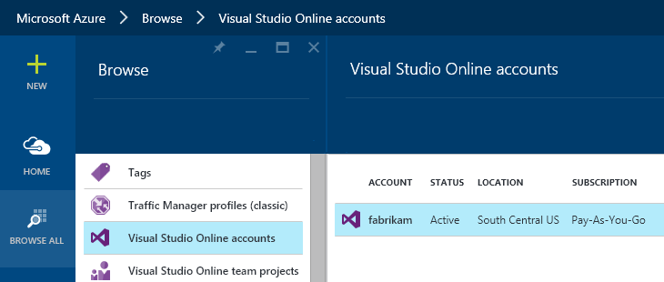
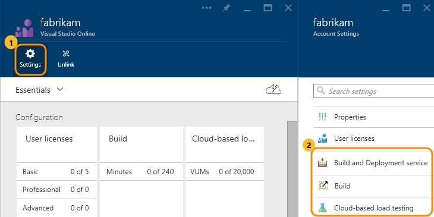
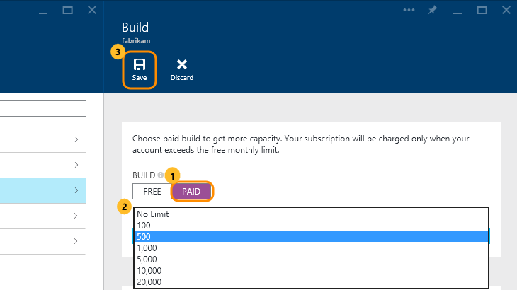
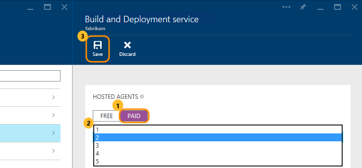
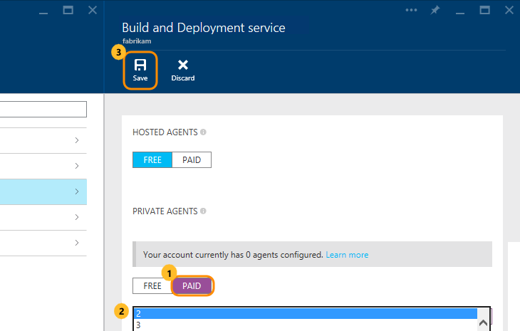
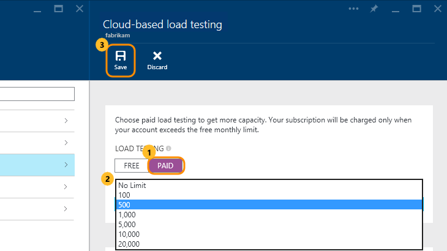

<properties
	pageTitle="Pay for Visual Studio Online additional services"
  description="Pay for Visual Studio Online additional services"
  services="visual-studio-online"
  documentationCenter = ""
  authors="terryaustin"
  manager="terryaustin"
  editor="terryaustin" /> 

# Pay for Visual Studio Online additional services

Visual Studio Online offers these additional services:

- **Build and Deployment**: Use this task-based service to create, queue, 
and monitor cross-platform builds. Use Hosted Agents that Microsoft runs, 
or Private Agents that you run so that you can install custom software.

With Hosted Agents, the compute costs are included. With Private Agents, 
you pay to license the agent software. You can build for any language, 
on any platform, and run multiple builds at the same time by purchasing
multiple agents for more throughput. 
[Learn more about the Build and Deployment service](https://www.visualstudio.com/products/build-pricing-vs)

- **Build (XAML)**: Create build definitions with Visual Studio
and run them in Visual Studio Online. Configure builds to run on demand 
at specific intervals, or for continuous integration (CI). Builds are
charged per minute for the actual amount of computing time used to
build your project.

This service will be retired by September 2016. Please plan
to use the Build and Deployment service instead.

- **Cloud-based Load Testing**: Create load tests using Visual Studio Ultimate 2013, 
Visual Studio Enterprise 2015, or later. Run those tests in Visual Studio Online. 
Load tests are measured and billed in virtual user minutes: the number of virtual users 
multiplied by the number of minutes that you set up for the load test run.

Your Visual Studio Online account includes **free** amounts of these additional services:

- Build (XAML) / Build and Deployment: combined 240 minutes (4 hours) per month

By default, you can run one job at a time. One job can run up to 30 minutes long. 
To run more than one job at the same time, or to run a single job up to 6 hours long, 
you can buy Build and Deployment Hosted Agents. You can also buy Private Agents.

- Cloud-based Load Testing: 20,000 virtual user minutes per month

By default, your account includes free services only. 
If you need to pay for additional services, first link your account 
to an Azure subscription in the
[Azure management portal](https://manage.windowsazure.com/) 
or the [Azure preview portal](https://portal.azure.com). 
You can then buy additional services in the Azure portals. 
Your Azure subscription has the necessary billing information; 
you won't set this up separately for Visual Studio Online.

Learn more about how to
[set up billing for your account](set-up-billing-for-your-account-vs.md). Learn more about 
[pricing](https://www.visualstudio.com/pricing/visual-studio-online-pricing-vs)
for Visual Studio Online additional services.

## Before you start

- If you haven't already, 
[set up billing for your Visual Studio Online account](set-up-billing-for-your-account-vs.md) 
with an Azure subscription.

- You must be the person who set up billing for your Visual Studio Online account.

Usually, this person owns the Visual Studio Online account and the Azure subscription
that's linked to your account for billing.

## Buy additional services

For Build (XAML) or Cloud-based Load Testing, 
follow the steps below for the Azure management portal 
or the [steps for the Azure portal](get-more-build-or-load-testing-vs.md#AzurePortal).
Both portals give you the same results.

For the Build and Deployment service, 
follow the [steps for the Azure preview portal](get-more-build-or-load-testing-vs.md#AzurePortal).

### Azure management portal

1. [Sign in to the Azure management portal](https://manage.windowsazure.com/) 
as the person who set up billing for your Visual Studio Online account.

2. Select your Visual Studio Online account.

[Why don't I see my Visual Studio Online account?](get-more-build-or-load-testing-vs.md#WhyNoVSOAccount)

3. Manage your additional services.

4. Turn on the paid services that you want. 
You can then set limits on the amounts that you use each month.

5. Save your changes. You're not charged until your account 
goes above the free monthly amounts.

6. Check your account's service use in the Azure management portal:

### Azure preview portal

1. [Sign in to the Azure preview portal](https://portal.azure.com/) 
as the person who set up billing for your Visual Studio Online account.

2. Select your Visual Studio Online account.

[Why don't I see my Visual Studio Online account?](get-more-build-or-load-testing-vs.md#WhyNoVSOAccount)

3. Select a service to manage.

4. Follow the steps for that service: [Build (XAML)](get-more-build-or-load-testing-vs.md#buildXaml), [Build and Deployment](get-more-build-or-load-testing-vs.md#buildDeploy), [Cloud-based Load Testing](get-more-build-or-load-testing-vs.md#cloudLT)

 - **Build (XAML)**: Turn on paid builds. If you want, set a limit on the minutes that you use each month.

 - **Build and Deployment service**: Turn on paid agents. Then select the total number of agents that you want.

  - **Hosted Agents**: To remove the free limit of 240 minutes per month of build and deployment time, 
select one or more Hosted Agents. With multiple Hosted Agents, you can run more than one job at the same time.

  - **Private Agents**

If you've already configured Private Agents (or XAML controllers), 
you'll see them here too. If you set them up before September 2015,
you can continue using them and set up new ones on the Free setting until January 2016.
After that, if you haven't started paying for them, they'll stop working.

Your minimum total agents is 2 because your account includes one Private Agent.

 - **Cloud-based Load Testing**: Turn on paid load testing. If you want, set a limit on the virtual 
user minutes that you use each month.

## Try this next

- [Build your app](../build/build-your-app-vs.md)

- [Load test your app](../test/load-test-your-app-vs.md)

## Q &amp; A

#### Q:  Why don't I see my Visual Studio Online account?

A:  Only these people can see your Visual Studio Online account in the Azure portals:

- The Visual Studio Online account owner

- The person who owns the Azure subscription used to bill your Visual Studio Online account

- An Azure administrator

#### Q:    Why pay for agents?

A:    When you pay for agents, you can run more than one build or deployment 
in your Visual Studio Online account. Whether you pay for Hosted Agents or Private Agents, 
you get unlimited minutes per agent, within reason.

Learn [more about agents here](https://www.visualstudio.com/products/build-pricing-vs).

#### Q: Are there any limits on builds, deployments, and load testing?

A: Yes, there's a limit on the duration for each build, deployment, and test run.

For Build and Deployment / Build (XAML), the limit is 30 minutes when you use your 
free minutes and 360 minutes (6 hours) when you use your paid minutes.

For Cloud-based Load Testing, the limit depends on where you're running your test:

- Visual Studio Online load test hub: 5 minutes

- Visual Studio IDE: 48 hours

- Azure Preview Portal: 1 hour

#### Q:    How do I get charged?

A:    You're billed monthly but only for services used above the free monthly limits.

- Free minutes reset on the 1st of the month.

- For additional Build (XAML) time, you're charged per minute based on actual usage.

- Each paid Hosted Agent or Private Agent includes unlimited minutes per month, within reason.

- Although a private XAML controller can host more than one agent,
each connected XAML controller is counted as one Private Agent.

- For Cloud-based Load Testing, you're charged per virtual user minute. 
This is the number of virtual users specified in the test run, 
multiplied by the duration of the run in minutes.

- Graduated discounts for Build (XAML) and Cloud-based Load Testing 
are calculated based on your Azure subscription billing cycle.

Learn more about [pricing here](https://www.visualstudio.com/pricing/visual-studio-online-pricing-vs).

#### Q:    Where can I check my bill?

A:    If you're the Azure subscription owner or an Azure administrator, 
check your bill at the [Azure usage and billing portal](https://account.windowsazure.com/Subscriptions).

#### Q:    What if I have other questions about my bill?

A:    Please contact [Support](https://azure.microsoft.com/en-us/support/options/).

