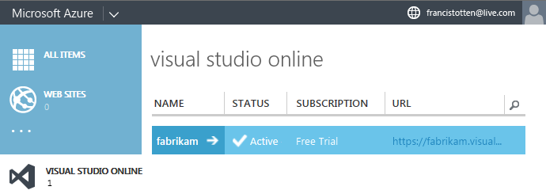

<properties
	pageTitle="Pay for users accessing your account"
  description="Pay for users accessing your account"
  services="visual-studio-online"
  documentationCenter = ""
  authors="terryaustin"
  manager="terryaustin"
  editor="terryaustin" /> 

# Pay for users accessing your account

Your Visual Studio Online account includes 5 free Basic users, 
unlimited stakeholders who can access and edit work items, and unlimited 
[eligible MSDN subscribers](../assign-licenses-to-users-vs.md#EligibleMSDNSubscriptions). 
If you stay within these free limits, you won't have to pay for users accessing your account.

If you need to pay for some users, first link your account 
to an Azure subscription in the
[Azure management portal](https://manage.windowsazure.com/) 
or the [Azure preview portal](https://portal.azure.com). 
You can then pay for more users in either Azure preview portal.
Then go back to the Users tab in your Visual Studio Online 
account to add users and assign them access. Learn more about how to
[set up billing for your account](../set-up-billing-for-your-account-vs.md).

Your Azure subscription has the necessary billing information; 
you won't set this up separately for Visual Studio Online.

Learn more about [pricing here](https://www.visualstudio.com/pricing/visual-studio-online-pricing-vs) 
and which features are available with each access level in the 
[Visual Studio Online Feature Matrix](../../get-started/visual-studio-online-feature-matrix-vs.md).

## Before you start

- If you haven't already, 
[set up billing for your Visual Studio Online account](../set-up-billing-for-your-account-vs.md) 
with an Azure subscription.
- You must be the person who set up billing for your Visual Studio Online account.

Usually, this person owns the Visual Studio Online account and the Azure subscription
that's linked to your Visual Studio Online account for billing.

## Pay for more users

Follow the steps below for the Azure management portal or the
[steps for the Azure preview portal](../get-more-user-licenses-vs.md#AzurePortal). Both portals give you the same results.

### Azure management portal

1. [Sign in to the Azure management portal](https://manage.windowsazure.com/) 
as the person who set up billing for your Visual Studio Online account.
2. Select your Visual Studio Online account.

[Why don't I see my Visual Studio Online account?](../get-more-user-licenses-vs.md#WhyNoVSOAccount)
3. Manage paid users for your account.

4. Drag the sliders until you see the number of users that you want. 
You won't be charged until you save your changes.

You won't see [Visual Studio with MSDN subscriptions](https://www.visualstudio.com/products/visual-studio-with-msdn-overview-vs) 
here because you buy them separately.
5. Save your changes when you're done.
6. Now go back to your Visual Studio Online account to [add users to your account](../assign-licenses-to-users-vs.md).

### Azure preview portal

1. [Sign in to the Azure preview portal](https://portal.azure.com/) 
as the person who set up billing for your Visual Studio Online account.
2. Select your Visual Studio Online account.

[Why don't I see my Visual Studio Online account?](../get-more-user-licenses-vs.md#WhyNoVSOAccount)
3. Manage paid users for your account.

4. Select the total number of users for each access level that you want. 
When you're done, save your changes.

You won't be charged until you save your changes.

5. Now go back to your Visual Studio Online account to [add users to your account](../assign-licenses-to-users-vs.md).

## Q&amp;A

#### Q:  Why don't I see my Visual Studio Online account?

A:  Only these people can see your Visual Studio Online account in Azure:

- The Visual Studio Online account owner
- The person who owns the Azure subscription used to bill your Visual Studio Online account
- An Azure administrator

#### Q:  How do I get charged?

A:  You're billed monthly. Learn more about 
[pricing here](https://www.visualstudio.com/pricing/visual-studio-online-pricing-vs).

#### Q:  Where can I check my bill?

A:  If you're the Azure subscription owner or an Azure administrator, 
check your bill at the [Azure usage and billing portal](https://account.windowsazure.com/Subscriptions).

#### Q:  What happens if I reduce the number of paid users during the month?

A:  Your charges won't change until the next month because paid users are monthly purchases.

- Just deleting a user from your Visual Studio Online account doesn't 
remove your charges. You must also reduce the number of paid users in the 
[Azure management portal](https://manage.windowsazure.com/) or the
[Azure preview portal](https://portal.azure.com/).
- Check that your Visual Studio Online account has enough paid users when the next 
month starts. Otherwise, users who were last added to your account for the level 
that you reduce, like Basic, will lose access first.

#### Q: When do paid users renew?

A: Paid users renew automatically on the 1st of each month. To reduce paid users for the next month, 
you must make the change before the last day of the month.

#### Q:  What if I have other questions about my bill?

A:  Please contact [Support](http://azure.microsoft.com/en-us/support/options/).
