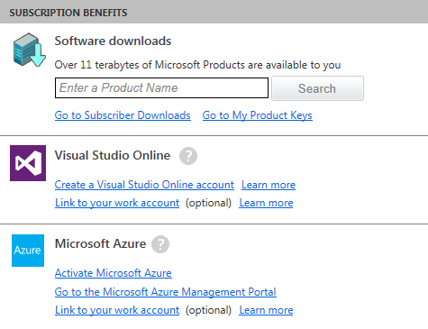
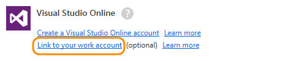
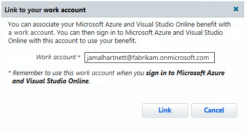

# Add a work account to your MSDN subscription

When activating an MSDN subscription, you must use a Microsoft account. You can also 
add a work account to your subscription so that you can use this account with Visual 
Studio Online and Microsoft Azure, if your subscription includes these benefits.

1. [Sign in to your MSDN My Account page](https://msdn.microsoft.com/subscriptions/manage/) 
with your Microsoft account. You see your subscription benefits here.

2. Add your work account to your subscription.

3. Enter your work account.

4. Use your work account to sign in to your Visual Studio Online 
account (youraccount.visualstudio.com), or 
[sign up for a new Visual Studio Online account](http://go.microsoft.com/fwlink/?LinkId=307137).

## Q&amp;A

#### Q:  Why can't I add a work account to my MSDN subscription?

A:  You can add a work account only to MSDN subscriptions that include Visual Studio 
Online or Microsoft Azure.

#### Q:  Can I add more than one work account to my MSDN subscription?

A:  No, you can add only one work account.

#### Q:  Why can't I sign in with my work account after adding it to my subscription or getting invited to Visual Studio Online?

A:  This can happen when the sign-in address for your work account differs from your 
Microsoft account. Check with the Visual Studio Online account owner. They might not 
have [set up work access](https://www.visualstudio.com/get-started/setup/manage-organization-access-for-your-account-vs)
for the Visual Studio Online account.

#### Q:  Why doesn't Visual Studio Online recognize me as an MSDN subscriber?

A:  You must have an [eligible MSDN subscription](https://www.visualstudio.com/get-started/setup/assign-licenses-to-users-vs#EligibleMSDNSubscriptions)
that includes Visual Studio Online, and your license in Visual Studio Online must be
[set to "Eligible MSDN Subscriber"](https://www.visualstudio.com/get-started/setup/assign-licenses-to-users-vs). Try these other 
[troubleshooting tips](http://blogs.msdn.com/b/visualstudioalm/archive/2014/03/19/visual-studio-online-best-practices-troubleshooting-issues-with-the-quot-eligible-msdn-subscriber-license-type.aspx) 
if Visual Studio Online still doesn't recognize your subscription.
