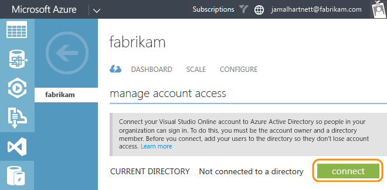
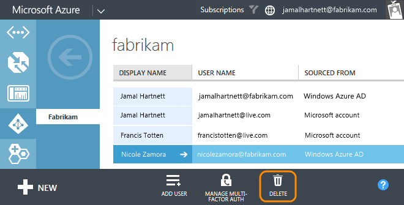

<properties
	pageTitle="Manage work access for your Visual Studio Online account"
  description="Manage work access for your Visual Studio Online account"
  services="visual-studio-online"
  documentationCenter = ""
  authors="terryaustin"
  manager="terryaustin"
  editor="terryaustin" /> 

# Manage work access for your Visual Studio Online account

Control access to your Visual Studio Online account with a directory, 
the same way that organizations do with Microsoft services like 
Office 365. You can then sign in to Visual Studio Online and other 
services with the same username and password. Using a directory 
helps you enforce policies about accessing company resources.

## How does a directory control access?

When your Visual Studio Online account is connected to a directory, 
only users in that directory can get access to your account. This 
helps authenticate users and secure access to your account.

The directory administrator controls who joins the directory and who can 
get access to your Visual Studio Online account. They can 
also control access in other ways, like require strong passwords. 
And if users are removed from the directory, for example, because 
they've moved elsewhere, they lose access to your account.

Without a directory, you're solely responsible for controlling 
access to your account. And all users must sign in with Microsoft 
accounts.

### What do I need to continue?

You'll need a work account that's associated with a directory 
in [Azure Active Directory (Azure AD)](http://azure.microsoft.com/en-us/documentation/articles/active-directory-whatis/). 
You might have this already, if you use Azure or Office 365.

If you don't, find out how to 
[sign up for a work account](http://azure.microsoft.com/en-us/documentation/articles/sign-up-organization/). 
This creates a directory in Azure AD automatically. If you 
use an on-premises Active Directory (AD), you can 
[synchronize](https://msdn.microsoft.com/en-us/library/azure/jj573653.aspx) it with your directory in Azure AD. You can 
then use existing work accounts with Visual Studio Online.

You'll also need directory administrator access to add users. 
If you don't have access, work with your directory administrator.

### What happens to current users?

Your work in Visual Studio Online is associated with your sign-in 
address. After your Visual Studio Online account is connected to a 
directory, account users will continue working seamlessly if their 
current sign-in addresses are in the directory. If they're not, add 
their sign-in addresses to the directory so they can keep all their 
work. Your company might have policies about adding users to the 
directory, so find out more first. What happens if they can't use 
the same sign-in addresses?

## Set up current users in the directory

1. [Sign in to the Azure Management portal](http://manage.windowsazure.com/) 
with your work account.
2. Sign up for an Azure subscription, if you don't have one.

After you finish, you see the directory that's associated 
with your work account.

3. Check that you have administrator access to the directory. 
That way, you can add users. Otherwise, work with your 
directory administrator to add users.

4. Select your directory.

5. Add your current users to the directory, if they're not 
there already. Use the same sign-in addresses that they use 
now with Visual Studio Online.

That way, they don't lose access after the account is connected. 
They'll also continue working seamlessly without losing work history. 
[What happens if they can't use the same sign-in addresses?](../manage-organization-access-for-your-account-vs.md#AddAsNewVSOUsers)

In this example directory for Fabrikam company, Jamal is the 
Visual Studio Online account owner and directory administrator. 
He's already in the directory with his work account 
(jamalhartnett@fabrikam.com). But he has a different sign-in 
address for Visual Studio Online (jamalhartnett@live.com). 
To keep work history, he adds his Microsoft account.

Nicole, another user, also has a work account. It shares 
the same sign-in address with her Microsoft account in 
Visual Studio Online. So, Jamal doesn't need to add her 
to the directory.

If Jamal doesn't need his work history, he can use his 
work account after adding it to Visual Studio Online. 
To free up the license used by his Microsoft account, 
he must update the account owner to his work account. 
If Jamal has an MSDN subscription, he must add his 
work account to that subscription on his 
[MSDN My Account page](https://msdn.microsoft.com/subscriptions/manage/).

Find out more about 
[adding your work account](../link-msdn-subscription-to-organizational-account-vs.md) 
to your subscription. Or find out more about 
[managing directory members](https://msdn.microsoft.com/library/azure/hh967632.aspx).
6. After you're done setting up current users, connect your 
account to the directory.

## Q&amp;A

#### Q:  What happens if my users can't use the same sign-in addresses they've been using?

A:  You'll have to add them to the directory with new work accounts. 
Or, if they already have work accounts, they can use those instead. 
Their work in Visual Studio Online won't be lost - it stays with 
their previous sign-in addresses. You'll have to add them as new 
users to Visual Studio Online, reassign licenses, and readd them 
to any projects. They can migrate work that they want to keep, 
except for their work history. If they have 
[eligible MSDN subscriptions](../assign-licenses-to-users-vs.md#EligibleMSDNSubscriptions), 
they can add their work accounts to those subscriptions. 
Find out more about 
[adding work accounts](../link-msdn-subscription-to-organizational-account-vs.md) 
to MSDN subscriptions and 
[assigning licenses](../assign-licenses-to-users-vs.md).

#### Q:  I want to add users from other directories, but I can't. What do I do?

A:  To add users from other directories, you must be a member 
of those directories or have read access. Or, you can add 
them with Microsoft accounts or new work accounts.

#### Q:  Can I switch current users from Microsoft accounts to work accounts in Visual Studio Online?

A:  No, although you can add new work accounts to your Visual 
Studio Online account, they're treated as new users. If you 
want to access all your work, including its history, you must 
use the same sign-in addresses that you used before your 
account was connected to the directory.

#### Q:  How do I use my work account with my MSDN subscription?

A:  If you have an [eligible MSDN subscription](../assign-licenses-to-users-vs.md#EligibleMSDNSubscriptions), 
add your work account on your 
[MSDN My Account page](https://msdn.microsoft.com/subscriptions/manage/). 
Find out more about [adding your work account](../link-msdn-subscription-to-organizational-account-vs.md).

## Connect your account to your directory

1. [Sign in to the Azure Management portal](http://manage.windowsazure.com/) 
as the Visual Studio Online account owner.
2. [Link your Visual Studio Online account](../set-up-billing-for-your-account-vs.md) 
to the Azure subscription associated with your directory, if it's 
not linked already.
3. In the Azure portal, under **Visual Studio Online**, start connecting
your Visual Studio Online account.

4. Connect your account to your directory.

[My account's already connected to a directory. What do I do?](../manage-organization-access-for-your-account-vs.md#AlreadyConnected)
5. Select your directory, then finish connecting.

[Why don't I see the directory that I want?](../manage-organization-access-for-your-account-vs.md#WhyNotMyDirectory)

Your Visual Studio Online account is now connected to your directory.
6. If you use tools that run outside a web browser, like the Git command 
line tool, then your alternate credentials for those tools won't work 
anymore. You must [set up your credentials](http://support.microsoft.com/kb/2991274/en-us) 
again for the Visual Studio Online account that you connected.

## Try this next

- [Add users and licenses](../assign-licenses-to-users-vs.md) 
to your Visual Studio Online account.
- [Manage account access with Azure AD groups](../manage-visual-studio-online-access-azure-active-directory-groups.md)
- [Set up billing](../set-up-billing-for-your-account-vs.md) so you can pay for additional users or resources
- [Pay for additional users](../get-more-user-licenses-vs.md)

## Q&amp;A

#### Q:  My Visual Studio Online account is already linked to another Azure subscription. What do I do?

A:  You might have to unlink your account, then relink it. 
When you unlink your account, it goes back to the 
[free account limits](../set-up-billing-for-your-account-vs.md#unlinking) 
and some users might lose access.

#### Q:  Why can't I connect my Visual Studio Online account to a directory?

A:  You have to be the account owner or a member of that directory.

#### Q:  My account is already connected to a directory. What do I do?

A:  This might happen if your account was connected to a 
directory when it was created. If that directory isn't the 
one that you want, follow these steps.

1. [Disconnect your account](../manage-organization-access-for-your-account-vs.md#DisconnectDirectory) 
from the directory. Do this before going to the next 
step, or else you can't disconnect your account.
2. [Change the directory](../manage-organization-access-for-your-account-vs.md#WhyNotMyDirectory) that's 
associated with your Azure subscription.
3. [Reconnect your account](../manage-organization-access-for-your-account-vs.md#ConnectDirectory) 
to the directory that you want.

#### Q:  Why don't I see the directory that I want?

A:  This might happen if your Azure subscription is associated 
with a different directory. You can be in more than one directory, 
but your subscription is associated with only one directory.

To connect your account to a directory, your subscription must 
be associated with that directory. You can change the directory 
that's associated with your subscription.

For example, Jamal works for Fabrikam, but he also works at 
Contoso on a special project. He already created a Visual Studio 
Online account for Contoso, so now he wants to connect that 
account to the Contoso directory. But his Azure subscription 
is associated with the Fabrikam directory. To connect the Visual 
Studio Online account to Contoso, he has to change the directory 
associated with his subscription from Fabrikam to Contoso.

#### Q:  Why can't users sign in after my account is connected?

A:  They must be in the connected directory and use the same 
sign-in addresses that were used to add them to the directory.

If they're not in the directory, and you have administrator access, you can
[add them to the directory](../../get-started/assign-licenses-to-users-vs.md#EligibleMSDNSubscriptions).

To use a work account with MSDN subscriptions that 
[include Visual Studio Online](../assign-licenses-to-users-vs.md#EligibleMSDNSubscriptions), 
add that work account to the subscription on the 
[MSDN My Account page](https://msdn.microsoft.com/subscriptions/manage/).

#### Q:  My alternate credentials don't work anymore. What do I do?

A:  This happens after you connect your Visual Studio Online 
account to a directory. You'll have to 
[set up your credentials](http://support.microsoft.com/kb/2991274) 
again for the account that you connected.

#### Q:  Why must I choose between a work account and a Microsoft account when I sign in?

A:  This happens because your work account and Microsoft account 
have the same email address. You must choose which account to use 
with Visual Studio Online.

#### Q:  What happens if I unlink my Azure subscription while my account is connected to a directory?

A:  This won't affect your account's connection to the directory. 
But when you unlink your account, it goes back to the 
[free account limits](../set-up-billing-for-your-account-vs.md#unlinking) 
and some users might lose access.

## Disconnect your account from its directory

To stop using a directory, disconnect your Visual Studio Online account. 
You must be the Visual Studio Online account owner with a Microsoft account, 
which you can create using any email address. To continue working seamlessly,
use your Visual Studio Online sign-in address to [create a Microsoft account](https://signup.live.com/).

After you disconnect, your Visual Studio Online account users must sign in with Microsoft accounts. 
They'll continue working seamlessly if their Microsoft accounts share 
the sign-in addresses that they use now with Visual Studio Online. Otherwise, 
they'll lose access until you add them to Visual Studio Online as new users. 
They can migrate everything except work history, relink MSDN subscriptions, 
and have their licenses reassigned to their new sign-in addresses.

1. [Sign in to the Azure Management portal](http://manage.windowsazure.com/)
as the Visual Studio Online account owner.
2. Select your Visual Studio Online account.

3. Configure your account.

4. Disconnect your account from your directory.

Your Visual Studio Online account is now disconnected. Only users with Microsoft accounts can sign in.

## Q&amp;A

#### Q:    Why can't users sign in after my account is disconnected?

A:  They now need to use Microsoft accounts to sign in. If they have 
Microsoft accounts that use the same sign-in addresses that they use 
now, they'll continue working seamlessly.

If they have to create Microsoft accounts with different sign-in addresses, 
make sure to add those sign-in-addresses to your Visual Studio Online account,
and reassign licenses. They can migrate work that they want to keep, 
except work history. They might also have to relink their MSDN 
subscriptions. They can use any email address to create a Microsoft account.

## Delete a user from a directory

This removes access to all Visual Studio Online accounts and 
company-managed assets that are associated with that directory. 
If this isn't what you want, 
[delete them from each Visual Studio Online account](../assign-licenses-to-users-vs.md#DeleteUser) 
where you need to remove them.

1. [Sign in to the Azure Management portal](http://manage.windowsazure.com/) 
as the directory administrator.
2. Identify the directory that's connected to your 
Visual Studio Online account.

3. Now find and select the directory.

4. View the directory members.

5. Delete the user.

6. [Remove that user](../assign-licenses-to-users-vs.md#DeleteUser) 
from your Visual Studio Online account and reeassign their licenses, if necessary.
