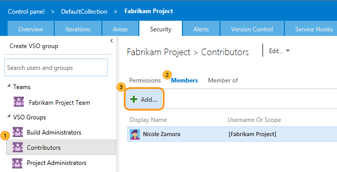
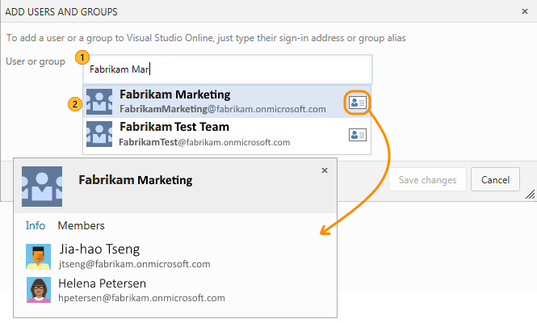
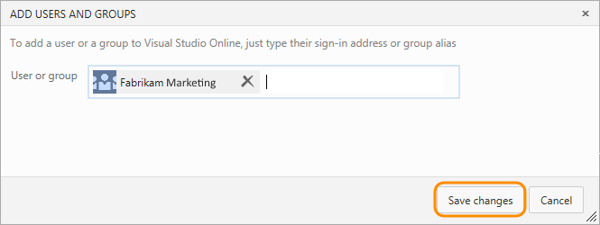
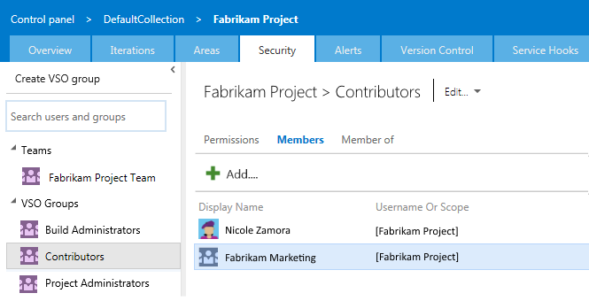
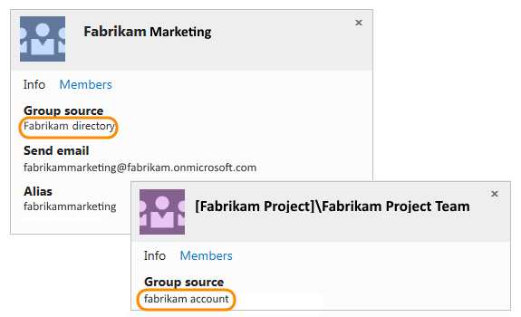
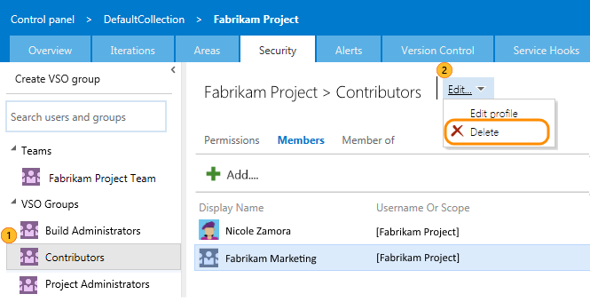

<properties
	pageTitle="Manage access with Azure Active Directory groups for your Visual Studio Online account"
  description="Manage access with Azure Active Directory groups for your Visual Studio Online account"
  services="visual-studio-online"
  documentationCenter = ""
  authors="terryaustin"
  manager="terryaustin"
  editor="terryaustin" /> 

# Manage access with Azure Active Directory groups for your Visual Studio Online account

Do you want an easier way to control who can access your team's 
critical resources and key business assets in Visual Studio Online (VSO)? 
If you already use Microsoft services like Office 365 or 
[Azure Active Directory (Azure AD)](https://www.microsoft.com/en-us/server-cloud/products/azure-active-directory/), 
you can use the same identities with your VSO account. 
[Azure AD works with your VSO account](https://www.visualstudio.com/get-started/setup/manage-organization-access-for-your-account-vs) 
to control access and authenticate users through your organization's directory.

When you use 
[Azure AD groups](https://azure.microsoft.com/en-us/documentation/articles/active-directory-manage-groups)
to organize directory members, you can reuse those groups to manage permissions in bulk for your VSO account.
Just add those Azure AD groups to the VSO group that you want, 
for example, built-in VSO groups like Project Collection Administrators or Contributors, 
or manually-created VSO groups like your project management team. 
Azure AD group members will inherit the same permissions from that VSO group,
so you don't have to manage VSO group members one at a time.

Not familiar with Azure AD, but want to check it out? Learn more about 
[Azure AD benefits](https://azure.microsoft.com/en-us/documentation/articles/active-directory-whatis/)
and the differences in how you 
[control VSO account access with Microsoft accounts or with Azure AD](https://www.visualstudio.com/get-started/setup/manage-organization-access-for-your-account-vs).

## Before you start

Here's what you'll need:

- Your VSO account must be connected to your organization's directory (tenant) in Azure AD.
[My account uses Microsoft accounts only. Can I switch to Azure AD?](https://www.visualstudio.com/get-started/setup/manage-visual-studio-online-access-azure-active-directory-groups#ChangeMSA)
- You must be a VSO project administrator, project collection administrator, or account owner.

To create and manage Azure AD groups, you must have tenant administrator permissions 
or have the tenant administrator delegate those permissions to you in the 
[Azure management portal](https://manage.windowsazure.com) or [Azure portal](https://portal.azure.com).

## Add an Azure AD group to a VSO group

1. Sign in to your VSO account `https://{youraccount}.visualstudio.com`, if you haven't already.
2. Go to your team project collection or team project, depending on the VSO group that you want to work on.
3. Go to the control panel.

4. Go to the security settings. Select the VSO group where you want to add your Azure AD group.

5. Find the Azure AD group that you want to add. 
Just start typing the group's name, alias, or display name. Then select the group to add it.

To get more details about a group and its members, review the group's contact card.

6. Add more groups, or save your changes if you're done.

7. Check that your group appears in the VSO group that you want.

## Q&amp;A

#### Q: My account uses Microsoft accounts only. Can I switch to Azure AD?

A: Yes, but before you switch, make sure that Azure AD meets your needs 
for sharing work items, code, resources, and other assets with your team and partners.

Learn more about the differences in how you 
[control access with Microsoft accounts or with Azure AD, and how to switch](https://www.visualstudio.com/get-started/setup/manage-organization-access-for-your-account-vs)
when you're ready.

#### Q: Why can't I assign VSO permissions directly to an Azure AD group?

A: Because these groups are created and managed in Azure, 
you can't assign VSO permissions directly or secure version control paths to these groups. 
You'll get an error if you try to assign permissions directly.

But, you can add an Azure AD group to the VSO group that has the permissions
you want. Or, you can assign these permissions to the VSO group instead.
Azure AD group members will inherit permissions from the VSO group where you add them.

#### Q: Can I manage Azure AD groups in VSO?

A: No, because these groups are created and managed in Azure. 
VSO doesn't store or sync member status for Azure AD groups. 
So, to manage Azure AD groups, 
use the [Azure management portal](https://manage.windowsazure.com)
or [Azure portal](https://portal.azure.com), Microsoft Identity Manager (MIM), 
or the group management tools that your organization supports.

#### Q: How do I tell the difference between a VSO group and an Azure AD group?

A: On the group's identity card, check the group's source:

#### Q:     Why doesn't the Users hub show all Azure AD group members?

A: These users have to sign in to your VSO account before they appear in the Users hub.

#### Q:     How do I assign user licenses to Azure AD group members?

A: When these group members sign in to your VSO account for the first time, 
VSO assigns user licenses to them automatically. If they have 
[eligible MSDN subscriptions](https://www.visualstudio.com/get-started/setup/assign-licenses-to-users-vs#EligibleMSDNSubscriptions), 
VSO assigns the respective user licenses to them. Otherwise, VSO assigns them the next
"best available" [VSO monthly user licenses](https://www.visualstudio.com/pricing/visual-studio-online-feature-matrix-vs) 
in this order: Advanced, Basic, Stakeholder

If you don't have enough licenses for all Azure AD group members, 
those members who sign in will get a Stakeholder license.

#### Q: Why doesn't the Security tab show all members when I select an Azure AD group?

A: The Security tab shows Azure AD group members 
only after they sign in to your VSO account and have a license assigned to them.

To see all Azure AD group members, 
use the [Azure management portal](https://manage.windowsazure.com), 
[Azure portal](https://portal.azure.com), Microsoft Identity Manager (MIM), 
or the group management tools that your organization supports.

#### Q:     Why doesn't the team members widget show all Azure AD group members?

A: The team members widget shows only users who previously signed in to your VSO account.

#### Q:     Why doesn't the team capacity pane show all Azure AD group members?

A: The team capacity pane shows only users who previously signed in to your VSO account.
To set capacity, manually add users to your team.

#### Q:     Why doesn't the team room show offline users?

A: The team room shows Azure AD group members, 
but only when they're online.

#### Q:     Why doesn't VSO reclaim licenses from users who aren't Azure AD group members anymore?

A: VSO doesn't automatically reclaim licenses from these users. 
To manually remove their licenses, go to the Users hub.

#### Q:     Can I assign work items to Azure AD group members who haven't signed in?

A: You can assign work items to any Azure AD member who has permissions for your VSO account. 
This also adds that member to your VSO account. When you add users this way, 
they'll automatically appear in the Users hub with the best available 
license and in the security settings, too.

#### Q: Can I use Azure AD groups to query work items using the "In Group" clause?

A: Yes, but only if these groups were added to your VSO account 
or have a parent that was added to your account.

#### Q:     Can I use Azure AD groups to set up field rules in my work item templates?

A: No, but read more here about our 
[VSO process customization plans](https://blogs.msdn.com/b/visualstudioalm/archive/2015/07/27/visual-studio-online-process-customization-update.aspx).

#### Q:     How do I remove an Azure AD group from VSO?

A: Go to your team project collection or team project. Go to the control panel.

Go to the security settings. Find the Azure AD group, 
then delete that group from VSO.

#### Q:     Where can I ask more questions or send suggestions?

A: We'd love to hear from you. For help from the Microsoft Developer Community,
visit the [Visual Studio Online forum](https://social.msdn.microsoft.com/Forums/en-US/home?forum=TFService).
For suggestions, visit
[Visual Studio UserVoice](https://visualstudio.uservoice.com/forums/121579-visual-studio/category/30925-team-foundation-server-visual-studio-online).
