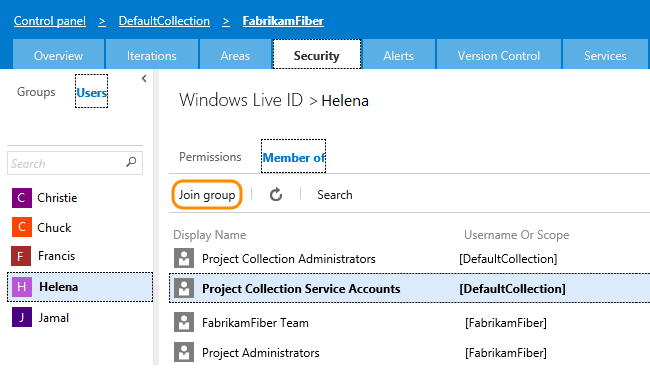
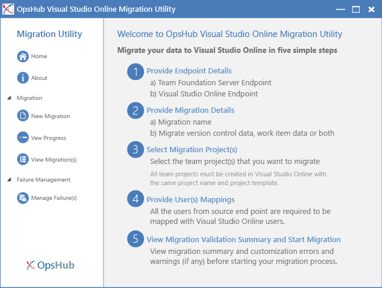
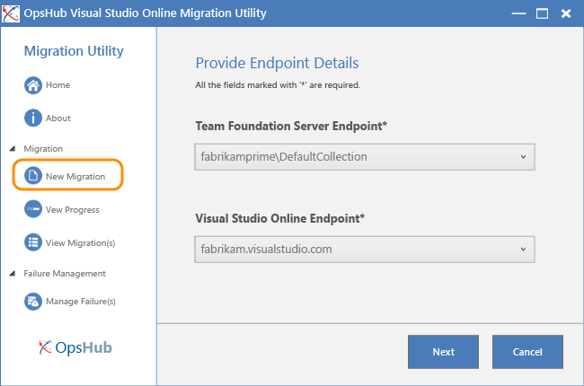
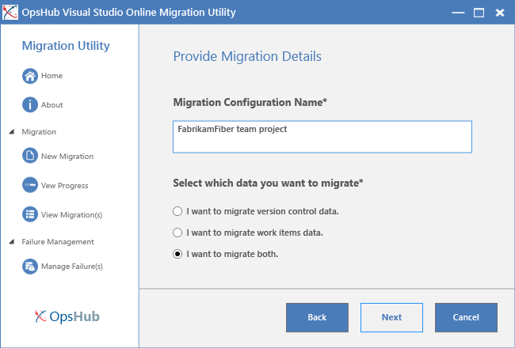
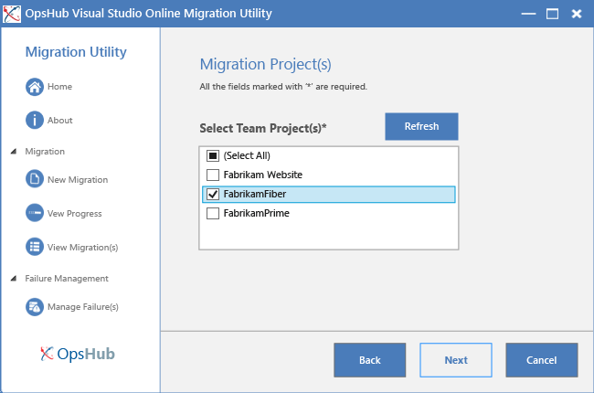
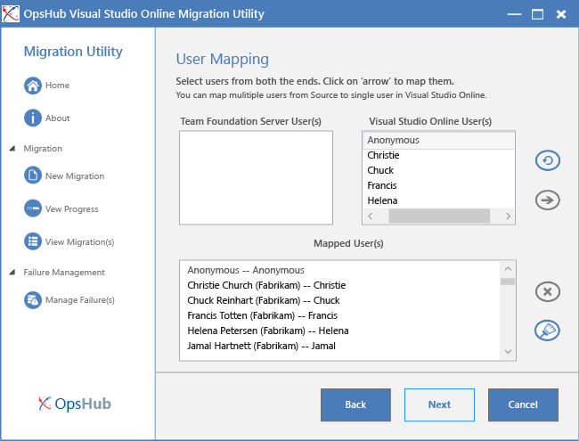
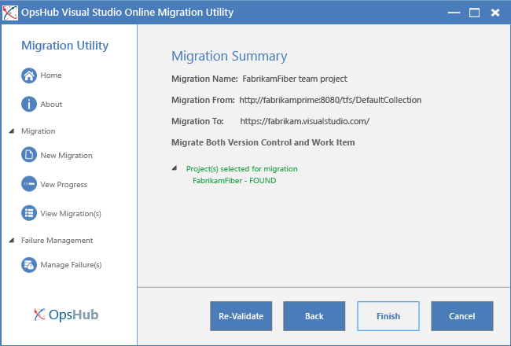
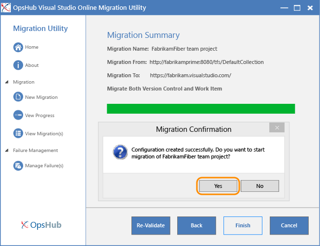
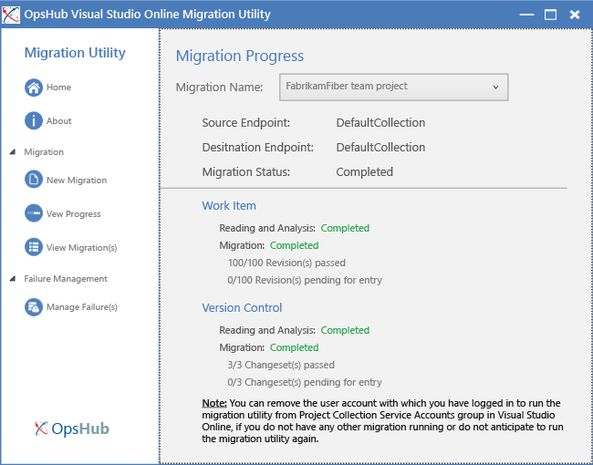

<properties
	pageTitle="Migrate team projects from on-premises TFS to Visual Studio Online"
  description="Migrate team projects from on-premises TFS to Visual Studio Online"
  services="visual-studio-online"
  documentationCenter = ""
  authors="terryaustin"
  manager="terryaustin"
  editor="terryaustin" /> 

# Migrate team projects from on-premises TFS to Visual Studio Online

Do you have data that you want to migrate from your on-premises TFS to Visual Studio Online? 
Moving to Visual Studio Online removes the overhead of maintaining on-premises servers and 
provides global flexibility for supporting distributed teams.

With the OpsHub Visual Studio Online Migration Utility you can migrate source code and work 
items from TFS 2010, TFS 2012 and TFS 2013. It supports all RTM versions and post-RTM updates. 
Go [here](../migrate-team-projects-vs.md#what_data) for details on the data it migrates.

The OpsHub Visual Studio Online Migration Utility is a free offering provided by Microsoft 
and developed by [OpsHub](http://opshub.com/). This utility is not supported by Microsoft 
Customer Service and Support (CSS). If you have a question, you can post it at 
[StackOverflow](http://stackoverflow.com/) and tag it with "OpsHub" and "visual-studio-online".

## Get ready to migrate team project data

1. **Get your team projects and users ready.**

a.    Choose a time to migrate your data and tell your users that they should stop 
working in the TFS team projects.

b.    Remove any customizations you may have made to work item types. To do this, download 
the original process template used to create your team project and import the WIT XML 
definition files using [witadmin importwitd.](https://msdn.microsoft.com/library/dd312129.aspx)

Migration will fail if the utility detects any customization of the WITs.
2. **Set up Visual Studio Online.**

a.    If you haven’t yet signed up for Visual Studio Online, 
[do that now](https://www.visualstudio.com/products/visual-studio-online-overview-vs).

b.    Sign in to Visual Studio Online (youraccount.visualstudio.com) as the account owner. 
[How do I find out who's the account owner?](../change-account-ownership-vs.md)

c.    If your Visual Studio Online account is not yet a member of the Project Collection 
Service Accounts group, add yourself to that group now.

d.    For each team project that you want to migrate, create the same named team project 
on Visual Studio Online.

For example, to migrate the scrum-based FabrikamFiber team project, create a team 
project on Visual Studio Online named FabrikamFiber using the Visual Studio Scrum 
process template.

Don’t add any work items to the new team projects.

e.    Add all user accounts from your TFS team project to Visual Studio Online. 
This way user accounts can be mapped when the data is migrated.
3. **Install the OpsHub Visual Studio Online Migration Utility.**

Install the OpsHub utility on a server running a 64-bit version of the Windows 
operating system, ideally on your application-tier server that hosts TFS.

a.    Download and run the OpsHub Visual Studio Online Migration Utility installer 
that you get from the [OpsHub download site](http://aka.ms/OpsHubVSOMigrationUtility).

b.    Enter information for all required fields.

c.    Enter the verification code that you receive in your email.

Wait several minutes as the installation completes.

## Start a new migration

Now you’re ready to start migrating one or more team projects.

1. Open the OpsHub Visual Studio Online Migration Utility and review the steps listed.

The utility is installed in the following directory:

Drive:\Program Files\OpsHub Visual Studio Online Migration Utility\Other\_Resources\Resources\TFSUtility.
2. Choose the team project collection that hosts the team project(s) that you want 
to migrate and the Visual Studio Online account to which you’ll migrate data.

If your project collection doesn’t appear in the drop down menu, then add the server manually.
3. Label your migration and select the data you want to migrate.

4. Select the checkbox for each team project that you want to migrate.

Remember that migration will fail if the name of the Visual Studio Online team project 
differs from the name of the TFS team project.
5. Map your on-premises Active Directory users to your cloud-based Microsoft Account user 
accounts. If you haven’t yet added the Microsoft Accounts to your Visual Studio Online team 
project, do that now and then refresh the page.

You must map all TFS users listed to a Visual Studio Online user. Map them to Anonymous 
if there is no Microsoft Account listed to map them to.
6. After validation completes, review the summary.

Resolve any errors you receive, and then click Re-Validate.

Resolve errors related to work item types by downloading the original process template 
used to create your team project and import the WIT XML definition files using 
[witadmin importwitd.](https://msdn.microsoft.com/library/dd312129.aspx)
7. With the configuration stage complete, you can start the migration process.

8. After data migration, go to your Visual Studio Online account and review the team 
project(s) that you have migrated.

9. Once you've completed migrating your team projects, remove your Microsoft account 
from the Project Collection Service Accounts group.

## Q &amp; A

#### Q:      What data will OpsHub migrate?

A:    **The tool will migrate:**

- Source code under Team Foundation version control, including changesets, labels,
and version control history.
- Work items, including links, tags, and attachments. (Excludes any customizations 
and data associated with customizations, such as custom fields, custom workflow, and custom forms.)
- Images in work items as attachments to the work item.
- Test cases and previously saved test results.
- Each history action on behalf of the original user so as to preserve as much 
history as possible.

During migration, the following field values are set to a default user and current system time:

- Person name fields: *Created By*, *Closed By*, *Activated By*, and *Resolved By*
- Date fields: *Closed Date*, *Activated Date*, *State Change Date*, *Accepted Date*, 
*Resolved Date*, *Called Date*, *Revised Date*, *Changed Date*, and *Created Date*

The tool won’t migrate:

- Git repositories.
- Data associated with builds, test plans, test suites, releases, and lab environments.
- Source code date stamps and labels created at the team project collection level. 
If there are revisions, which are across projects, and some of the projects are not selected, 
the revisions will not be processed.
- Customization of all work tracking objects: fields, forms, link types, categories, or 
process configuration.
- Comments and dates associated with Attachments.
- Customization of Kanban boards.
- Alerts, queries, and event history.
- Teams, team memberships, team alerts, personal and team favorites, and team room archives.
- Accounts, group memberships, and user permissions.

#### Q:        What are the differences between Visual Studio Online and an on-premises TFS deployment?

A:    Visual Studio Online is the online service version of Team Foundation Server. It rolls out new 
features on a regular basis which you can review in the 
[features timeline](https://www.visualstudio.com/news/release-archive-vso).

Using Visual Studio Online, teams can collaborate on software projects using most of the features 
that are available on an on-premises TFS deployment without having to administer the server. Get 
an overview of Visual Studio Online services [here](https://msdn.microsoft.com/magazine/dn519923.aspx).

When you migrate to Visual Studio Online you can no longer customize your team projects, access 
dashboards made available through SharePoint Products integration, or access reporting features 
associated with SQL Server Analysis Services and SQL Server Reporting Services.

#### Q:      What if I need to re-start a data migration?

A:    If you have problems migrating and want to attempt to migrate again, you need to 
[delete the Visual Studio Online team project](https://msdn.microsoft.com/library/ff357756.aspx) 
first. Then, recreate the project and retry the migration.

#### Q:      Can I use this utility to perform ongoing synchronization between on-premises TFS and Visual Studio Online?

A:    No, the OpsHub utility supports a one-time, one-way migration. If you require ongoing 
synchronization between your on-premises and cloud environment please contact OpsHub for details 
on their product offerings.

#### Q:        Can I use this utility to migrate team projects between Visual Studio Online accounts?

A:    No, but you can use the OpsHub Integration Platform to help with this scenario.

#### Q:        What is the difference between this utility and the OpsHub Integration Manager?

A:    The OpsHub Integration Manager is a commercially available tool to support advanced scenarios 
such as: migration, synchronization, other platforms and competitive tools, custom business rules 
for migrating entities, etc. If you have a more complex scenario to support, for example customized 
process templates, it is suggested that you use the [OpsHub’s commercial offerings.](http://opshub.com/)

#### Q:     Where can I go if I have more questions?

A:    Post a question in [StackOverflow](http://stackoverflow.com/) and tag it with "OpsHub" 
and "visual-studio-online."
