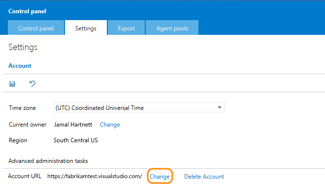
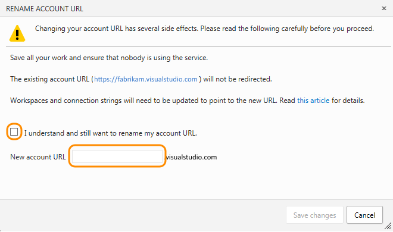

<properties
	pageTitle="Rename your Visual Studio Online account"
  description="Rename your Visual Studio Online account"
  services="visual-studio-online"
  documentationCenter = ""
  authors="terryaustin"
  manager="terryaustin"
  editor="terryaustin" /> 

# Rename your Visual Studio Online account

You can change your Visual Studio Online account name (URL) at any time, for any reason.

**Caution**: This affects your account's connections and those currently working with your account. So before you start, 
find out [what to do before and after renaming your account](https://support.microsoft.com/kb/2793597).

1. Sign in as the account owner to your Visual Studio Online account (`https://{youraccount}.visualstudio.com`).

Only account owners can change the account URL.
2. Go to your account's control panel and settings.

3. Change your account name.

4. Confirm that you want to rename your account. Then give your account a new name, and save your changes.

