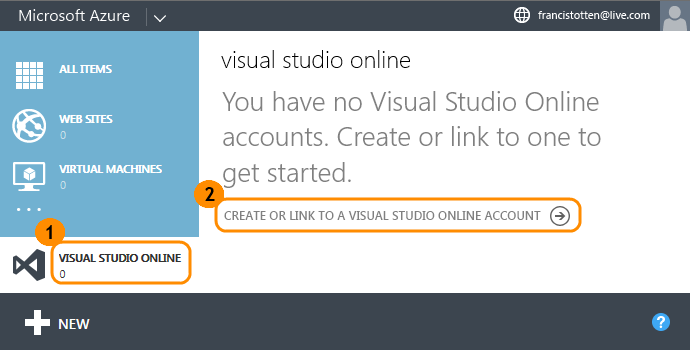
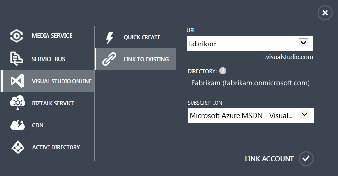
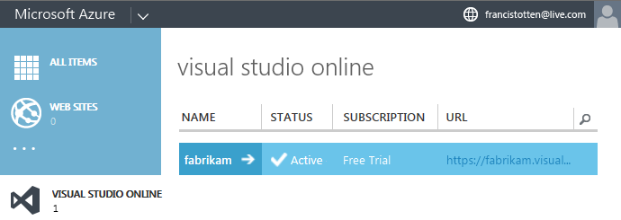
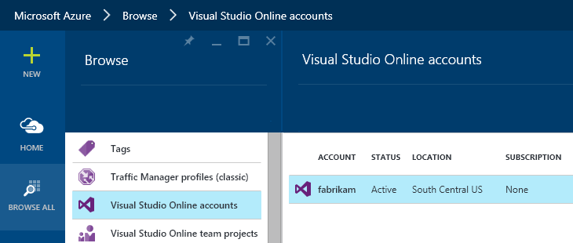
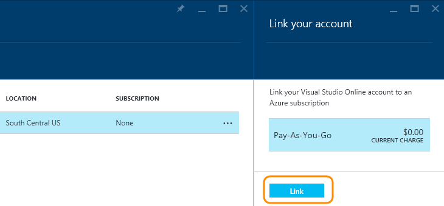
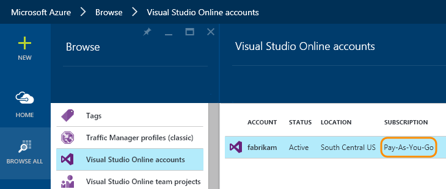
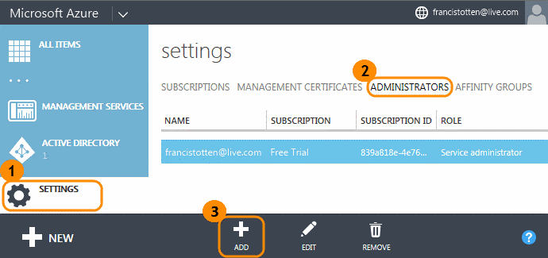
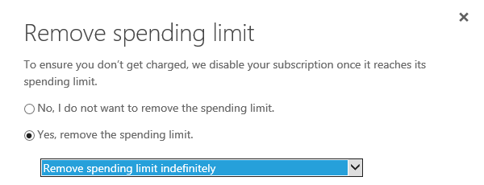

<properties
	pageTitle="Set up billing for your account"
  description="Set up billing for your account"
  services="visual-studio-online"
  documentationCenter = ""
  authors="terryaustin"
  manager="terryaustin"
  editor="terryaustin" /> 

# Set up billing for your account

You only need to set up billing if your needs exceed the free amount 
of Visual Studio Online users or additional services that we include 
with your account. See the details in our 
[Visual Studio Online Feature Matrix](https://www.visualstudio.com/pricing/visual-studio-online-feature-matrix-vs).

Billing happens through Microsoft Azure. To set up billing,
link your Visual Studio Online account to an Azure subscription
in the [Azure management portal](https://manage.windowsazure.com)
or the [Azure preview portal](https://portal.azure.com). 
After you set up this link, you can pay for users or additional services,
like Build and Deployment or Cloud-based Load Testing.

Your Azure subscription has the necessary billing information; 
you won't set this up separately for Visual Studio Online.

## Before you start

If you haven't already, 
[sign up for an Azure subscription](https://account.windowsazure.com/subscriptions/)
as the Visual Studio Online account owner. 
[Can I use my Azure MSDN subscription?](../set-up-billing-for-your-account-vs.md#AzureMSDNSubscription)

## Link your Visual Studio Online account to your Azure subscription

Follow the steps below for the Azure management portal or the 
[steps for the Azure preview portal](../set-up-billing-for-your-account-vs.md#AzurePortal). Both portals give you the same results.
You can link multiple Visual Studio Online accounts to an Azure subscription.

### Azure management portal

1. [Sign in to the Azure management portal](https://manage.windowsazure.com/) 
as the Visual Studio Online account owner.
2. Start linking your account.

3. Select your account and an Azure subscription, if you own more than one. For example:

[What do all these settings mean?](../set-up-billing-for-your-account-vs.md#SettingsDescription)

After you're done, your account appears in the Azure management portal.

### Azure preview portal

1. [Sign in to the Azure preview portal](https://portal.azure.com/) 
as the Visual Studio Online account owner.
2. Select your Visual Studio Online account.

3. Select an Azure subscription, if you have more than one. Finish linking your account.

Your account is now linked to your Azure subscription.

## Add a backup administrator to manage billing

This way, other users can make billing changes, if necessary.

Don't have a backup administrator for your Azure subscription? Contact 
[Support](http://azure.microsoft.com/en-us/support/options/) to regain access.

## Try this next

- [Pay for users accessing your account](../get-more-user-licenses-vs.md) through Microsoft Azure.
- [Pay for Visual Studio Online additional services](../get-more-build-or-load-testing-vs.md) 
through Microsoft Azure.

## Q&amp;A

#### Q: Can I use my Azure MSDN subscription?

A: Yes, but please note that you can't use the
[monthly Azure credits offered as an MSDN subscriber benefit](https://azure.microsoft.com/en-us/pricing/member-offers/msdn-benefits-details/) 
to pay for users or VSO additional services. To bill your MSDN subscription, you must first 
[remove the subscription's default spending limit](https://azure.microsoft.com/en-us/pricing/spending-limits/).

**Important:** Remove your spending limit indefinitely. 
That way, your limit doesn't reactivate with the next billing period. 
Otherwise, if you use paid additional services or pay for users, 
your reactivated limit will disable your Azure MSDN subscription. 
This disrupts all resources linked to your subscription, 
not just VSO additional services and access for paid users, but Azure resources too.

#### Q:    What are all these settings to link my Visual Studio Online account in the Azure management portal?

A:    Here's what they mean:

- **URL**: The Visual Studio Online accounts that you own. 
[Why don't I see any accounts?](../set-up-billing-for-your-account-vs.md#CannotLinkVSOAccount)
- **Directory**: The directory, if any, 
that's connected to your Visual Studio Online account. 
[What's a directory? Why is it connected to my account?](../set-up-billing-for-your-account-vs.md#WhyDirectory)
- **Subscription**: Appears only when you have more than one Azure subscription. 
These subscriptions are filtered by the directories selected in the Azure 
management portal's **Subscriptions** list:

#### Q:    Why can't I link my Visual Studio Online account?

A:  This might happen because:

- Only the Visual Studio Online account owner can set up billing. 
[How do I find the account owner?](../change-account-ownership-vs.md#FindAccountOwner)
- If you don't see any accounts, maybe your account is linked to another Azure subscription. 
Or maybe your account is connected to a directory that's different than the one selected in the 
Azure preview portal's **Subscriptions** list. To select another directory, open that list.

#### Q:    Are there restrictions that might stop me from linking my Visual Studio Online account to my Azure subscription?

A:  Yes, you can link accounts in Australia East only to Azure subscriptions with billing addresses
 in Australia and New Zealand. Otherwise, you'll see this message:

"You need an Azure subscription that is valid for Visual Studio Online accounts in Australia East."

#### Q:    What's a directory? Why is it connected to my account?

A:    A directory helps you authenticate users and control access to assets in the cloud using 
[Azure Active Directory (Azure AD)](http://azure.microsoft.com/en-us/documentation/articles/active-directory-whatis/). 
Here, the directory controls who can get access to your Visual Studio Online account. 
All account users must be in the directory to get access. This works like an extra 
security layer.

Without a directory, the Visual Studio Online account administrator 
is solely responsible for managing access. With a directory, 
the directory administrator controls who can 
[join the directory](https://msdn.microsoft.com/library/azure/hh967632.aspx) 
and get access. Your Visual Studio Online account was connected 
to a directory by the account owner. Learn more about 
[managing work access](../manage-organization-access-for-your-account-vs.md) 
for your account.

#### Q:    How do I get billed?

A:    You're billed monthly but only after you've paid for users 
or used additional services above the free limits.

#### Q:    Where can I check my bill?

A:    If you're the Azure subscription owner or an Azure administrator, 
[check your bill here](https://account.windowsazure.com/Subscriptions).

#### Q:    How do I stop billing?

A:    Sign in to the [Azure management portal](https://manage.windowsazure.com/) 
or the [Azure preview portal](https://portal.azure.com/) 
as the Visual Studio Online account owner or Azure subscription administrator. 
Select your account, reduce the paid users to zero, and turn off any 
paid additional services. Your Visual Studio Online account and bill won't show any 
changes in paid users or Build and Deployment agents until next month when 
these changes take effect. You're still charged for additional services that you've already used.

#### Q:    What happens if I unlink my Visual Studio Online account?

A:    Your account goes back to the limit of 5 free Basic users starting next month.

- You're still charged for paid users and for Build and Deployment agents
for the current month.
- Additional services, like Build and Deployment or Cloud-based Load Testing
go back to the free monthly limits immediately. 
You're charged for any amounts you've already used.
- Your account won't appear in the Azure preview portal anymore.

You can relink your account to another Azure subscription at any time.

#### Q:    What happens if I cancel my Azure subscription?

A:    Your Visual Studio Online account goes back to the free monthly limits, 
but you'll keep any paid users or Build and Deployment agents until next month. 
Your account stays linked to your subscription until you unlink your account, 
or until your account unlinks automatically when your subscription is disabled.

#### Q:    What happens if my Azure subscription is disabled?

A:    If you're the Visual Studio Online account owner, 
[check your subscription status here](https://account.windowsazure.com/), 
then try to fix your subscription. This will restore your account's paid 
settings. Or you can link your Visual Studio Online account to another Azure 
subscription by unlinking your account from the disabled subscription. 
While your subscription is disabled, your account goes back to the free 
monthly limits until your subscription is fixed.

#### Q:    What happens if my credit card expires?

A:    Your Visual Studio Online account goes back to the free monthly limits, 
but you'll keep any paid users or Build and Deployment agents until next month. 
Your Azure subscription will eventually become disabled, but fixing this issue 
reactivates your subscription and restores your account's paid settings.

#### Q:    What if I have other questions about my bill or Azure subscription?

A:    Please contact [Support](https://azure.microsoft.com/en-us/support/options/).
