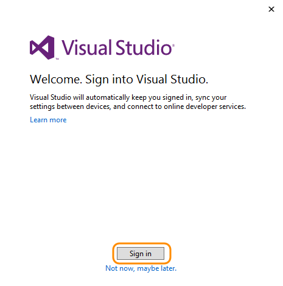
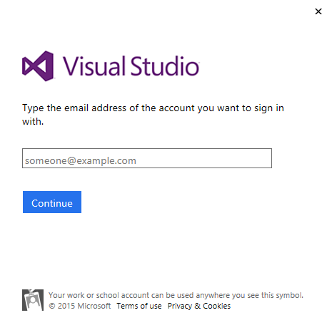
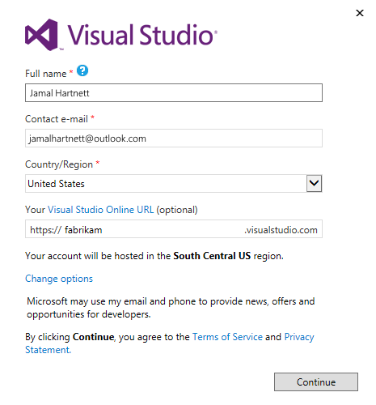
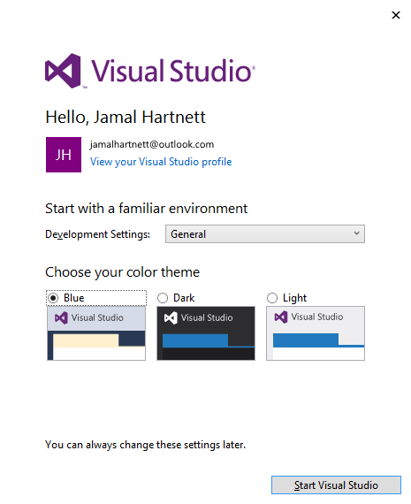
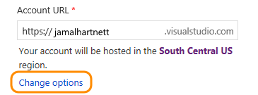

<properties
	pageTitle="Set up Visual Studio"
  description="Set up Visual Studio"
  services="visual-studio-online"
  documentationCenter = ""
  authors="terryaustin"
  manager="terryaustin"
  editor="terryaustin" /> 

# Set up Visual Studio

Visual Studio is an integrated development environment (IDE) that works with Visual Studio Online (VSO), 
a set of complementary cloud services that teams can use to share code, track work, and ship software. 
When you store your code, tests, and test results using VSO, you can access your code from anywhere 
with Visual Studio or other development tools, build your app, run tests, and deploy. No setup needed.

To get started, download and install Visual Studio, then create your Visual Studio Online account.

1. If you don't have Visual Studio installed, 
[download your version now](https://go.microsoft.com/fwlink/?LinkId=309297&amp;clcid=0x409&amp;slcid=0x409), 
then install.

If you have an MSDN subscription or a Visual Studio Online license, 
get the version that's available for your subscription or license.

2. When you start Visual Studio, sign in to create your Visual Studio profile. [Why create a profile?](set-up-vs.md#why-sign-in)

3. Enter your Microsoft account (for example, @outlook.com or @hotmail.com), 
or your work or school account (for example, @fabrikam.com).

If you have an MSDN subscription or a Visual Studio Online license, 
use the sign-in address for that subscription or license.

4. Create your Visual Studio profile. You only have to do this once.

Give a memorable name to your new Visual Studio Online account 
and confirm [your account's location](set-up-vs.md#AccountLocation). For a better experience, 
select the location closest to most users in your account.

5. If you're a new Visual Studio user, you can change your settings here, 
or change them later in Visual Studio options. Otherwise, your personalized settings will be applied.

Your changes are saved with your profile, and your settings roam with you wherever you sign in.

## Try this next

- [Connect to Visual Studo Online](connect-to-visual-studio-online.md) to create your team project,
share your code, build your app, create and run tests, and deploy.

## Q &amp; A

#### Q: Why create a Visual Studio profile?

A:    Your Visual Studio settings, like automatic brace completion, are saved with your 
profile. These settings roam with you when you sign in to Visual Studio on any computer, 
anywhere with your Microsoft account, or with your work or school account.

Sign in to Visual Studio during the 30-day trial period for these benefits:

- Visual Studio Enterprise: Extend your trial for another 90 days

- Visual Studio Express or Community: Continue to use this edition for free

You can also create a Visual Studio Online account when you create your profile.

Learn more about the 
[benefits of signing in and creating a profile](https://msdn.microsoft.com/library/dn457348%28v=vs.140%29.aspx).

#### Q: Where does Visual Studio Online host my account?

A: Your default account's location is selected based on the closest 
[Microsoft Azure region](https://azure.microsoft.com/en-us/regions) 
where Visual Studio Online is available. 
But you can change this location during account signup.

#### Q: Can I create a Visual Studio Online account later?

A:    Yes, you can always create a Visual Studio Online account later. 
Learn more about how to [sign up for Visual Studio Online](sign-up-for-visual-studio-online.md).

#### Q: Can I use Visual Studio 2015 with Visual Studio 2013 and 2012 on the same computer?

A:    Yes, you can run all these versions on the same computer.

