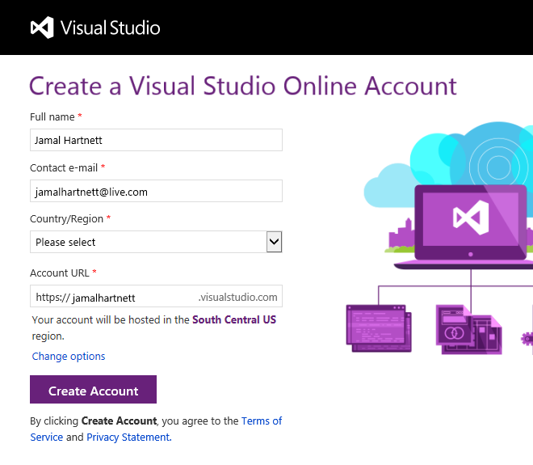

<properties
	pageTitle="Sign up for Visual Studio Online"
  description="Sign up for Visual Studio Online"
  services="visual-studio-online"
  documentationCenter = ""
  authors="terryaustin"
  manager="terryaustin"
  editor="terryaustin" /> 

# Sign up for Visual Studio Online

Store your code, tests, and test results in the cloud with Visual Studio Online. You can then
access your code from anywhere with your development tools, build your app, run tests, and
deploy. No setup needed. Whether by yourself or on a team, plan your work and collaborate
better with others because you can see what everyone's working on. And, Visual Studio Online
is free for up to five team members.

To use this service, you need a sign-in account.

- To get started quickly, you just need a [Microsoft account](https://www.visualstudio.com/get-started/setup/sign-up-for-visual-studio-online#MicrosoftAccount).
- If you work for an organization, like a company or school, 
and need more control over who can access your Visual Studio Online account,
use a [work or school account](https://www.visualstudio.com/get-started/setup/sign-up-for-visual-studio-online#orgaccount).

## Sign up with a Microsoft account

1. [Create a Microsoft account](https://signup.live.com/), if you don't have one.
2. [Sign in to Visual Studio Online](https://go.microsoft.com/fwlink/?LinkId=307137&amp;clcid=0x409) 
with your Microsoft account (for example, @outlook.com or @hotmail.com).

If you have an MSDN subscription that has Visual Studio Online as a benefit, 
use the Microsoft account for that subscription.
3. Confirm your profile details. You only have to do this step once.

Give a memorable name to your new Visual Studio Online account and confirm [your account's location](https://www.visualstudio.com/get-started/setup/sign-up-for-visual-studio-online#AccountLocation). 
For a better experience, select the location closest to most users in your account.

You're now a Visual Studio Online account owner!
4. [Create your first team project](https://www.visualstudio.com/get-started/setup/connect-to-visual-studio-online) to store your code, backlog, and more. 
Name your project, select a process template to manage your work, then choose your version control provider.

Not sure what to choose? Find out which 
[process template](https://msdn.microsoft.com/Library/vs/alm/Work/guidance/choose-process)
and [version control](https://msdn.microsoft.com/Library/vs/alm/code/overview) works for you.

### Try this next

- Start coding your app.

 - Git using [Visual Studio](https://www.visualstudio.com/get-started/code/share-your-code-in-git-vs) or [Eclipse](https://www.visualstudio.com/get-started/setup/connect-to-visual-studio-online#eclipse) or [Xcode](https://www.visualstudio.com/get-started/code/share-your-code-in-git-xcode)
 - TFVC using [Visual Studio](https://www.visualstudio.com/get-started/code/share-your-code-in-tfvc-vs#workspace) or [Eclipse](https://www.visualstudio.com/get-started/setup/connect-to-visual-studio-online#eclipse) or [Xcode](https://www.visualstudio.com/get-started/code/share-your-code-in-tfvc-xcode)
- [Create a backlog](https://www.visualstudio.com/get-started/work/create-your-backlog-vs) to plan, organize, and track your work.
- [Add users and their licenses](https://www.visualstudio.com/get-started/setup/assign-licenses-to-users-vs) to your Visual Studio Online account.

## Sign up with a work or school account

Control access to your Visual Studio Online account the same way you do with Microsoft services 
like Office 365 - using a directory. You can then sign in to Visual Studio Online 
and other services with the same username and password that you use at your work or school 
(for example, fabrikam.com).

Using a directory helps you enforce policies about accessing company resources. 
[Learn more](https://azure.microsoft.com/en-us/documentation/articles/sign-up-organization) 
about signing up as an organization.

### How does a directory control account access?

When you use your work or school account to create your Visual Studio Online account, 
only users in your work or school directory will be able to get account access.

The directory administrator has control over who can join the directory and get access. 
If users are removed from the directory, for example, because they've moved elsewhere, 
they will lose access to your account.

Without a directory, you solely control account access. All users must sign in 
with Microsoft accounts. [*What are other differences?*](https://www.visualstudio.com/get-started/setup/sign-up-for-visual-studio-online#SignInAccountDifferences)

### What do I need to sign up?

You need a work or school account account that's managed using
[Azure Active Directory (Azure AD)](https://azure.microsoft.com/en-us/documentation/articles/active-directory-whatis/). 
You might have this already if you use Azure or Office 365. If you don't, find out how to 
[sign up for a work or school account](https://azure.microsoft.com/documentation/articles/sign-up-organization/). 
If you use an on-premises Active Directory, find out 
[how to synchronize](https://msdn.microsoft.com/library/azure/jj573653.aspx) that with your directory 
in Azure AD. You can then use existing user accounts with Visual Studio Online.

1. [Sign in to Visual Studio Online](https://go.microsoft.com/fwlink/?LinkId=307137) 
with your work or school account.

If you have an MSDN subscription that has Visual Studio Online as a benefit, 
[add your work or school account](https://www.visualstudio.com/get-started/setup/link-msdn-subscription-to-organizational-account-vs) to your subscription.

2. Enter your sign-in address and password. Your sign-in page will look different based on the address you used.
3. Confirm your profile details. You only have to do this step once.
4. Give a memorable name to your new Visual Studio Online account and confirm [your account's location](https://www.visualstudio.com/get-started/setup/sign-up-for-visual-studio-online#AccountLocation).
For a better experience, select the location closest to most users in your account.

If you belong to multiple directories, you can [change the directory now](https://www.visualstudio.com/get-started/setup/sign-up-for-visual-studio-online#ChangeDirectory) 
or later. Only users in the selected directory will be able to get account access.

You're now a Visual Studio Online account owner!
5. [Create your first team project](https://www.visualstudio.com/get-started/setup/connect-to-visual-studio-online) to store your code, backlog, and more. 
Name your project, select a process template to manage your work, then choose your version control provider.

Not sure what to choose? Find out which 
[process template](https://msdn.microsoft.com/Library/vs/alm/Work/guidance/choose-process) 
and [version control](https://msdn.microsoft.com/Library/vs/alm/code/overview) works for you.

### Try this next

- Start coding your app.

 - Git using [Visual Studio](https://www.visualstudio.com/get-started/code/share-your-code-in-git-vs) or [Eclipse](https://www.visualstudio.com/get-started/setup/connect-to-visual-studio-online#eclipse) or [Xcode](https://www.visualstudio.com/get-started/code/share-your-code-in-git-xcode)
 - TFVC using [Visual Studio](https://www.visualstudio.com/get-started/code/share-your-code-in-tfvc-vs#workspace) or [Eclipse](https://www.visualstudio.com/get-started/setup/connect-to-visual-studio-online#eclipse) or [Xcode](https://www.visualstudio.com/get-started/code/share-your-code-in-tfvc-xcode)
- [Create a backlog](https://www.visualstudio.com/get-started/work/create-your-backlog-vs) to plan, organize, and track your work.
- [Add users and their licenses](https://www.visualstudio.com/get-started/setup/assign-licenses-to-users-vs) to your Visual Studio Online account.
- [Set up work or school access](https://www.visualstudio.com/get-started/setup/manage-organization-access-for-your-account-vs) for users who aren't in your directory.

## Q &amp; A

#### Q:    How many Visual Studio Online accounts can I create?

A:    You can create multiple Visual Studio Online accounts. Your account can also have unlimited private 
projects using Git or TFVC. Rather than create another account, you might consider 
[creating a new team project](https://www.visualstudio.com/get-started/setup/connect-to-visual-studio-online) instead.

There's no limit on how many Visual Studio Online accounts where you can be a member.

#### Q:    What if I don't remember my Visual Studio Online account name (URL)?

A:    To find your account, [sign in to Visual Studio Online](https://go.microsoft.com/fwlink/?LinkId=309329).

#### Q: Where does Visual Studio Online host my account?

A: Your default account's location is selected based on the closest 
[Microsoft Azure region](https://azure.microsoft.com/en-us/regions) 
where Visual Studio Online is available. 
But you can change this location during account signup.

#### Q:    Can I change my Visual Studio Online account name (URL) or owner?

A:    Yes, you can do this from your account's control panel and settings. Find out how to:

- [Rename your account](https://www.visualstudio.com/get-started/setup/rename-vso-account-vs).
- [Change the account owner](https://www.visualstudio.com/get-started/setup/change-account-ownership-vs).

#### Q:    What's the difference between using a Microsoft account and a work account to sign up?

A:    Your choice affects how you control access to your Visual Studio Online account.

When you sign up with a Microsoft account:

- You solely control access to your Visual Studio Online account.
- Users sign in with Microsoft accounts.

When you sign up with a work or school account:

- Your Visual Studio Online account is connected to a directory in Azure AD.
- Users must be in the connected directory to get access to your Visual Studio Online account.
- The directory administrator has control over who can join the directory.
- You sign in with work or school accounts, or with Microsoft accounts if your company allows that.
- Some features, like strong passwords, don't apply to Microsoft accounts added the directory.

To [add other users to the directory](https://msdn.microsoft.com/library/azure/hh967632.aspx), 
you must be a directory administrator. If you don't have access, work with your directory administrator to add users.

[Learn more](https://azure.microsoft.com/en-us/documentation/articles/sign-up-organization) 
about work or school accounts for your organization.

#### Q:    Why am I asked to choose between a work account and a Microsoft account twice during signup?

A:    Because you have a work account and a Microsoft account that share the same email address. 
Choose the account that you want to use with Visual Studio Online.

#### Q:    Can I change the directory after signup?

A:    You can change directories after signup by first 
[disconnecting your account](https://www.visualstudio.com/get-started/setup/manage-organization-access-for-your-account-vs#DisconnectDirectory).
You then reconnect your account to another directory. Also, make sure that all your account users 
are in the new directory with the same sign-in address that they used before.
