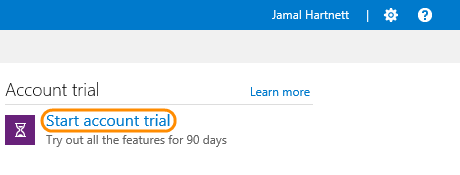
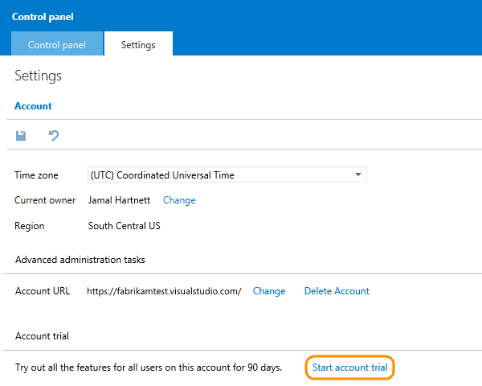
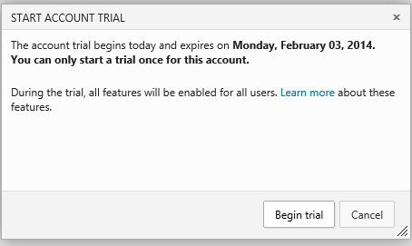

<properties
	pageTitle="Visual Studio Online trial"
  description="Visual Studio Online trial"
  services="visual-studio-online"
  documentationCenter = ""
  authors="terryaustin"
  manager="terryaustin"
  editor="terryaustin" /> 

# Visual Studio Online trial

Try these features for free for 90 days:

- [Web-based test case management](../test/create-a-test-plan-vs.md) 
(create test plans and test cases, and organize test suites)

If you're the owner of your Visual Studio Online account, 
you can start a 90-day trial of these additional features. 
During the trial, all account users, except stakeholders, 
can try all Visual Studio Online features.

After the trial, you can upgrade to keep access to additional features 
and any data you added. You'll need Advanced access 
(Visual Studio Online Advanced, or certain higher-level MSDN subscriptions)
to continue using these features.

Learn more about [features](https://www.visualstudio.com/pricing/visual-studio-online-feature-matrix-vs) 
and [pricing](https://www.visualstudio.com/pricing/visual-studio-online-pricing-vs) 
for Visual Studio Online.

## Start the trial

1. Make sure you're the account owner. 
([How do I find the account owner?](change-account-ownership-vs.md))

2. Sign in to your Visual Studio Online account (`http://{youraccount}.visualstudio.com`).

3. From your account home page, start the trial.

Or you can start the trial from your account settings.

4. You can only start a trial once for your Visual Studio Online account.

Your trial has begun - now you can try all Visual Studio Online features.

## Q&amp;A

#### Q:   During the trial, what are my charges?

A:  You incur charges for Build (XAML), Build and Deployment agents,
and Cloud-based Load Testing usage beyond the monthly included amounts, 
and also for any user license purchases in the Azure management portal 
or Azure preview portal. All users, except stakeholders, can use 
Advanced features during the trial.

#### Q:  How many times can I try out the features?

A:  You can only start a Visual Studio Online trial once per account.

#### Q:  What happens to my account when the trial is over?

A:  Feature access returns to normal, based on the level assigned to each 
team member. Data changes are preserved.

