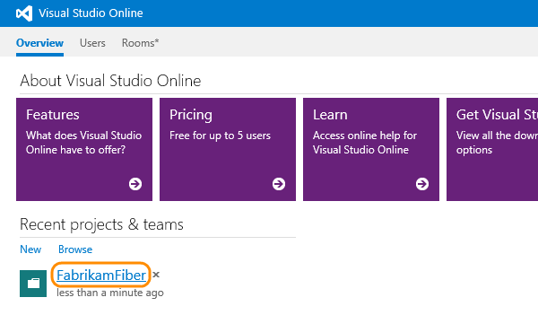
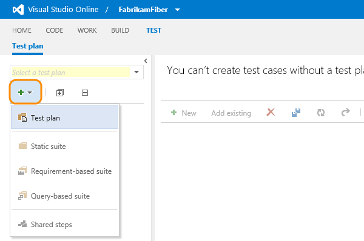
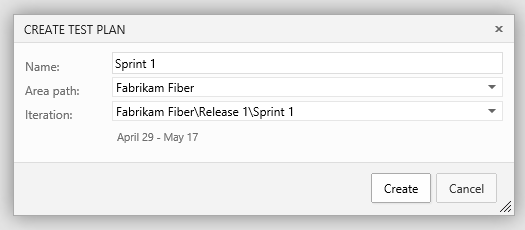
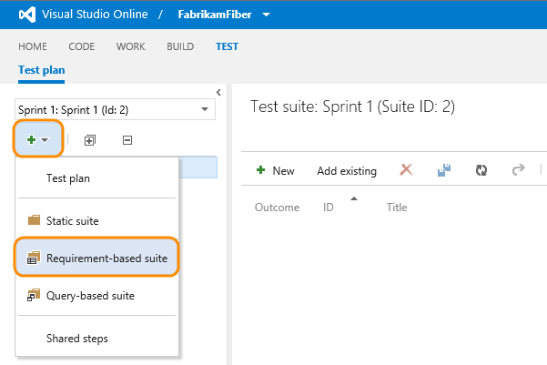
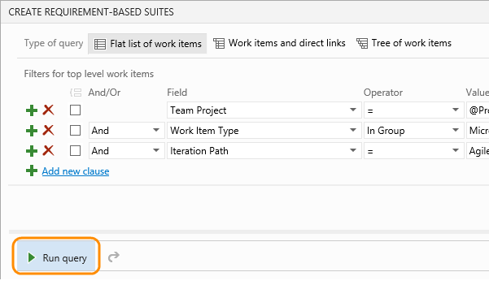
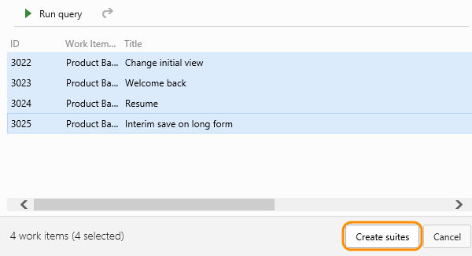
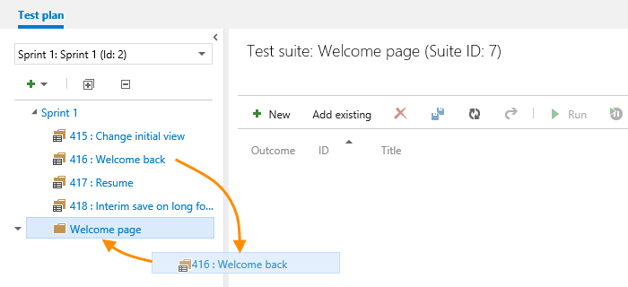
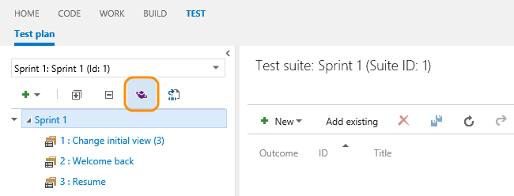
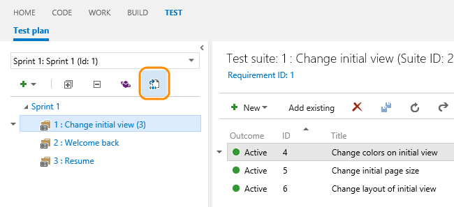

# Create a test plan

Create test plans to track manual testing for sprints 
or milestones. That way, you can see when the testing 
for a specific sprint or milestone is complete.

1. If you haven't already, 
[sign up for Visual Studio Online](https://www.visualstudio.com/get-started/setup/sign-up-for-visual-studio-online), 
[create your team project](https://www.visualstudio.com/get-started/setup/connect-to-visual-studio-online#createteamproject), 
and [create your backlog](https://www.visualstudio.com/get-started/work/create-your-backlog-vs).
2. In Visual Studio Online, select your team project. 
(If you haven't been here before, use Browse.)

3. Go to the Test hub. Create a test plan for your current sprint.

4. Name the test plan. Check the area path and iteration.

5. Now add test suites for the backlog items that need manual tests. 
(These backlog items could be user stories, requirements or another 
work item based on the setup of your team project.)

You use requirement-based suites to group your test cases together. 
That way, you can track the testing status of a backlog item. 
Each test case that you add to a requirement-based test suite is 
automatically linked to the backlog item.
6. Add a clause to filter by the iteration path for the sprint. 
Run the query to view the matching backlog items.

7. Select the backlog items that you want to test this sprint. 
Add them as requirements to your test plan by creating test suites from them.

Now you've created a requirement-based test suite for each backlog item.

## Try this next

- [Create test cases](https://www.visualstudio.com/get-started/test/create-tests-vs) for each requirement-based test suite

## Q&amp;A

#### Q:  Can I group my requirement-based test suites together?

A:  Yes, you can create a static test suite to do this. 
Static test suites can contain any type of test suites - just like folders. 
Drag test suites to group them in a static test plan.

#### Q:  What are query-based test suites ?

A:  Use a query to group together test cases that have a particular characteristic, 
for example, all tests that have Priorty=1. The suite will automatically include 
every test case that is returned by the query that you define.

#### Q:  Can I edit other properties of a test plan from the test hub?

A:  You can only do this from Microsoft Test Manager (MTM). If you're using Visual Studio 2015,
Visual Studio 2013, or Visual Studio 2012 Update 3, you can open a test plan in MTM directly from the Test hub. 
(The most recently installed version of MTM is launched.)

#### Q:  Can I export the test plan to share or review offline?

A:  Yes, you can export test plans, test suites, and test cases. Select the details 
that you want in the report. Then email or print this report for review.

Change the test case fields in the report by adding or removing columns from 
the list view of the test suite.

#### Q:  When I export a test plan, can I just view the data or copy it to a Word document?

A:  Yes, choose Print in the Export dialog box, then choose Cancel in the Print dialog box. 
This displays the data in the report. Select all the text, then copy and paste it 
into a Word document, if you want. All the formatting in the report is retained.

#### Q:  When I export a test plan, can I customize the report?

A:  You can only do this if you are using an on-premises Team Foundation Server. 
You can [edit the XSLT file](https://msdn.microsoft.com/library/dd380763.aspx#XSLT).

#### Q:  Can I track changes to test plans and test suites that I create with Visual Studio Online?

A:  Yes, you can track changes to test plans and test suites. Open the work item 
for the test plan or test suite, then view the work item history.

For test suites, other actions are tracked in the Test Suite Audit field. 
For example, adding and removing test cases from a test suite are tracked in this field.
