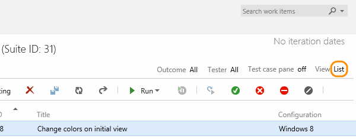

<properties
	pageTitle="Create tests"
  description="Create tests"
  services="visual-studio-online"
  documentationCenter = ""
  authors="terryaustin"
  manager="terryaustin"
  editor="terryaustin" /> 

# Create tests

Create manual test cases to check that each of the deliverables 
meet your users' needs. Organize your test cases by adding test 
cases to test suites. Then choose which testers you want to run 
the tests.

1. If you haven't already, 
[create a test plan and requirement-based test suites](create-a-test-plan-vs.md).

2. Select a requirement-based test suite, and then create a 
test case for that suite.

The test suite that you selected was created from a backlog item. 
When you add a test case to this kind of suite, the test case is 
linked automatically to the backlog item.

3. Add test steps with actions and expected results so that 
any team member can run the test. You can add attachments to 
a step if you want.

Now you've created a test case that you can run.

4. You can reassign test cases so that another tester can 
run them. Select the tests that you want to reassign. Then 
choose the tester that you want to run the tests.

Or, you can assign all the test cases in a test suite to multiple testers. 
This is useful for acceptance testing.

After you select the testers, you can email them so they
know the tests are ready for them to run. (You only need a 
[Basic license](https://www.visualstudio.com/products/visual-studio-online-Basic-vs)
to run tests from Visual Studio Online.)

## Try this next

- [Run your manual tests](run-tests-vs.md)

## Q&amp;A

#### Q:  Can I add an extra line to a test step?

A:  Yes, press Shift+Enter in the action or expected 
results field to add an extra line.

#### Q:  How do I insert a test step into a test case?

A:  Select a test step. Press Alt+P to insert a new test step 
above the selected step.

#### Q:  Is there a way to quickly add multiple test cases at the same time?

A:  Yes, use the grid view when you add test cases to 
the test suite.

On the grid shortcut menu, you can add, delete, or clear rows.

#### Q:  Can I bulk edit multiple test cases?

A:  Yes, switch the view from list to grid. The grid shows 
all the test cases for the current test suite and all the 
test steps for those cases. This is a helpful view if you 
want to review your test cases with other team members. 
When you review, you can update and add new test cases.

Or, you can filter and sort the test cases in list view. Then select 
just the ones that you want to bulk edit using the grid.

To return to the test suite view, switch the view 
from grid back to list.

#### Q:  Can I copy test cases and test steps from an existing Excel worksheet?

A:  Yes, copy the columns from Excel that you want to use for 
the title, action, and expected results fields. No column 
formatting, other than multiline, is copied from the
worksheet. Paste these columns into the grid view, 
edit if necessary, and save them. (This is supported only with 
Internet Explorer and Chrome browsers.)

#### Q:  Can I copy test cases from the grid to an Excel worksheet?

A:  Yes, copy the data from the grid and paste it into your 
Excel worksheet. No test step formatting, other than multiline, 
is copied into the worksheet. (This is supported only 
with Internet Explorer and Chrome browsers.)

#### Q:  Can I edit other fields in the grid view?

A:  Yes, use the column options to select the fields in the test 
case work item.

You can then view and edit these fields when you switch to 
the grid view.

#### Q:  Can I tag test cases so that I can see only tests with specific tags?

A:  Yes, you can tag test cases in a suite with any tag that 
you want. For example, tag all the tests related to login so that 
you can rerun these tests if a bug is fixed for the login page. 
Then you can filter on that tag from the Test hub.

You can add and edit tags when you edit a test case, or bulk edit tags 
in the grid view. You can also create suites based on queries when
you use tags.

#### Q:  Can I share test steps between test cases?

A:  Yes, choose the steps that you want to share. Find out more about 
[sharing test steps](https://msdn.microsoft.com/library/dd286655.aspx).

#### Q:  Can I add parameters to a test case so it can run multiple times with different data?

A:  Yes, choose a test step, and then add the parameter. Find out more about
[repeating test steps with different data](https://msdn.microsoft.com/library/dd997832.aspx).

#### Q:  Can I share parameter data between test cases?

A:  Yes. That way, test cases with the same parameters can run with same data, 
so you get consistent results. To share parameter data, convert your existing
parameters to shared parameters.

After you create a shared parameter set, open another test case, 
and add the shared parameter set to that test case. Find out more about 
[sharing parameters](https://msdn.microsoft.com/library/dd997832.aspx#SharedParameters).

Add, edit, and rename your shared parameter sets on the Parameters tab. 
In the test cases pane, view the test cases that use those parameters.

Each shared parameter set is a work item. On the Properties tab, 
you can view or make changes to this work item. For example, 
you can assign owners and track changes.

#### Q:  Can I import parameter values from an Excel spreadsheet to my shared parameter sets?

A:  Yes, copy the data from your Excel spreadsheet and paste it into your 
shared parameters grid. You can also copy the data from your grid back 
into Excel, if necessary.

#### Q:  How can I find out if a test case was added to other test suites?

A:  Select a test case, then view the test suites details. The Associated
test suites pane shows you any test suite for any test plan that contains 
this test case. This includes all team projects.

Click the associated test suite to view it. To view the team project and the test 
plan for that test suite, move your pointer over the test suite.

#### Q:  What happens when I delete a test case from a requirement-based test suite?

A:  The test case still exists in your team project, but the 
test case is removed from the test suite. Also, it's no 
longer linked to the backlog item for that test suite.

#### Q:  Why do I see the wrong test suite and tests when I click 'View Tests' from the notification email about tests that are assigned to me?

A:  This might happen if you were prompted to enter sign-in 
credentials for Visual Studio Online when you clicked this link. 
Without signing out from Visual Studio Online, click 'View Tests' 
again to see the correct test suite and tests.

