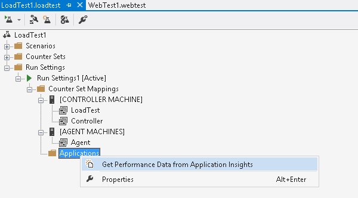
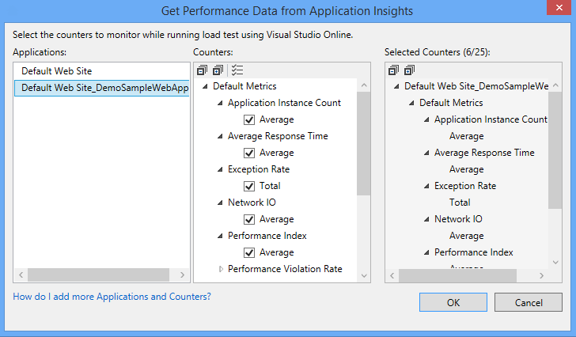
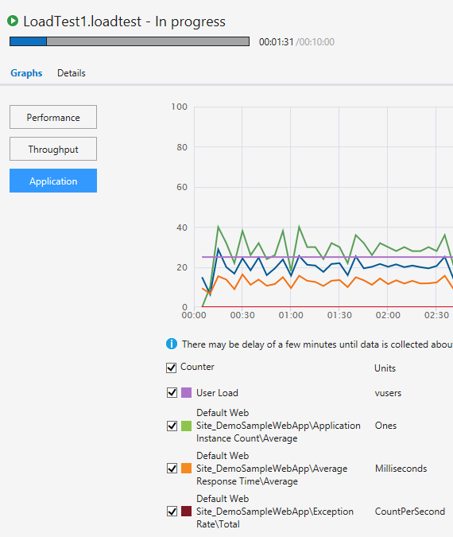
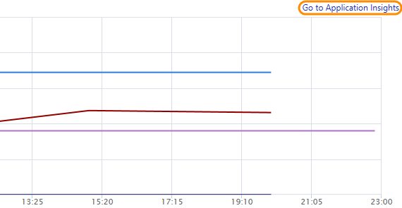

<properties
	pageTitle="Get app performance data with your load tests"
  description="Get app performance data with your load tests"
  services="visual-studio-online"
  documentationCenter = ""
  authors="terryaustin"
  manager="terryaustin"
  editor="terryaustin" /> 

# Get app performance data with your load tests

When you load test your app in the cloud using Visual Studio Online, 
you can compare app performance with virtual user load using Application Insights. 
Then, by doing a quick root cause analysis, you can figure out which code 
is causing performance problems.

If you're using Application Insights with Visual Studio Online, 
continue with these steps. Otherwise, if you're new to Application Insights, 
or you're using Application Insights with Azure, contact 
[vsoloadtest@microsoft.com](mailto:vsoloadtest@microsoft.com) to get instructions.

1. Download and install 
[Visual Studio Enterprise 2015](https://www.visualstudio.com/downloads/download-visual-studio-vs), 
if you haven't already.
2. [Set up your load test project to run in the cloud](../load-test-your-app-vs.md#LoadTestVSIDE), 
if you haven't already.
3. [Set up monitoring for your app using Application Insights](https://blogs.msdn.com/b/visualstudioalm/archive/2014/07/08/get-application-performance-counters-of-your-choice-during-load-runs-with-visual-studio-online.aspx), 
if you haven't already. You must use the same sign-in account that you 
use to monitor your app and to run your load test using Visual Studio Online.
4. Open your load test in Visual Studio Enterprise 2015.
5. Now you'll add the apps that you want to get performance 
data from Application Insights.

6. Select the apps that you want to monitor and the performance counters 
that you want to view while your load test runs.

7. View the performance data from Application Insights while your 
load test runs. The data might take a few minutes to appear.

Application counters are correlated with user load so that you can 
understand which issues might cause performance problems that you find.
8. To do a more detailed analysis for any performance issue, or to do a 
quick root cause analysis, go to Application Insights.

## Q&amp;A

#### Q: Can I view data from other app monitoring tools when load testing in the cloud?

A: No.

#### Q: Can I increase how often data is collected?

A: No, this is currently a fixed frequency of 1 minute.

#### Q: I don't see any counters even after waiting a few minutes. What's wrong?

A: Go to Application Insights and check that you can view performance data 
for your app there. If you see data collected there, report your issue to 
[vsoloadtest@microsoft.com](mailto:vsoloadtest@microsoft.com). If there's no data, get 
[troubleshooting help here](http://blogs.msdn.com/b/visualstudioalm/archive/2013/12/11/application-insights-microsoft-monitoring-agent-setup-faq.aspx) 
for Application Insights.

#### Q: Can I still use Visual Studio Ultimate 2013 to get app performance data?

A:  Yes, you can still use this version with Update 4 or Update 5. [Download this version here](https://www.visualstudio.com/downloads/download-visual-studio-vs).
