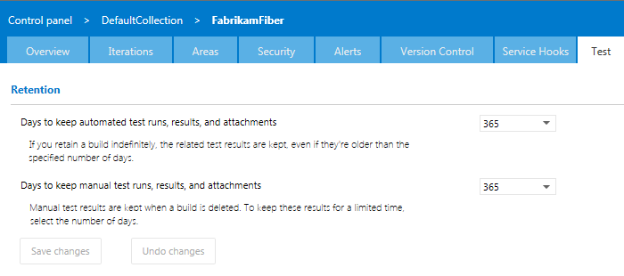
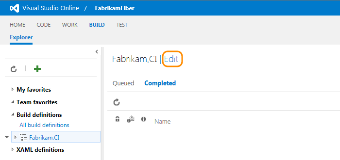
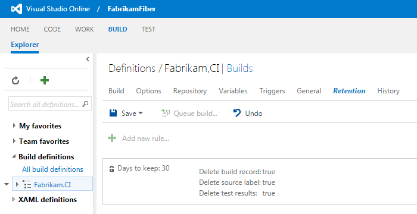
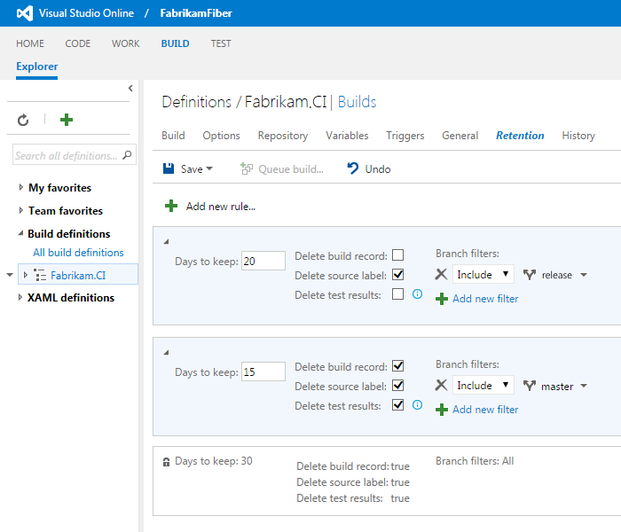
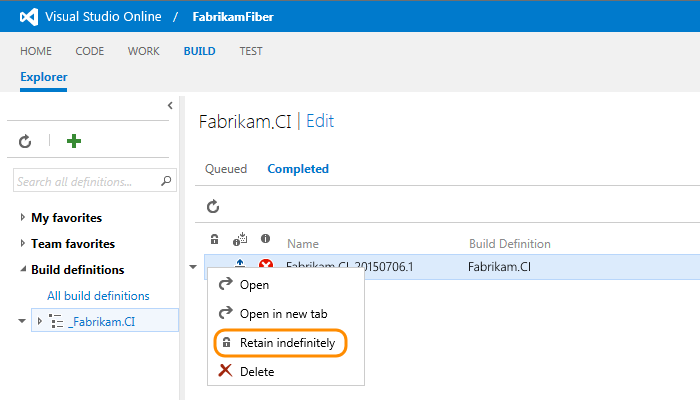

<properties
	pageTitle="Control how long to keep test results in Visual Studio Online"
  description="Control how long to keep test results in Visual Studio Online"
  services="visual-studio-online"
  documentationCenter = ""
  authors="terryaustin"
  manager="terryaustin"
  editor="terryaustin" /> 

# Control how long to keep test results in Visual Studio Online

Running tests, especially automated ones, generates lots of data. 
To keep your test system responsive and performing well,
have a policy to clear test results that you don't need anymore. 
Delete automated test results when you delete your builds.
You can keep manual test results while you're still reviewing them, 
for example, up to a year.

## Manual test results

To delete manual test results after a specific number of days, 
set the retention limit at the team project level. 
Visual Studio Online keeps manual test results related to builds, 
even after you delete those builds. That way, build policies don't delete 
your test results before you can analyze the data.

1. Sign to your Visual Studio Online account (`https://{youraccount}.visualstudio.com`). 
You'll need at least team project administrator permissions.

2. Go to your team project.

3. Go to the team project control panel.

4. Select a limit for how long you want to keep manual test data.

## Automated test results

### Automated test results associated with builds

By default, Visual Studio Online keeps automated test results related to builds 
only as long as you keep those builds. To keep test results after you delete your builds, 
edit the build retention policy. If you use Git for version control, 
you can specify how long to keep automated test results based on the branch.

1. Sign to your Visual Studio Online account (`https://{youraccount}.visualstudio.com`). 
You'll need at least build level permissions to edit build definitions.

2. Go to your team project. Find and edit your build definition.

By default, test results are deleted when the build is deleted.

3. If you use Git, and you have more than one branch, 
set the branch filter to delete test results and builds
in one branch. Meanwhile, you can keep test results in another branch, 
even though you delete the builds in that other branch.

### Automated test results not associated with builds or orphaned from deleted builds

To clean up automated test results that are left over from deleted 
builds or test results that aren't related to builds, 
for example, results published from external test systems, 
set the retention limits at the team project level. 
[Learn more](how-long-to-keep-test-results.md#manual-test-results-limits)

## Q&amp;A

#### Q: What are the default retention limits?

A: For team projects created before October 2015, 
Visual Studio Online doesn't delete results from automated tests 
and manual tests unless you change the retention limit.

For new team projects created after October 2015, 
Visual Studio Online deletes all test results after one year (365 days),
unless you chose to indefinitely retain a build associated with those results.

#### Q: What is the default test retention policy for XAML builds?

A: By default, a XAML build definition is set up to delete builds older 
than the 10 most recent builds. But related test results aren't automatically
deleted when those builds are deleted. 
[Learn more](https://msdn.microsoft.com/en-us/library/ms181716%28v=vs.120%29.aspx).

#### Q: Why isn't test data deleted for XAML builds by default?

A: By default, this is turned off because 10 builds can happen very quickly, 
especially with continuous integration builds. 
Test results are often deleted before you can analyze them.

#### Q: How do I keep a build indefinitely?

A: Like this:

