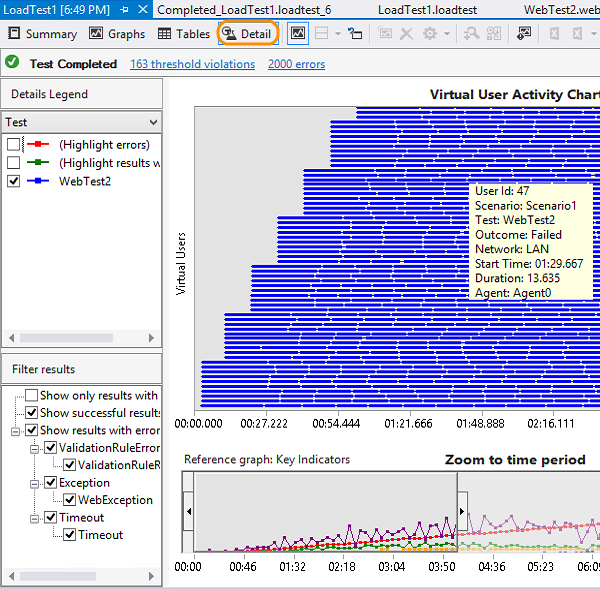

<properties
	pageTitle="Load test in the cloud"
  description="Load test in the cloud"
  services="visual-studio-online"
  documentationCenter = ""
  authors="terryaustin"
  manager="terryaustin"
  editor="terryaustin" /> 

# Load test in the cloud


Find performance problems in your app before customers do. 
Make sure your app can handle the traffic for your next launch or marketing campaign. 
Start running [cloud-based load tests](https://www.visualstudio.com/features/vso-cloud-load-testing-vs) 
in almost no time with Visual Studio Online.


**Why load test in the cloud?**


- **Quick**: Just one click gets you a performance lab 
in the cloud, no setup needed. Scale up or down based 
on your needs.
- **Free load testing**: Get 20,000 [virtual user minutes](https://www.visualstudio.com/get-started/test/load-test-your-app-vs#VUM) 
every month to load test at no extra charge.
- **Real-time charts and graphs**: Watch your app's 
performance while your tests run. Share the results 
when your tests are done.
- **Test where your users are**: Test from different 
locations to reduce latency and simulate local conditions.
- **Get deeper insights about performance**: Get full 
server and client diagnostics when you simulate real-life 
load patterns for your app.


To check your web app's performance, 
start [load testing in the cloud](https://www.visualstudio.com/get-started/test/load-test-your-app-vs#LoadTestVSIDE) with Visual Studio Enterprise 2015 
or Visual Studio Ultimate 2013, our sample load test project 
or your own load test project, and Visual Studio Online.


Or, if you have a Visual Studio Enterprise with MSDN subscription 
or a Visual Studio Ultimate with MSDN subscription,
you can run a basic load test [directly in Visual Studio Online](https://www.visualstudio.com/get-started/test/load-test-your-app-vs#LoadTestHub).
No load test project necessary.


To performance test Azure web apps with Visual Studio Online, 
[learn more here](https://azure.microsoft.com/en-us/documentation/articles/app-service-web-app-performance-test).


## Load test with Visual Studio


Before you start:


- [Create your Visual Studio Online account](https://www.visualstudio.com/get-started/setup/sign-up-for-visual-studio-online), 
if you don't have one already. You can have any license assigned to you in Visual Studio Online 
when you use Visual Studio Enterprise 2015 or Visual Studio Ultimate 2013 to run load tests.
- If you don't have a load test project, use our sample load test project with your web site or app. 
Just provide the address for the web site that you want to test. Or, if you have a load test project, jump ahead to 
[set up your load test project](https://www.visualstudio.com/get-started/test/load-test-your-app-vs#SetUpProject) to run load tests in Visual Studio Online.


### Get the sample load test project

1. [Download and install Visual Studio Enterprise 2015 or Visual Studio Ultimate 2013](https://www.visualstudio.com/downloads/download-visual-studio-vs), 
if you haven't already.
2. [Download the sample load test project](https://code.msdn.microsoft.com/Getting-started-with-17a52e95), 
and unzip the files.
3. Open the GettingStartedWithLoadTesting.sln solution.
4. Open the SampleWebTest.webtest file. Replace the URL with your app's web page.


5. Save the solution, then jump ahead to 
[Connect to your Visual Studio Online account](https://www.visualstudio.com/get-started/test/load-test-your-app-vs#ConnectVSOnline).


### Set up your load test project to run tests in the cloud


Do you have a load test project from Visual Studio Ultimate 2012 or 2010? 
No problem, just open your project in Visual Studio Enterprise 2015 or Visual Studio Ultimate 2013, then set up 
that project for load testing with Visual Studio Online.


1. [Download and install Visual Studio Enterprise 2015 or Visual Studio Ultimate 2013](https://www.visualstudio.com/downloads/download-visual-studio-vs), if you haven't already.
2. Open your load test project in Visual Studio Enterprise or Ultimate.
3. Edit the test settings file so that your project uses 
Visual Studio Online for load testing.


When you're ready to start load testing, connect Visual Studio to Visual Studio Online.


### Connect to your Visual Studio Online account


Before you can run load tests in the cloud, 
connect Visual Studio Enterprise or Ultimate to your Visual Studio Online account.


1. If you haven't already, [sign up for a Visual Studio Online account](https://go.microsoft.com/fwlink/?LinkId=309297&amp;clcid=0x409&amp;slcid=0x409). 
Find out more about 
[signing up for Visual Studio Online](https://www.visualstudio.com/get-started/setup/sign-up-for-visual-studio-online).
2. In Team Explorer, connect to your Visual Studio Online account.


3. View your available team projects.


a.    If you haven't connected to your Visual Studio Online 
 account before, add your account to the server list.


b.    Enter your Visual Studio Online account name 
  (`{youraccount}.visualstudio.com`).


c.    If you're prompted to sign in to Visual Studio Online, do that.
4. Select your Visual Studio Online account from the list, 
then choose your team project. Now you can connect.


### Run and analyze your load test

1. In Solution Explorer, open the load test that you want to run.


2. To run your test closer to where your users are,
select a location closer to your users.


3. Now run your load test. This will run in the cloud 
using Visual Studio Online.


Your test appears in the queue and waits for its turn to run. 
When Visual Studio Online is ready to run your test, the test status 
changes to "Acquiring resources".


A large test run might take up to 10 minutes while Visual
Studio Online sets up virtual machines and agents for you.
4. You can watch your app's performance while the test runs. 
Look at the details to review errors, warnings, or other information 
about your test.


5. When the test is done, download the report to view the results.


The results include performance counter data, threshold violations, and error information.
6. Review your test's details. Find the number of users where your 
app's performance fails to meet your requirements by examining the 
step load pattern for virtual users.



7. Fix any performance issues that you find in your app's code, 
then rerun the test.


To [simulate real-world loads](https://msdn.microsoft.com/library/ff406975%28v=vs.140%29.aspx) 
more closely, you can refine your test by specifying web performance 
test properties, load test scenario properties, and run settings properties.


### View your load test runs


You can review past load test runs or current runs started by 
anyone on your team, at any time.


1. Open your load test project, so you can open Load Test Manager.


2. Now you can view any load test runs started by anyone on your team.


3. You can filter test runs by state, date, or user who created the test run.


## Load test with Visual Studio Online


If you have Visual Studio Enterprise with MSDN or Visual Studio Ultimate with MSDN, 
you can run a basic load test on your web app or site directly from 
your Visual Studio Online account, no other tools necessary.


1. [Create your Visual Studio Online account](https://www.visualstudio.com/get-started/setup/sign-up-for-visual-studio-online), 
if you don't have one already.
2. Sign in to your Visual Studio Online account (`https://{youraccount}.visualstudio.com`).
3. Go to the Load Test hub.


4. Enter your load test details. To run your test closer to where your users are located,
select a closer location for your load test. Then start your test when you're ready.


5. Watch your app's performance on the graph while the test runs, 
or come back later for the results.


6. When your test is done, look at the results to see how 
well your app performed.


For example, you can see your app's average response time, 
failed requests, and any errors that might have happened.


## Try this next

- [Get performance data](https://www.visualstudio.com/get-started/test/get-performance-data-for-load-tests) while running load tests in the cloud


## Q&amp;A

- General
- [Set up tests](https://www.visualstudio.com/get-started/test/load-test-your-app-vs#set-up-tests)
- [Run and monitor tests](https://www.visualstudio.com/get-started/test/load-test-your-app-vs#run-monitor-tests)
- [Troubleshooting](https://www.visualstudio.com/get-started/test/load-test-your-app-vs#troubleshooting)
- [Errors](https://www.visualstudio.com/get-started/test/load-test-your-app-vs#errors)

### General

#### Q:  How do I learn more about Cloud-based Load Testing?


A: Watch this video, or check out the 
[Cloud-based Load Testing blog here](http://aka.ms/loadtestkb), 
or the [Cloud-based Load Testing FAQ here](https://www.visualstudio.com/support/load-testing-faq-vs).

<iframe src="//channel9.msdn.com/Events/Visual-Studio/Launch-2013/QE103/player" width="600" height="315" allowfullscreen="true" frameborder="0"></iframe>
#### Q: Do I need anything to load test in the cloud with Visual Studio Ultimate 2013?


A:  Yes, you'll need Update 4 or Update 5 installed. [Download this version here](https://www.visualstudio.com/downloads/download-visual-studio-vs).


#### Q:  My Visual Studio trial period ended, but I still want to run load tests?


A:  To continue load testing after the trial, you'll need an active and valid 
Visual Studio Enterprise 2015 license or Visual Studio Ultimate 2013 license. 
[Learn more about licensing here](https://www.visualstudio.com/en-us/products/how-to-buy-vs).


#### Q:  Can I run cloud-based load tests on any app, even behind a firewall?


A:  Yes, you can load test apps or sites that are only available to your company, 
like internal or pre-release apps, staging or preproduction deployments. To learn more, see 
[Load testing applications behind a firewall using Trusted IP](https://blogs.msdn.com/b/visualstudioalm/archive/2015/03/10/load-testing-applications-behind-firewall-using-trusted-ip.aspx)


Or, you can 
[run a load test locally using Visual Studio](https://msdn.microsoft.com/library/dn250793.aspx).


#### Q:    What are virtual users?


A:    Virtual users create load by accessing your app or web site all at the same 
time during your test run. That way, you can test performance under more realistic 
or projected conditions. Virtual users are simulated by test agents.


#### Q:  What are test agents? How do they relate to my test run?


A: Test agents are computing resources, like CPU, memory, and network, 
that generate load by simulating virtual users. Test agents use agent cores 
to create virtual users. Each core creates at least 1 virtual user.


For load test runs in Visual Studio Online with the Visual Studio IDE,
you can specify the number of cores to use. For example,
if you get errors when you run your test, 
you might have to increase the number of cores.


Otherwise, your tests and the number of virtual users that 
you specify determine how many cores and agents are used.


#### Q:    Where do I specify the number of cores for runs in Visual Studio Online with the Visual Studio IDE?


A:     You can do that here:


What do the values mean?


- 0: (Default) The number of cores is based on the number 
of virtual users that you specify for your test.
- 1: Your test run will use 1 agent with 1 core.
- 2 or more: Each agent will always uses 2 cores. For example, 
if the value is 4, then you get 2 agents with 2 cores each. 
If the value is 3, you'll still get 2 agents with 2 cores each. 
You won't get 1 agent with 2 cores and 1 agent with just 1 core.


The maximum number of cores for each test run is 100 cores. 
If your test run needs more cores, you can run 10 load tests at the same time.


The minimum number of virtual users per agent core is 1. 
If your load test requires more cores OR fewer virtual users per core, 
please contact [vsoloadtest@microsoft.com](mailto:vsoloadtest@microsoft.com).


The number of agents also depends on your text mix (web performance test or unit test). 
If you have only web performance tests, 
then we suggest using 250 to 1000 virtual users for every 2 cores. 
If you have unit tests, the agent count depends on what your unit tests do. 
This means you will have to test if you have enough agents by 
running a shorter duration load test run or use 
[goal-based load testing](http://blogs.msdn.com/b/visualstudioalm/archive/2015/08/03/announcing-support-for-goal-based-load-pattern-in-cloud-based-load-tests.aspx).


#### Q:  What are virtual user minutes (VUMs)? How many minutes will my load test use?


A: If your test run uses 25 or more virtual users per core, 
then VUMs = (max virtual user load for your test run) \* (test run duration in minutes).


If your test run uses fewer than 25 users per core, then VUMs = 
(number of cores) \* (25 virtual users per core) \* (test run duration in minutes).


The minimum values used to calculate VUMs are 25 virtual users and 1 minute. 
If your test run values are smaller than the minimum values, 
then those values are rounded up to meet the minimums. 
For example, if your test run specifies 20 virtual users for 30 seconds,
then your test run will actually run with 25 virtual users for 1 minute = 25 VUMs, 
not 15 VUMs.


Also, test run duration is in minutes, not seconds. For example, 
if your test run duration is 5 minutes and 15 seconds, 
then that duration is rounded up to 6 minutes.


A minimum of 250 virtual user minutes, including the warm-up period, is deducted from your account for:


- Completed runs, based on the full duration of the run
- Aborted runs, based on the elapsed run duration


For runs that end in an error state, no virtual user minutes will be deducted from your account.


To check how many virtual user minutes that your Visual Studio Online account 
has used or has remaining, go to your Visual Studio Online account home page 
(`https://{youraccount}.visualstudio.com`).


#### Q:  Are there any limits when running the cloud-based load tests?


A: Yes.


**Test duration limits**


Based on where you're running the test, each test run duration limit is:


- Visual Studio IDE: 48 hours
- Visual Studio Online load test hub: 5 minutes
- Azure preview portal: 1 hour

#### Q:    Do other load tests run on the same virtual machines that host my agents?


A:    No, the virtual machines that host your agents host only one load test run.


#### Q:  Are there load test features that aren't supported when you run load tests in the cloud?


A: These features aren't currently supported:


- Goal-based load patterns
- Iteration-based runs
- Network mix property
- Agent to Use in test settings - use the core count property instead
- SQL Trace properties in run settings
- IP switching


### Set up tests

#### Q:  Can I have other test types, besides web performance tests, in a load test mix?


A: Yes, you can include unit tests and coded web tests, but not coded UI tests.


#### Q:    How long do I have to wait until I can run my load test after creating a Visual Studio Online account?


A:    It can take between 5 seconds to 3 hours until you get permissions 
to run the load test in the cloud. If you previously created your Visual Studio Online account, 
you might be able to run the load test right away.


#### Q:    How do I provide different values to the same test?


A:    Use a .csv file or an Excel spreadsheet. Using SQL Server is currently not supported. 
Learn how to [supply values to your test](https://msdn.microsoft.com/en-us/library/ms243142.aspx).


#### Q: Help, I'm having problems with my agents!


A: You must have at least 1 virtual user per core. If you're getting status 
messages that an agent stopped working due to load, 
or if the downloaded report shows high CPU use for an agent, 
try increasing the number of agents that you're using.


If you need more help, please contact 
[vsoloadtest@microsoft.com](mailto:vsoloadtest@microsoft.com)


#### Q:  Where are the test agents used for my load test runs located?


A:    Starting with Visual Studio Ultimate 2013 Update 5 and Visual Studio Enterprise 2015, 
you can select the test agent location when you set up your load test run. 
Choose a location from any supported Azure datacenter around the world. 
[What if I'm using an earlier version of Visual Studio?](https://www.visualstudio.com/support/load-testing-faq-vs#EarlierVersions)


After your run finishes, your results are stored in the same location 
as your Visual Studio Online account.


If you're using an earlier version of Visual Studio, 
the agent location is based on the location that you chose 
when you created your Visual Studio Online account.


| Visual Studio Online Account Region | Test Agent Azure Datacenter |
| --- | --- |
| South Central US | East US 2 |
| West Europe | West Europe |


#### Q:  Can virtual users simulate pausing between test steps?


A: Yes, you can specify think times. Select a scenario in your load test and 
edit the think time in the Properties view.


#### Q:  Where can I get more information about simulating real-world loads?


A: Learn more about how to specify 
[web performance test properties, load test scenario properties, and run settings properties](https://msdn.microsoft.com/library/ff406975.aspx).


#### Q:  Can I run load tests locally and in the cloud from the same project?


A: Yes, your project can have multiple test settings files. Add another 
test settings file to your Solution Items folder.


Now you can use one settings file to run your tests locally and the 
other settings file to run your load tests in the cloud. To switch between them, 
open the file's shortcut menu, then select the test settings file that you want to use.


#### Q: How do I install certificates or software on agents that run my load tests in the cloud?


A: In the test settings, you can use deployment options and a setup script. 
In the Deployment window, add the .exe or other files that you want to deploy on the agents. 
To install those files on the agents, use the setup script.


All the items deployed on the agents are copied to a directory on the agent. 
You can access the directory location by using %DeploymentDirectory% in the setup and cleanup script. 
For example, if you want to install WebDeploy on the agent machine, 
add WebDeploy\_x64\_en-US.msi to Deployment window. The setup.cmd will look like this:


%DeploymentDirectory%\WebDeploy\_x64\_en-US.msi /passive


### Run and monitor load tests

#### Q:    Can I use mstest to run load tests with Visual Studio Online?


A:    No, there's currently no support for running load tests with mstest.


#### Q:  Can I debug a load test while it's running in the cloud?


A: Yes, you can do this when you use Visual Studio Enterprise 2015. 
[Learn more here](https://blogs.msdn.com/b/visualstudioalm/archive/2015/02/06/using-advanced-diagnostics-to-debug-issues-in-cloud-load-test.aspx)


#### Q: How can I check the status of the Cloud-based Load Testing service?


A: You can view the service status at the top of the 
[Visual Studio Online support page](https://www.visualstudio.com/support-overview-vs) 
and on our [service blog](http://blogs.msdn.com/b/vsoservice/). 
You can also subscribe to alerts for service status by following 
[this post in our support forum](https://social.msdn.microsoft.com/Forums/vstudio/en-US/74fdaf92-e293-4d71-bd63-cfcc8a9dcd60/subscribe-to-alerts-about-team-foundation-service-and-elastic-load-service-status).


#### Q:    What are the possible load test run states?


A: When you run load tests with Visual Studio Online, the test run states are:


- **In-Progress**: The test run is currently running in the cloud.
- **Completed**: The test run was completed successfully.
- **Aborted**: The test run was stopped because the user clicked the stop button. 
This state can also result from issues related to your load test, 
such as issues with your test scripts.
- **Error**: The test run was stopped due to an error with the service itself. 
For example, there might be an infrastructure issue in the service, 
and it can't continue to run your test. This is not an issue caused 
by your load test or test scripts.

#### Q:  Where is my load test report stored after I download it?


A: Your downloaded reports are stored in a local SQL Server Express database. 
You can 
[change the default location](https://msdn.microsoft.com/library/ms318550.aspx), 
if you want. You can also store all the reports together for everyone by changing 
the location for each user to the same database.


SQL Server Express works best for storing test results from a trial run. 
For better performance as you download more reports, use SQL Server. 
[Learn more](https://msdn.microsoft.com/library/ms182600.aspx)


#### Q: How should I view test logs after downloading the test results locally?


A: Due to a known issue, you must currently use this workaround:


1. Start Notepad with administrator privileges.
2. Open devenv.exe.config file. You can usually find this file at:


C:\Program Files (x86)\Microsoft Visual Studio 12.0\Common7\IDE
3. Change the value of bindingRedirect to "8.0.0.0-14.0.0.0"


```
&lt;dependentAssembly&gt;
  &lt;assemblyIdentity name="Microsoft.VisualStudio.QualityTools.LoadTest" publicKeyToken="b03f5f7f11d50a3a" culture="neutral" /&gt;
  &lt;bindingRedirect oldVersion="8.0.0.0-14.0.0.0" newVersion="12.0.0.0"/&gt;
&lt;/dependentAssembly&gt;
```


### Troubleshooting

#### Q: What do I do if Visual Studio stops responding when I try run a load test in the cloud?


A: To resolve this issue, [go here](https://blogs.msdn.com/b/visualstudioalm/archive/2013/11/07/known-issues-with-load-testing-in-visual-studio-2013.aspx).


#### Q: How do I record a web performance test with Internet Explorer 11?


A: If the web test recorder is not active when you try and record your 
web test with Internet Explorer 11, 
[go here](https://blogs.msdn.com/b/visualstudioalm/archive/2013/09/16/using-internet-explorer-11-and-not-able-to-record-a-web-performance-test-successfully.aspx) 
to resolve the issue.


#### Q: How do I view errors and warnings that happen when my load test is running in the cloud?


A: Status messages and test errors are reported while your load test runs. 
Status messages give you details about the load test run itself, 
such as when a connection to the results database is lost. 
Test errors relate to the test. View both these messages from the 
Details tab on the progress graphs.


#### Q: I get an error when I try to import downloaded test results. What do I do?


A: If the error states that the connection's current state is closed, 
you can set the amount of time that a connection waits before timing out.


Set the ConnectTimeout or Connection Timeout keywords in the connection string. 
Do not set a value of 0 as a timeout in a ConnectionString because the 
connection will keep trying to connect indefinitely.


#### Q: Why can't I use more than 250 virtual users or plug-ins when I have Visual Studio Ultimate or Visual Studio Enterprise?


A: If this happens, you must take the Visual Studio Ultimate 2013 or Visual Studio 
Enterprise 2015 Product Key from your MSDN subscription and use the "Change my Product License" 
option on the Product Information page. You must do this on every machine where you want 
to run load tests using Visual Studio Online. To get the product key, 
[visit this site](https://msdn.microsoft.com/en-us/subscriptions/keys/).


#### Q: Why did the REST API calls that I use stop working?


A: Starting on 26th November 2014, you must add the version 
information to your REST API calls. If your call fails with a 
**VssVersionNotSpecifiedException** exception, 
you must include **?api-version=1.0-preview.1** 
in your REST API calls. To do this, 
[follow these instructions here](https://www.visualstudio.com/integrate/get-started/get-started-rest-versions-vsi).


#### Q: I noticed that user code fails to execute if it depends on the test names. Are test names changed when run against the service?


A: When the test runs using Visual Studio Online, 
test names in load tests are converted to lower case. 
Any string match done on a test name by user code should 
ignore the case or convert test names to lower case.


#### Q: How do I enable client-side logs to help troubleshoot issues with load tests run in the cloud?


A: Edit devenv.exe.config with a text editor. You can usually find file at:


"C:\Program Files (x86)\Microsoft Visual Studio 12.0\Common7\IDE"


1. Add this line inside the &lt;appSettings&lt; section:


```
&lt;add key="ElsClientLogLevel" value="XXX"/&gt;
```


Where XXX can be any of the following:


 - **all** - logs all messages
 - **off** - stops logging any messages
 - **critical** - only logs critical messages
 - **error** - only logs error and critical messages
 - **warning** - logs error, critical and warning messages (default)
 - **information** - logs error, critical, warning and info messages
 - **verbose** - logs error, critical, warning, info and verbose messages
2. Add this section to the bottom of the devenv.exe.config file, 
just above the closing tag. You can specify the path for the log 
file by changing the initializeData value.


```
&lt;system.diagnostics&gt;
  &lt;trace autoflush="true" indentsize="4"&gt;
      &lt;listeners&gt;
          &lt;add name="myListener" type="System.Diagnostics.TextWriterTraceListener" initializeData="d:\VSTestHost.log"/&gt;
      &lt;/listeners&gt;
  &lt;/trace&gt;
  &lt;switches&gt;
   &lt;!-- You must use integral values for "value": 0 = off, 1 = error, 2 = warn, 3 = info, 4 = verbose.--&gt;
   &lt;add name="EqtTraceLevel" value="4" /&gt;
   &lt;/switches&gt;
&lt;/system.diagnostics&gt;
```
3. Restart Visual Studio and reproduce the issue. 
You can then review the log file or share it with Support. You can find the log file here: %Temp%\ELSClient.

#### Q: Why don't I see the individual timing values in the Load Tests Results Store?


A: For Visual Studio 2013 Update 4, Visual Studio Enterprise 2015, 
and later versions, the default value for the TimingDetailsStorage property 
was changed from AllIndividualDetails to None. If you want to collect the individual timings, 
you must specifically set TimingDetailsStorage property to be AllIndividualDetails. 
[Learn more here](https://msdn.microsoft.com/library/ff406976.aspx).


### Errors

#### Q: My test run failed with these errors. What do I do?


A: If you get one of these errors:


- VS1550064
- VS1550072
- VS1550078
- VS1550081
- VS1550082
- VS1550083


[Contact Visual Studio Online Support](https://www.visualstudio.com/en-us/support/cloud-services-assisted-support-vs). You will have to give them your test run id.


#### Q: My run was aborted because the .loadtest xml file could not be parsed. What do I do?


A: You might get these errors if you manually edit the .loadtest xml file:


- VS1550084


Open the file and revert any changes that you added. Rerun the load test. The run should complete successfully.


#### Q: Too many applications or counters were selected to run for my load test. What do I do?


A: You might get these errors if you manually edit the .loadtest xml file:


- VS1550026
- VS1550027


Open the file and revert any changes that you added. Rerun the load test. The run should complete successfully.


#### Q: No active load test settings were found in my load test. What do I do?


A: You might get this error if you close the load test wizard without completing it:


- VS1550030


To fix this problem, create another load test. Delete the failed test run.


#### Q: My load test got an error when it started or was aborted during the run. What do I do?


A: Generally, these problems happen due to issues with the cloud-based load testing service. Just try and run your load test again. If these problems still happen, contact Visual Studio Online support. You will have to give them your test run id.


#### Q: Where can I find information about other errors?


A: [Go here](https://blogs.msdn.com/b/visualstudioalm/archive/2014/10/21/visual-studio-cloud-load-testing-amp-error-codes.aspx) to find more details about other errors and their resolutions, where applicable.
