<properties
	pageTitle="Run tests"
  description="Run tests"
  services="visual-studio-online"
  documentationCenter = ""
  authors="terryaustin"
  manager="terryaustin"
  editor="terryaustin" /> 

# Run tests

Run your manual tests and record the test results for each test step 
using Microsoft Test Runner. If you find an issue when testing, 
use Test Runner to create a bug. Test steps, screenshots, and comments 
are automatically included in the bug.

You only need a [Basic license](https://www.visualstudio.com/products/visual-studio-online-Basic-vs) 
to run tests that have been assigned to you with Visual Studio Online. 
Find out more about
[licenses](https://www.visualstudio.com/pricing/visual-studio-online-pricing-vs) 
that you need for more advanced testing features.

1. If you haven't already,    [create tests](../create-tests-vs.md).
2. Select a test from a test suite and run it.

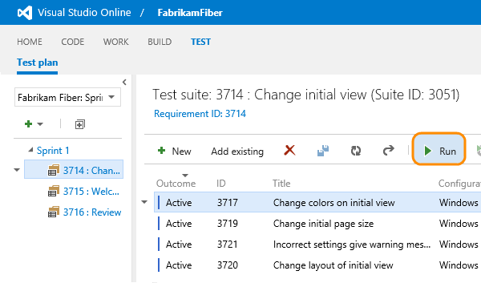

Microsoft Test Runner opens and runs in a new browser.
3. Start the app that you want to test. Your app doesn't have to run on 
the same computer as Test Runner. You just use Test Runner to record which 
test steps pass or fail while you manually run a test. For example, you 
might run Test Runner on a desktop computer and run your Windows 8 store 
app that you are testing on a Windows 8 tablet.

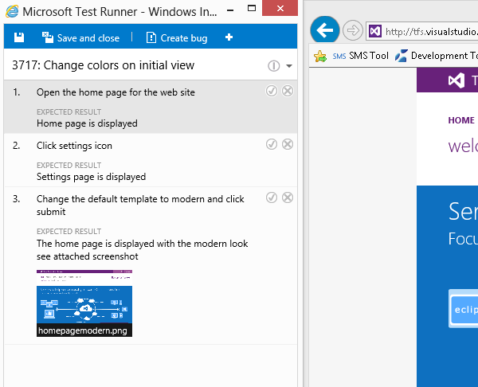
4. Mark each test step as either passed or failed based on the expected results. 
If a test step fails, you can enter a comment on why it failed.

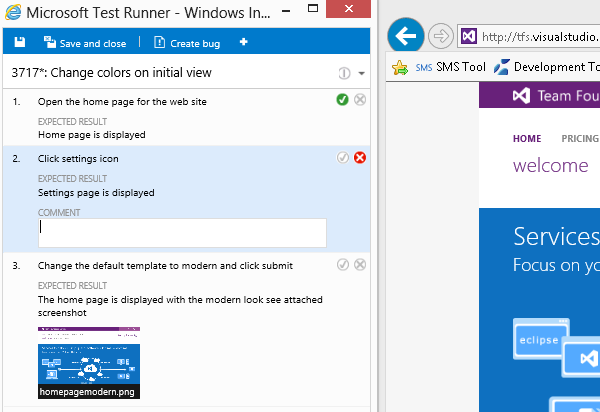
5. Create a bug to describe what failed.

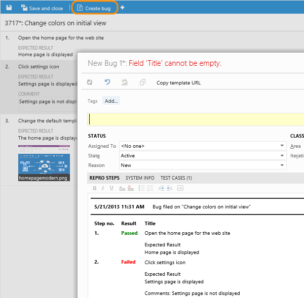

The steps and your comments are automatically added to the bug. Also, 
the test case is linked to the bug.

If Test Runner is running in an Internet Explorer 11 or a Chrome window, 
you can copy a screenshot from the clipboard directly into the bug.
6. You can see any bugs that you have reported during your test session.

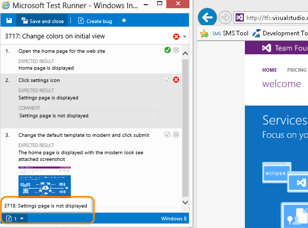
7. When you've run all your tests, save the results and close Test Runner. 
Now, all the test results are stored in Visual Studio Online.
8. View the testing status for your test suite.

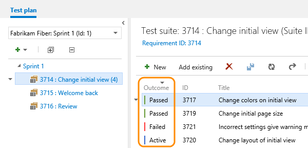

You see the most recent results for each test.

## Try this next

- [View your test progress with lightweight charts](../track-test-status-vs.md)
- [Control how long to keep test results](../how-long-to-keep-test-results.md)

## Q&amp;A

#### Q:  How do I rerun a test?

A:  Just select any test and choose Run.

#### Q:  Can I run all the tests in a test suite together?

A:  Yes, select a test suite and choose Run. This runs all the active 
tests in the test suite. If you haven't run a test yet, its state 
is active. You can reset the state of a test to active if you want to rerun it.

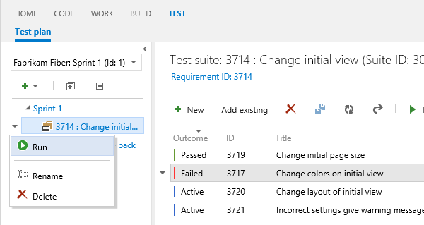

#### Q:  I want to do some exploratory testing before I create manual test cases. Can Test Runner help with this?

A:  Not from the Test hub. But if you use 
[Microsoft Test Manager](https://msdn.microsoft.com/library/hh191621.aspx), 
it will record your actions, screenshots and other data while you're exploring 
your app. If you create a bug, all this data is included automatically.

#### Q:    Can I add a screenshot to the test results when I am running a test?

A:  Yes, take a screenshot, save it to a file and add the attachment. 
The file is stored with the test results.

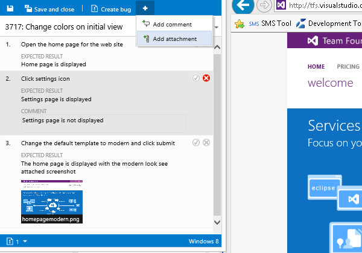

#### Q:    Can I add a screenshot to a bug when I am running a test?

A:  Yes, if Test Runner is running in an Internet Explorer 11 or a Chrome window, 
you can copy a screenshot from the clipboard directly.

#### Q:  Can I fix my test steps while I'm running a test?

A:  Yes, if you have an [Advanced license](https://www.visualstudio.com/products/visual-studio-online-advanced-vs) 
for Visual Studio Online. You can insert, move, or delete steps. 
Or you can edit the text itself. Use the edit icon next to the test 
step number to do this.

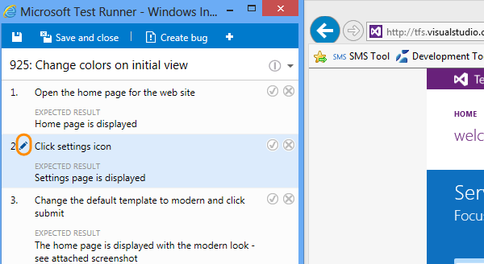

The tool to edit the test steps is shown.

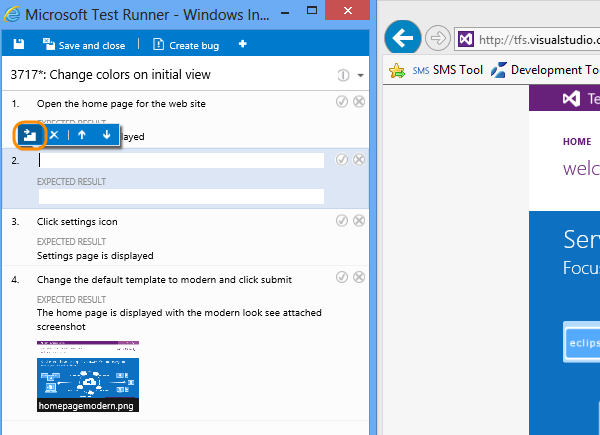

#### Q:  Can I collect additional data while I'm running a test?

A:  If you use [Microsoft Test Manager](https://msdn.microsoft.com/library/jj635157.aspx) 
to run your tests, you can collect user actions, system logs, screen and audio recordings 
and other additional data. If you're using Visual Studio 2015, Visual Studio 2013, 
or Visual Studio 2012 Update 3, you can run a test using Microsoft Test Manager from the Test hub. 
(The most recently installed version of MTM will launch.)

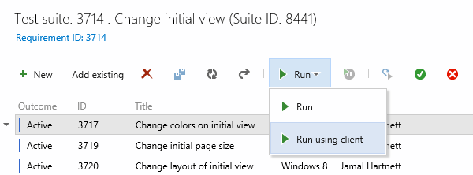

#### Q:    How do I control how long I keep my test data?

A:  [Learn more here](../how-long-to-keep-test-results.md).
