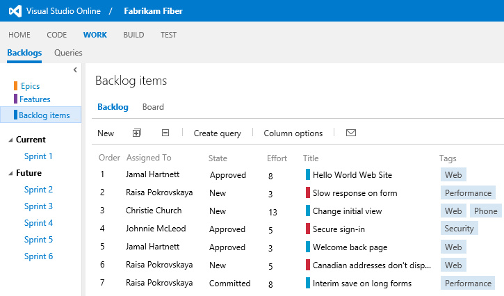
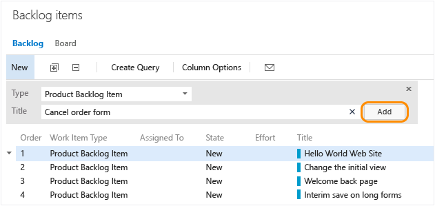
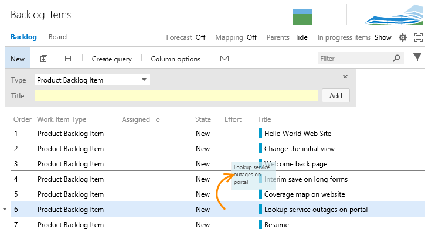
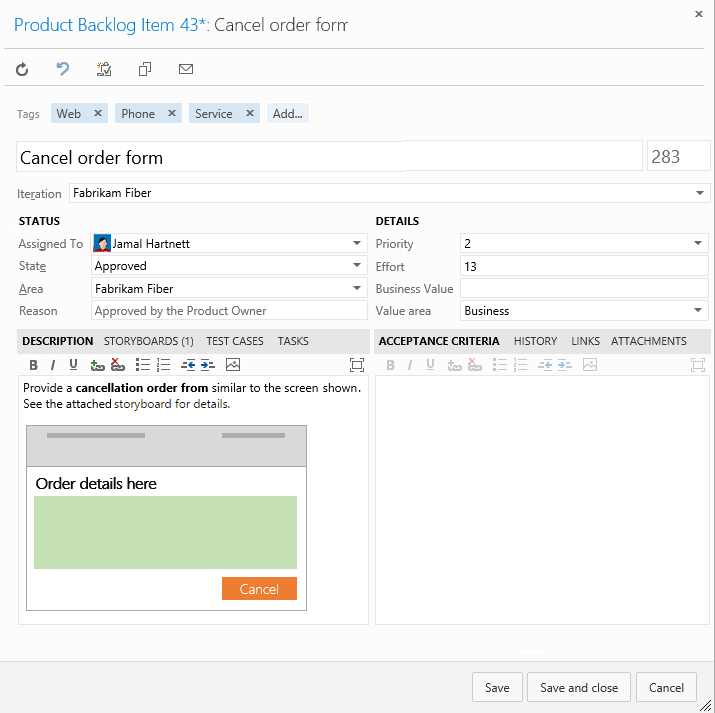

<properties
	pageTitle="Create your backlog"
  description="Create your backlog"
  services="visual-studio-online"
  documentationCenter = ""
  authors="terryaustin"
  manager="terryaustin"
  editor="terryaustin" /> 

# Create your backlog

Every project needs a backlog, the place where you keep a prioritized list of work or requirements. 
As you move from ideas to shipping software, your backlog acts as a repository of all the information 
you need to stay on track. Because the most important work appears at the top of the list, 
your team knows what to work on next.

> **Note:**Your view will vary based on the [process (Agile, CMMI, or Scrum)](https://msdn.microsoft.com/library/vs/alm/work/guidance/choose-process) used to create your team project.

In Visual Studio Online, your backlog consists of [work items](https://msdn.microsoft.com/Library/vs/alm/work/backlogs/add-work-items). 
You use work items to share information, assign work to team members, 
track dependencies, organize work, and more.

## Add items

As a first step, get some items onto the backlog. Simply enter a title and click **Add**. Repeat this step a few times to start building your backlog.

You'll notice how user stories show up with a blue bar. 
If you want, you can [treat bugs like user stories](https://msdn.microsoft.com/library/vs/alm/work/customize/show-bugs-on-backlog), 
and then they'll show up on your backlog with a red bar. 
Each work item type has its own color assignment, so you can quickly differentiate the types of work in the list.

## Get items in priority order

Now that you've got some work on your backlog, 
it's time to get them in order. 
Whether you call it stack ranking or backlog priority, 
the outcome is the same: get things in the order you want them worked on.

Simply drag and drop an item to adjust its position within the backlog. 
If you're a keyboard enthusiast, hold the Alt key down and use the up and down arrows.

## Add details

You may have noticed that as we added items, we only entered a title for each item. 
That's a great way to get the high-level set of features visible. 
However, that's usually not enough information for work to actually start. 
You need to capture more information.

We've designed each work item type - user story, bug, task, etc. - to capture all the 
information your team needs to collaborate and complete their work. 
When you open an item (double-click to do this) you'll see additional 
fields and tabs used to capture and share information.

You'll no doubt want to estimate the size of each item, to support planning and scheduling 
activities that come later. For user stories, you enter estimates as Story Points. 
(For product backlog items and requirements, you capture estimates in the Effort and Size fields.)

Most Agile methods recommend setting estimates based on relative size of work. 
Such methods include t-shirt sizes (S, M, L, XL, and too big), 
powers of 2 (1, 2, 4, 8), and the Fibonacci sequence (1, 2, 3, 5, 8, etc.), which story points uses.

> *"Story points are a unit of measure for expressing the overall size of a user story,  feature or other piece of work." Story points tell us how big a story is,  relative to others, either in terms of size or complexity.* – [Estimating](https://msdn.microsoft.com/library/hh765979.aspx), Mike Cohn of Mountain Goat Software

You can use any method that works for your team and enter estimates in the field provided for that purpose.

## Next step: Scrum or Kanban

With your backlog defined and prioritized, you're ready to start work on the top priority items. 
From here, it's time to make a decision… how do you want to work? 
Visual Studio Online has built-in support for two popular methods – Scrum and Kanban. 
You can use these methods independently or together.

Using [Scrum](work-in-sprints-vs.md) methods, teams define a sprint schedule – a time-boxed set of periods for planning and developing. 
Using the sprint backlog, they plan their sprints by assigning items to the sprint and defining the tasks 
required to develop each item. Task boards, capacity charts, and sprint burndown charts all help to 
keep the team aware of progress throughout the sprint cycle.

With [Kanban](work-from-the-kanban-board-vs.md), teams focus on the flow of work from start to finish - limiting work in progress 
in order to optimize flow and deliver the highest priority items as quickly as possible.

Teams that want the least overhead in terms of tracking and estimating may prefer Kanban. 
Teams that like to work at a steady cadence and plot the details of their sprint plan will prefer Scrum.

## Related backlog notes

Before you can create or work with a backlog, you need a team project. 
If you don't have one yet, you can [create one](../setup/connect-to-visual-studio-online.md) 
in Visual Studio Online. 
If you don't have access to your team's backlog, [get invited to the team](../setup/add-team-members-vs.md).

Do you have an existing backlog in your on-premises TFS that you want to 
migrate to your Visual Studio Online account? Find out if you can do that 
[here](../setup/migrate-team-projects-vs.md).

You'll find more useful tips for working with your backlog in these articles:

- [Organize your backlog](https://msdn.microsoft.com/Library/vs/alm/work/backlogs/organize-backlog)

- [Agile tools](https://msdn.microsoft.com/Library/vs/alm/Work/overview)

- [Storyboard your ideas using PowerPoint](https://msdn.microsoft.com/Library/vs/alm/work/office/storyboard-your-ideas-using-powerpoint)

- [Manage team assets](https://msdn.microsoft.com/Library/vs/alm/work/scale/manage-team-assets)

- [Prioritization](https://msdn.microsoft.com/library/hh765981.aspx)

- [Estimating](https://msdn.microsoft.com/library/hh765979.aspx)

### Backlog controls

| Control | Function |

| --- | --- |

| Backlog | Switch to backlog view |

| Board | [Switch to Kanban board view](work-from-the-kanban-board-vs.md) |

| Forecast | [Turn forecasting Off/On](https://msdn.microsoft.com/Library/vs/alm/Work/scrum/velocity-and-forecasting) |

| Mapping | [Turn mapping Off/On](https://msdn.microsoft.com/Library/vs/alm/Work/backlogs/organize-backlog) |

| Parents | [Show/Hide parents](https://msdn.microsoft.com/Library/vs/alm/Work/backlogs/organize-backlog) |

| In progress items | [Show/Hide in progress items](https://msdn.microsoft.com/Library/vs/alm/Work/scrum/velocity-and-forecasting) |

|  /  | Enter or exit full screen mode |

|  /  | Expand or collapse one level of the tree hierarchy |

|  | Email a copy of your backlog |

|  | [Turn tag filtering On/Off ](https://msdn.microsoft.com/Library/vs/alm/Work/track/add-tags-to-work-items#Filteralistofworkitems) |

Note that even if you have show parents turned on, the Create query and mail  controls will only list items at the currently selected level.

