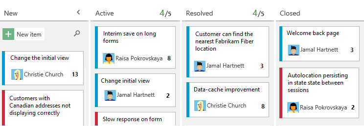
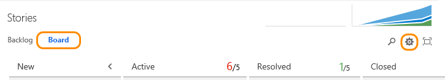
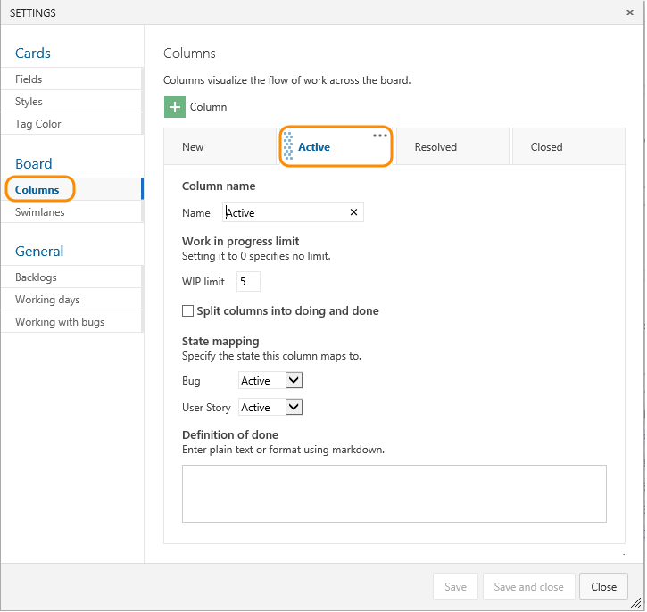
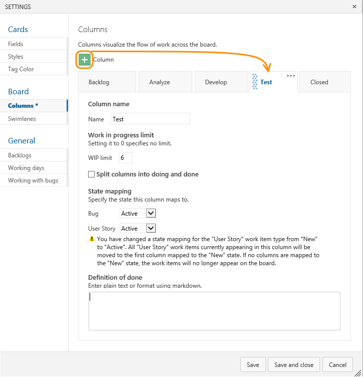
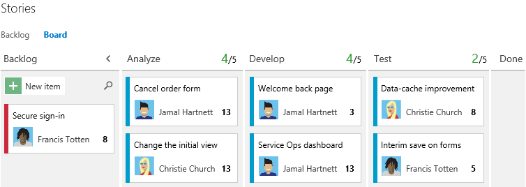
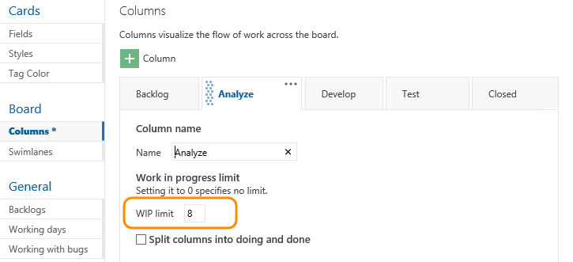
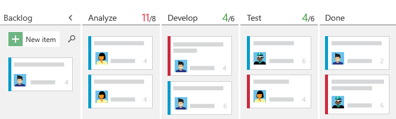
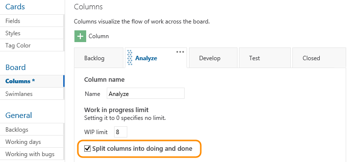
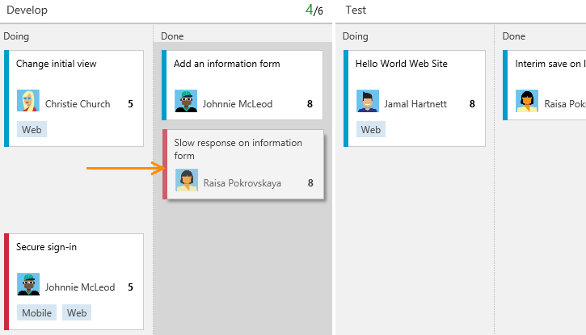

<properties
	pageTitle="Kanban"
  description="Kanban"
  services="visual-studio-online"
  documentationCenter = ""
  authors="terryaustin"
  manager="terryaustin"
  editor="terryaustin" /> 

# Kanban

Your backlog provides a great starting point for what you want to build. 
Your Kanban board, on the other hand, turns your backlog into an interactive signboard. 
A board you can use to visualize, track, and share progress as you build your project.

Each backlog comes with a Kanban board. You get the most value by getting the board to match 
how your team works. Each card on the board corresponds to an item of work you've added to your backlog.

Simply drag-and-drop cards from one column to another to update status. 
Dragging cards within a column changes the priority.

And with Kanban, you get built-in methods designed to optimize your workflow process. 
What exactly does that mean? 
Well, for one, you can set Work in Progress (WIP) limits to help teams stay focused 
on completing work before starting new work. By limiting the amount of work your team 
starts at each stage can actually increase the speed of delivery.

Second, you can split columns to enable a pull method, highlight where bottlenecks occur, 
and perfect your workflow process.

## Add columns to match your workflow stages

As a first step, get your Kanban board looking like what you want it to.

1. Open your board from your Backlog and click the  gear icon.

If you're not a team admin, [get added as one](https://msdn.microsoft.com/Library/vs/alm/work/scale/manage-team-assets#Addanaccountasateamadministrator). 
Only team and project admins can customize the Kanban board.

2. Click Columns, and then click a column tab to see all the settings you can modify. Your initial column settings will look something like this.

Actual titles vary based on the [process (Agile, CMMI, or Scrum)](https://msdn.microsoft.com/library/vs/alm/work/guidance/choose-process) used to create your team project.

3. Change your column titles to map to your workflow stages. You can add, rename, and move columns to support more stages.

Here, we rename the first, second, and third columns to Backlog, Analyze, and Develop. 
We then add a column and label it Test.

To change the column order, simply drag the tab to the position you want.

After you save your changes, your board will look something like this...

As you can see, you've got more features which you can set. 
We'll go over WIP limits and split columns next.

You can always change the [state-to-column mappings](https://msdn.microsoft.com/Library/vs/alm/work/kanban/add-columns) 
later as you gain insight into how to improve your workflow process.

## Set WIP limits to manage flow

The whole idea behind WIP limits is to keep team members from taking on too much work at any one time. 
This may seem counterintuitive and uncomfortable at first. However, this single practice has helped 
teams identify bottlenecks, improve their process, and increase the quality of software they ship.

What limits should you set?  Start with numbers that don't exceed 2 or 3 items per team member working within a stage.

Click each intermediate column tab to set the WIP limit for that column.

Once set, you'll see the count of items next to the limit set for each stage. 
Red numbers indicate you've gone over the limit.

After you set WIP limits, you'll want to monitor the actual count of items at each stage. 
While teams will exceed limits from time to time, frequent occurrences [signals the need to 
review processes or adjust the limits](https://msdn.microsoft.com/Library/vs/alm/Work/kanban/wip-limits).

## Split columns to highlight where bottlenecks occur

Split columns provides your team with another method to discover bottlenecks. 
Split columns highlights when work completes in one stage and signals when work can begin in the next stage.

Without split columns, teams push work forward. With split columns, 
teams pull an item into the next stage when they actually begin work. 
This pull model provides a more accurate means for tracking how long items sit in a stage not being worked.

You don't have to split all columns, just the ones where you want to use the pull model.

As before, click each intermediate column tab to set the split columns for that column.

When split, you'll see Doing and Done sub-columns. 
Now, when a team member completes coding an item, he moves it into the Develop-Done column. 
And, when the tester begins work on the item, she pulls it into the Test-Doing column.

With Kanban, you want to decrease worker idle time and the time items sit idle or unworked. 
When you minimize idle time for all, you drive towards perfect flow.

## Next steps

With the above customizations in place, you can start using your Kanban board. 
If you don't have a Kanban board and want one, you'll need to [create a team project](../setup/connect-to-visual-studio-online.md). 
All work in Visual Studio Online occurs by connecting to a team project.

Also, if you don't have access to the Kanban board, [get invited to the team](../setup/add-team-members-vs.md).

## Related notes

For more opportunities to adopt Kanban practices and customize your team’s Kanban board, check out the following articles:

- [Kanban basics](https://msdn.microsoft.com/Library/vs/alm/work/kanban/kanban-basics)

- [Add task checklists](https://msdn.microsoft.com/Library/vs/alm/work/kanban/add-task-checklists)

- [Definition of Done](https://msdn.microsoft.com/Library/vs/alm/work/kanban/definition-of-done)

- [Add swimlanes to expedite work](https://msdn.microsoft.com/Library/vs/alm/work/kanban/expedite-work)

- [Customize cards](https://msdn.microsoft.com/Library/vs/alm/work/customize/customize-cards)

Also, from the Settings dialog, you can configure these team settings:

- [Activate backlogs for the team](https://msdn.microsoft.com/en-us/Library/vs/alm/Work/backlogs/organize-backlog#activate-backlogs)

- [Set working days](https://msdn.microsoft.com/en-us/Library/vs/alm/Work/scale/capacity-planning#team_settings)

- [Show bugs on backlogs and boards](https://msdn.microsoft.com/Library/vs/alm/work/customize/show-bugs-on-backlog)

### Board controls

| Control | Function |

| --- | --- |

| Backlog | [Switch to backlog view](create-your-backlog-vs.md) |

| Board | Switch to Kanban board view |

|  | Enter a keyword to find items on the board |

|  /  | Enter or exit full screen mode |

