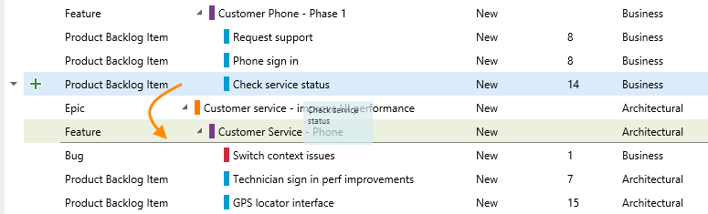

<properties
	pageTitle="Scrum"
  description="Scrum"
  services="visual-studio-online"
  documentationCenter = ""
  authors="terryaustin"
  manager="terryaustin"
  editor="terryaustin" /> 

# Scrum

While your product backlog maintains the full set of requirements to build your product, 
sprint backlogs show a filtered subset of these requirements. Scrum teams use sprint backlogs 
to target what they'll build during the sprint.

Sprints can be of any length, but typically last from one to four weeks. 
Teams use sprints to plan and deliver shippable software at a regular cadence.

You'll want to use your sprint backlog to make sure that your team has all the information 
they need to successfully plan and complete work within the time allotted without having to rush at the end.

> **Note:**Some teams like to track bugs along with requirements on the backlog. Other teams like to track bugs as tasks performed in support of a requirement, and have them appear on their task board. You [configure your choice as to how you want to manage bugs through team settings](https://msdn.microsoft.com/Library/vs/alm/work/customize/show-bugs-on-backlog).   
> 
> Also, your team can [choose what level of portfolio backlogs appear](https://msdn.microsoft.com/Library/vs/alm/work/backlogs/organize-backlog#Activatebackloglevelsforyourteam). Portfolio backlogs are useful when your want to group items and organize your backlog.

At the beginning of each sprint, teams plan the work they can commit to. 
The planning process generally occurs in two parts. 
The first part considers what the team believes they can deliver based on estimates 
(Effort or Story Points) made to each requirement.  The second part identifies more details 
about how each requirement will be built, breaking the requirement down into a set of tasks. 
Estimating each task equips team with the level of detail they need to compare the total amount of 
planned work against their team capacity.

Successful planning leads teams to neither overcommit nor under commit.

Teams new to Agile methods often gravitate to Scrum practices to reap the benefits 
of a regular sprint cadence and to improve their ability to estimate, forecast, and commit as a team.

To get started, first set the sprint dates to match your sprint cadence.

## Define sprints, set your schedule

Does your team already work in sprints? Then all you need to do is define the dates that match 
the cadence you've been working to. If you're new to working in sprints, 
you'll need to pick a sprint cadence as well. You might start with a 3 or 4 week cadence.

Once you know your cadence, you're ready to get your schedule defined.

1. From the Backlogs view, you can click the first sprint that appears under Current.

You already have several sprints predefined, they're listed under Current and Future. 
Actual sprint titles vary based on the [process (Agile, CMMI, or Scrum)](https://msdn.microsoft.com/library/vs/alm/work/guidance/choose-process) used to create your team project.

However, calendar dates haven't been assigned.
2. To set the calendar dates, choose the first sprint under Current and set its dates. 
You can even rename the sprint.

You can do the same for the remaining sprints listed. Also, it's important to understand 
that each team controls their sprint schedule. You can even [set up a release cadence which 
includes several sprints](https://msdn.microsoft.com/library/vs/alm/work/scrum/define-sprints).

## Pull items off the backlog onto your sprint

Now, with your sprint dates set, choose the subset of requirements you want to work on during the sprint. 
Simply drag each item from the product backlog onto the sprint.

Of course, this requires that you've [created, prioritized, and estimated your backlog](create-your-backlog-vs.md).

Next, check the total level of effort of your sprint items. For example, the Fabrikam Fiber team has four members with 
a total velocity of 40 effort points per three week sprint cycle. 
So, they're in good shape to commit to the 6 items in the Sprint 1 backlog.

Your initial plan should identify the subset of requirements that's within your team's capacity based on 
estimated effort and team velocity. Velocity corresponds to the total Effort or Story Points a team can complete 
within the sprint time period.

If the total amount of effort exceeds your team's velocity, simply drag items from the bottom of the list onto Backlog items.

After your team has worked a few sprints, you can [monitor the velocity of the team sprint-over-sprint and use that to forecast the subset of work that can be built during a sprint](https://msdn.microsoft.com/Library/vs/alm/work/scrum/velocity-and-forecasting).

## Set team capacity

The next step in planning requires determining your team's actual capacity.
 Whereas velocity correlates to how the team estimates requirements, 
capacity correlates to actual time – either hours or days. 
Capacity takes into account variation in work hours by team members as well as holidays and vacation days. 
Because this can vary from sprint to sprint, you set capacity for each sprint.

Open the Capacity page and enter the capacity and days off for each member of your team. For example, Christie Church's capacity is 6 hours hours/day.

Most teams specify capacity in terms of hours, however, you can also specify it in days. 
For example, .5 days would correspond to 4 hours for a typical 8 hour day. 
Choose the same unit you will use to report remaining work.

If you don't see a team member listed, you need to [add them to the team](../setupadd-team-members-vs.md). 
Also, you only have to indicate planned days off. You [set weekend days or other recurring days off](https://msdn.microsoft.com/library/vs/alm/work/scale/capacity-planning#team-settings) under team settings.

## Break down work into tasks

Capacity provides you with detailed knowledge of how much work team members and the team can commit to.  
To compare capacity against actual planned work, you next break down each requirement into tasks 
that you estimate in hours or days.

Add as many tasks for each requirement to capture the work required to complete the item. 
Tasks can represent different work to be performed – such as design, code, test, content, signoff. 
Usually, each team member adds their own tasks and sets estimates for the work. 
However, a development lead could define the initial tasks for a requirement.

Give the task a name, and estimate the amount of time it will take to complete. Enter the value in Remaining Work.

At the planning stage, Remaining Work corresponds to an estimate of how long it will take to complete the task. 
During the sprint, team members update remaining work to continually reflect the time required to complete the task. 
This value can actually increase after work begins. As you perform a task, you might find that more time is required. 
Always update the task with your best estimate of remaining work. That way, you help accurately reflect the total amount 
of work remaining in the sprint.

As you define tasks and estimate the work, you'll see capacity charts start to fill in for each team member. 
Capacity bars track the remaining work against the capacity for each team member as well as the entire team.

You'll also see the remaining work totals for each requirement and bug.

From this view, you can easily see which individuals are at or near capacity. 
Teams can determine if work needs to be moved out of the sprint or to reassign tasks.

To quickly reassign tasks, drag the task onto the new assignee's capacity bar. As you reassign tasks, capacity bars automatically update.

To move items out of the sprint, simply drag them back into the backlog or another sprint. 
All tasks assigned to the item will move as well. Or, you can move a task to appear under a different requirement, 
called re-parenting.

We've covered a lot of the features that support sprint planning. In addition to these features, 
you can also create tasks from the task board and set and use capacity per team activity.

## Burn down work, track progress throughout the sprint cycle

Once the team completes the sprint plan, their ready to tackle their sprint tasks and burn down the work.

The task board provides the best tool for tracking and sharing progress through the sprint cycle. 
During daily scrum meetings, teams can refer to the task board to discuss what they accomplished, 
what they plan to work on next, and any blocking issues they need help with.

Prior to the meeting, they can update the remaining work and the status of their tasks.

Another great tool for monitoring team progress is the burndown chart. To open it, click the image at the upper right of the sprint backlog or task board.

Your burndown chart reflects the progress made by completing tasks and updating remaining work. 
The ideal trend line always indicates a smooth and steady burndown. 
The blue area, however, represents what's actually going on. 
It shows the buildup of remaining work as team members add tasks, and the reduction of remaining work 
as team members complete those tasks.

Updating the remaining work daily helps you and your team to stay on track and will contribute to a smoother burndown chart. 
You can also create additional views of your team's progress – such as active bugs, reactivated bugs, 
completed test cases, and more – with query charts.

One last item – once you've completed all tasks for a requirement, update its status to Done or Closed. This way, the item moves off your backlog.

## Next steps

We just walked through the basic Scrum tools and tasks. These included defining your sprints, planning a sprint, 
setting capacity, defining tasks, and updating the task board to show burndown of work.

If you're new to Visual Studio Online and want to start using these tools, you'll need to [create a team project](../setupconnect-to-visual-studio-online.md). 
All work in Visual Studio Online occurs by connecting to a team project. 
If you don't have access to your team's backlog, [get invited to the team](../setupadd-team-members-vs.md).

## Related Scrum notes

You can learn more about defining and planning sprints, and customizing your sprint backlog and task board from these topics:

- [Define sprints](https://msdn.microsoft.com/Library/vs/alm/Work/scrum/define-sprints)
- [Sprint planning](https://msdn.microsoft.com/Library/vs/alm/Work/scrum/sprint-planning)
- [Work with the task board](https://msdn.microsoft.com/library/vs/alm/work/scrum/task-board)
- [Capacity planning](https://msdn.microsoft.com/library/vs/alm/work/scale/capacity-planning)
- [Velocity and forecasting](https://msdn.microsoft.com/library/vs/alm/work/scrum/velocity-and-forecasting)
- [Sprint burndown](https://msdn.microsoft.com/library/vs/alm/work/scrum/sprint-burndown)
- [Customize task board cards](https://msdn.microsoft.com/Library/vs/alm/work/customize/customize-cards)

### Order, re-parent, and reassign items to different sprints

When you need to change the order of an item, simply drag the item to its new location. Also, you can [re-parent an item using the mapping pane](https://msdn.microsoft.com/Library/vs/alm/Work/backlogs/organize-backlog), or simply drag it within the hierarchy to change its parent.

Ordering and re-parenting backlog items requires that you don't nest items within each other. That is, you don't create product backlog items that are children of other product backlog items. You can only re-parent backlog items under other features, and features under other epics.

If you receive the following message, you can fix it by removing nested child items.

While you can create a hierarchy of backlog items, tasks, and bugs─we don't recommend that you do. The Kanban board, sprint backlog, and task board only show the last node in a hierarchy, called the leaf node. For example, if you link items within a hierarchy that is four levels deep, [only the items at the fourth level appear on the Kanban board, sprint backlog, and task board](https://msdn.microsoft.com/Library/vs/alm/Work/customize/show-bugs-on-backlog#how-hierarchical-items-appear-in-backlog-and-board-views).

Instead of nesting requirements, bugs, and tasks, we recommend that you maintain a flat list─only creating parent-child links one level deep between items. Use the feature work item type when you want to group requirements or user stories. You can [quickly map stories to features](https://msdn.microsoft.com/Library/vs/alm/Work/backlogs/organize-backlog), which creates parent-child links in the background.

### Backlog controls

| Control | Function |
| --- | --- |
| Backlog | Switch to backlog view |
| Board | [Switch to task board view](https://msdn.microsoft.com/Library/vs/alm/Work/scrum/task-board) |
| Capacity | [Switch to Capacity planning](https://msdn.microsoft.com/Library/vs/alm/Work/scale/capacity-planning) |
| Work details On/Off | Show/hide [capacity bars](https://msdn.microsoft.com/Library/vs/alm/Work/scrum/sprint-planning#set-capacity) |
|  | Configure team settings: [Backlogs](https://msdn.microsoft.com/en-us/Library/vs/alm/Work/backlogs/organize-backlog#activate-backlogs), [Working days](https://msdn.microsoft.com/Library/vs/alm/Work/scale/capacity-planning#team_settings), [Working with bugs](https://msdn.microsoft.com/Library/vs/alm/work/customize/show-bugs-on-backlog) |
|  /  | Enter or exit full screen mode |
|  /  | Expand or collapse all levels of the tree hierarchy |
|  | [Email a copy of your sprint plan](https://msdn.microsoft.com/Library/vs/alm/Work/scrum/sprint-planning#share) |

